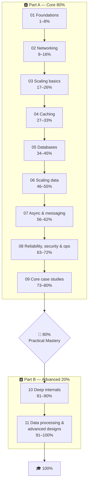

# ⚛️ System Design from Atoms

**System design, learned one atom at a time.** It's taught the Richard Feynman way: plain words, pictures, and explaining things back to yourself. It's also built for ADHD brains, with short lessons, one idea per lesson, and a clear sense of progress.

> "If you can't explain it simply, you don't understand it well enough."
> The idea behind every lesson here.

---

## 🧭 How this guide works

- **100 lessons, and each one is 1%.** Your progress is simply the number of lessons you've finished.
- **Most important stuff comes first.** Lessons **1–80 (Part A)** are the core that every engineer and interviewer expects. Lessons **81–100 (Part B)** are the advanced 20%. If you stop at 80%, you still have practical mastery.
- **There's a checkpoint every 5%.** Each one is a short self-test, an explain-it-aloud task, a mini design, and interview questions. You get a bigger 🎉 level-up every 10%, and a 🏁 **Practical Mastery gate at 80%**.
- **Every lesson has the same shape**, so your brain always knows what's coming next:

| Section | What it gives you |
|---|---|
| 🎯 One-sentence idea | The whole lesson in one line |
| 🧸 Analogy | An everyday picture |
| 🖼️ Visual | A diagram |
| 🔬 How it works | 3–6 short bullets |
| 🧩 Worked example | Real numbers or a tiny bit of code |
| ⚖️ Trade-offs | What you gain vs. what you pay |
| 🌍 Real world | Where you'll meet this idea |
| 📌 Cheat card | Rules of thumb, numbers, and tricks |
| 🧪 Feynman check | Explain it back, plus the common confusion |
| ⚡ Quick recall | 3 questions with hidden answers |
| 🎤 Interview practice | Interview-style questions with model answers |

👉 **New here? Read [START-HERE.md](START-HERE.md) first (5 min).** Then track your progress in [PROGRESS.md](PROGRESS.md).

---

## 🗺️ The roadmap

---

## 🅰️ Part A — The core 80%

| Phase | Lessons | % | What you'll be able to do |
|---|---|---|---|
| [01 Foundations](phases/01-foundations/README.md) | 001–008 | 1–8% | Think in trade-offs, estimate scale, speak the language of latency and availability |
| [02 Networking essentials](phases/02-networking/README.md) | 009–016 | 9–16% | Follow a request across the internet and pick the right API style |
| [03 Scaling basics](phases/03-scaling-basics/README.md) | 017–026 | 17–26% | Grow from 1 server to many with load balancers, CDNs, and rate limits |
| [04 Caching](phases/04-caching/README.md) | 027–033 | 27–33% | Make things fast without serving stale nonsense |
| [05 Databases](phases/05-databases/README.md) | 034–045 | 34–45% | Choose and use the right database for the job |
| [06 Scaling data](phases/06-scaling-data/README.md) | 046–055 | 46–55% | Replicate, shard, and reason about consistency and CAP |
| [07 Async & messaging](phases/07-async-messaging/README.md) | 056–062 | 56–62% | Decouple systems with queues, pub/sub, and streams |
| [08 Reliability, security & ops](phases/08-reliability-ops/README.md) | 063–072 | 63–72% | Build systems that survive failure, stay secure, and can be observed |
| [09 Core case studies](phases/09-core-case-studies/README.md) | 073–080 | 73–80% | Design classic systems end to end, interview style |

## 🅱️ Part B — The advanced 20%

| Phase | Lessons | % | What you'll be able to do |
|---|---|---|---|
| [10 Deep internals](phases/10-deep-internals/README.md) | 081–090 | 81–90% | Explain how databases and distributed systems really work underneath |
| [11 Data processing & advanced designs](phases/11-advanced-designs/README.md) | 091–100 | 91–100% | Handle specialist designs: payments, geo, crawlers, schedulers |

---

## 📌 Cheatsheets (keep these open while you study)

| Sheet | Use it for |
|---|---|
| [NUMBERS.md](cheatsheets/NUMBERS.md) | Latency numbers, powers of 2, nines → downtime, typical throughput |
| [ESTIMATION-TRICKS.md](cheatsheets/ESTIMATION-TRICKS.md) | Back-of-envelope math shortcuts |
| [TRADEOFFS.md](cheatsheets/TRADEOFFS.md) | Every "X vs Y" in one place |
| [PATTERNS.md](cheatsheets/PATTERNS.md) | "If you hear X, reach for Y" |
| [DATABASE-CHOOSER.md](cheatsheets/DATABASE-CHOOSER.md) | Which database, and why |
| [INTERVIEW-FRAMEWORK.md](cheatsheets/INTERVIEW-FRAMEWORK.md) | The 4-step interview template, with time budgets |
| [MNEMONICS.md](cheatsheets/MNEMONICS.md) | Memory tricks |

Each phase also has its own `CHEATSHEET.md` and `INTERVIEW-QUESTIONS.md`.

## 📚 Reference

- [COVERAGE.md](COVERAGE.md): every standard system design topic, mapped to the lesson that teaches it
- [GLOSSARY.md](GLOSSARY.md): plain-English definitions, linked to their lessons
- [templates/lesson-template.md](templates/lesson-template.md): the lesson shape, if you want to add your own atoms

---

## 🚀 Quick start

1. Read [START-HERE.md](START-HERE.md).
2. Open [Lesson 001](phases/01-foundations/001-what-is-system-design.md).
3. Do one lesson (about 10 minutes), tick it in [PROGRESS.md](PROGRESS.md), then stop or keep going. Both are fine.

Licensed under the terms in [LICENSE](LICENSE).
