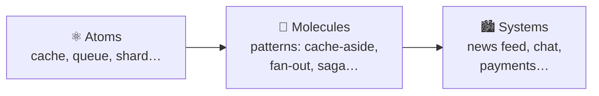
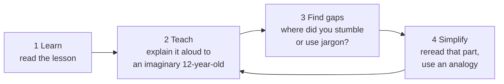
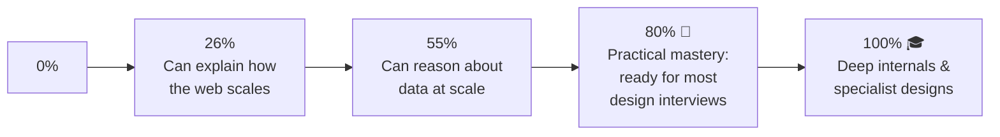

# 🚦 Start Here

> ⏱ 5 min. Read this once, then go straight to [Lesson 001](phases/01-foundations/001-what-is-system-design.md).

## 1. What "system design" means

System design is **deciding how the pieces of a software system fit together** (servers, databases, caches, queues) so it stays **fast, correct, and alive** as more people use it.

You won't memorize one right answer, because there isn't one. You'll learn a small set of **atoms** (building blocks) and the **trade-offs** each one brings. Every big system is just these atoms, combined.

## 1½. It's a story 📖

I've written this guide like a book I'm reading to you. I'll tell you the story of **Maya**, a junior engineer, as she grows **Pantry**, a food marketplace, from one laptop into a global system. Each lesson opens with a short **📖 Story** scene where something breaks, and closes with a **📖** teaser for the next one.

- **Before reading a lesson, pause after the story and guess:** *what would you do?* Guessing first (even wrongly) makes the answer stick.
- **Don't want the story?** Skip the 📖 parts. Every lesson works without them.
- Meet the cast and see the chapter map in **[STORY.md](STORY.md)**.

## 2. The Feynman loop (do this for every lesson)

Richard Feynman learned things by trying to **teach them simply**. The places where his explanation broke down showed him what he didn't understand yet.

Every lesson has a **🧪 Feynman check** to make this a habit. Say it out loud, write it in a notebook, or explain it to your rubber duck. **Saying it beats rereading it.**

## 3. ADHD-friendly by design

| Problem | What this guide does |
|---|---|
| Long chapters are overwhelming | **One idea per lesson, about 10 minutes** |
| "Where was I?" | **Numbered lessons**, each one worth 1%, plus [PROGRESS.md](PROGRESS.md) |
| Walls of text | **Diagrams, tables, bullets, emoji signposts** |
| Losing motivation | **A checkpoint every 5%**, a level-up every 10%, and a big 🏁 at 80% |
| Unpredictability | **Every lesson has the same shape**, so you always know what's next |
| Forgetting | **Quick recall + checkpoints + cheatsheets** for spaced review |

### Tips that actually help

- ⏲️ **Timebox it.** Set a 15-minute timer and do one lesson. If you want more when it rings, great. If not, you still won.
- ✅ **Stop at the "safe stopping point".** Every lesson ends with one, so you never leave a thought half-finished.
- 🎯 **Only read the 🎯 line if you're low on energy.** One sentence is still progress. Come back for the rest later.
- 🔁 **Spaced review.** Before you start a new session, reread the 📌 cheat cards from your last 3 lessons (about 2 minutes).
- 🧩 **Skip around within a phase if you're bored.** Lessons inside a phase mostly stand alone. Just do them all before that phase's checkpoint.
- 🗣️ **Talk out loud.** Explaining it aloud is the Feynman check, and it keeps your attention anchored.
- 🏆 **Celebrate checkpoints.** Tick the box, and do something nice for yourself.

## 4. How to use checkpoints

At each checkpoint (5%, 10%, … 100%) you'll do:

1. **5 recall questions.** Answer them *before* you open the hidden answers.
2. **1 explain-aloud task.** Do the Feynman loop on a whole group of lessons.
3. **1 mini-design.** Sketch a tiny system on paper.
4. **3 interview questions.** Answer them like you would in a real interview.
5. **Score yourself.** If you get less than 4/5 on recall, revisit the lessons it points to. **That's normal, not failure.**

## 5. How far do you need to go?

- **Most people only need 80%.** That's Part A.
- **Part B is for senior and staff interviews**, for infrastructure roles, or for curiosity.

## 6. Keep these open while you study

- [📌 NUMBERS.md](cheatsheets/NUMBERS.md): the numbers every engineer should know
- [🧮 ESTIMATION-TRICKS.md](cheatsheets/ESTIMATION-TRICKS.md): quick math shortcuts
- [📖 GLOSSARY.md](GLOSSARY.md): when a word confuses you

---

➡️ **Go: [Lesson 001: What Is System Design?](phases/01-foundations/001-what-is-system-design.md)**
