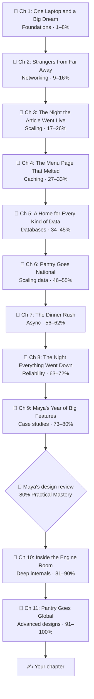

# 📖 The Story: How Pantry Grew Up

> A story told to you, the reader, so the lessons have a reason to exist.
> Every lesson opens with a short **📖 Story** scene and ends with a **📖 Next time…** teaser. Read them for motivation, or skip them when you just want the facts. The lessons work either way.

---

## Pull up a chair

Let me tell you a story.

It begins in a small apartment kitchen, with a laptop, a big idea, and a lot of optimism. **Leo** wants to build **Pantry**, a website where neighbours sell home-cooked meals to each other. He hires **Maya**, a junior engineer who has built websites before but has never designed a *system*.

Over the next hundred lessons, you'll watch Pantry grow from one laptop to a global service feeding millions. Every time it grows, something breaks: a slow page, a crashed server, a double charge, a stampede of fans. And every time, Maya has to learn one new idea (one *atom*) to fix it.

That's the trick of this guide. **You never learn a concept before you need it.** The story creates the need, and the lesson fills it. It's exactly how Richard Feynman believed we learn best: by wrestling with a real question before being handed the answer.

---

## 👥 The cast

| Character | Who they are | Where they appear |
|---|---|---|
| **Maya** | Our hero. She starts as a curious junior engineer and becomes the person who leads design reviews. She asks the questions you'd ask. | Everywhere |
| **Leo** | Pantry's founder. Endlessly enthusiastic, always has a new feature idea, and occasionally causes outages by running reports at lunchtime. | Everywhere |
| **Priya** | Pantry's on-call engineer, whose pager goes off at the worst moments. She teaches Maya that everything fails eventually. | From Chapter 8 |
| **Grandma Rosa** | A home cook whose lasagna is so popular it causes a race condition. | Chapter 5 |
| **You** | The reader. The narrator talks to you directly, and in the final chapter, hands you the pen. | The whole way |

---

## 🍲 What Pantry does (and which lessons each feature teaches)

| Pantry feature | Teaches you |
|---|---|
| Ordering home-cooked meals | Requests, APIs, transactions, idempotency |
| "Top dishes near you" page | Caching, CDNs, invalidation |
| Order history, recipes, chat logs | Databases, indexes, NoSQL, sharding |
| Live courier tracking | UDP vs TCP, WebSockets, geo-indexing |
| The dinner rush | Queues, pub/sub, backpressure |
| Recipe videos | Object storage, transcoding, streaming |
| Cook wallets and payouts | Ledgers, sagas, payment systems |
| Celebrity cooking classes | Contention, waiting rooms, seat holds |
| "Trending now" board | Stream processing, count-min sketch, top-K |

---

## 🗺️ The chapters

| Chapter | Title | Lessons |
|---|---|---|
| 1 | [One Laptop and a Big Dream](phases/01-foundations/README.md) | 001–008 |
| 2 | [Strangers from Far Away](phases/02-networking/README.md) | 009–016 |
| 3 | [The Night the Article Went Live](phases/03-scaling-basics/README.md) | 017–026 |
| 4 | [The Menu Page That Melted](phases/04-caching/README.md) | 027–033 |
| 5 | [A Home for Every Kind of Data](phases/05-databases/README.md) | 034–045 |
| 6 | [Pantry Goes National](phases/06-scaling-data/README.md) | 046–055 |
| 7 | [The Dinner Rush](phases/07-async-messaging/README.md) | 056–062 |
| 8 | [The Night Everything Went Down](phases/08-reliability-ops/README.md) | 063–072 |
| 9 | [Maya's Year of Big Features](phases/09-core-case-studies/README.md) | 073–080 |
| 10 | [Inside the Engine Room](phases/10-deep-internals/README.md) | 081–090 |
| 11 | [Pantry Goes Global](phases/11-advanced-designs/README.md) | 091–100 |

---

## 🧭 How to read it

- **Story mode:** read each lesson's 📖 Story first, and pause. *What would you do in Maya's place?* Guess for 30 seconds, then read the lesson. This is the Feynman habit: attempt it before you're taught.
- **Facts mode:** skip the 📖 parts entirely. Every lesson still stands on its own.
- **Low-energy mode:** read only the 📖 Story and the 🎯 One-sentence idea. That's still progress.

---

➡️ **Begin the story: [Chapter 1, Lesson 001](phases/01-foundations/001-what-is-system-design.md)** · 🏠 [README](README.md)
