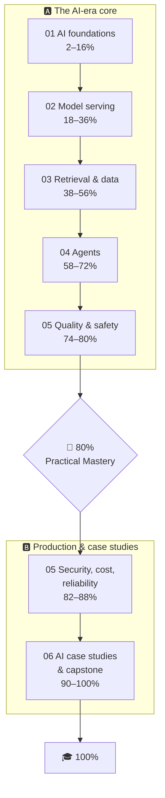

# 🧠 Book 2 · Mastering System Design for the AI Era

**The sequel to [System Design from Atoms](../README.md).** Same author, same Maya, same Pantry, and a new kind of machine at the centre of everything: a model that **thinks in tokens, costs money per word, and is sometimes confidently wrong**.

It's taught the same way: the Richard Feynman way, with plain words, pictures, and explaining things back to yourself. It's built for ADHD brains, with short lessons, one idea per lesson, and visible progress.

> "What I cannot create, I do not understand."
> Richard Feynman, on the blackboard the day he died. And the reason every lesson here ends with you building something.

---

## 🧭 How this book works

- **50 lessons, and each one is 2%.** Your progress is simply the number of lessons you've finished, times two.
- **It builds on Book 1.** Caching, queues, sharding, idempotency, and SLOs are your atoms. Book 2 shows how AI **stretches** every one of them. Each lesson's 🧬 line cites the Book 1 atoms it uses as **[B1·027]**.
- **Most important first.** Lessons **1–40** are the AI-era core. The 🏁 **Practical Mastery gate sits at 80%**. Lessons **41–50** cover security, cost, reliability, and the big case studies.
- **There's a checkpoint every 10%.** Each one has recall questions, an explain-it-aloud task, a mini-design, and interview questions.
- **It's told as a story.** Maya, now a senior engineer, turns Pantry into an AI-native company, and every AI feature she ships breaks something new. 👉 [STORY.md](STORY.md)
- **Every lesson has the same 14-section shape**, so your brain always knows what's next:

| Section | What it gives you |
|---|---|
| 📖 Story | The scene: what just broke, and why *now* |
| 🎯 One-sentence idea | The whole lesson in one line |
| 🧸 Analogy | An everyday picture |
| 🖼️ Visual | A diagram, with a one-line brief |
| 🔬 How it works | 3–6 dense bullets |
| 🧩 Worked example | Real numbers, napkin math, or a tiny bit of code |
| ⚖️ Trade-offs | What you gain vs what you pay |
| 🌍 Real world | Where you'll meet this idea |
| 📌 Cheat card | Rules of thumb, numbers, and tricks |
| 🧪 Feynman check | Explain it back, plus the common confusion |
| ⚡ Quick recall | 3 questions with hidden answers |
| 🎤 Interview practice | One interview question with a model answer |
| 📖 Teaser | A one-line cliffhanger into the next lesson |

👉 **New here? Read [START-HERE.md](START-HERE.md) first (5 min).** Then track your progress in [PROGRESS.md](PROGRESS.md).

---

## 🗺️ The roadmap

| Phase | Lessons | % | What you'll be able to do |
|---|---|---|---|
| [01 AI foundations](phases/01-ai-foundations/README.md) | 001–008 | 2–16% | Speak tokens, estimate GPU memory, and write requirements for a probabilistic feature |
| [02 Model serving](phases/02-model-serving/README.md) | 009–018 | 18–36% | Serve models fast and cheaply: batching, KV cache, quantization, gateways, caching |
| [03 Retrieval & data](phases/03-retrieval-data/README.md) | 019–028 | 38–56% | Ground models in your data with embeddings, vector search, and RAG that respects permissions |
| [04 Agents & orchestration](phases/04-agents/README.md) | 029–036 | 58–72% | Give models tools, memory, and durable, supervised workflows |
| [05 Quality, safety & AI ops](phases/05-quality-safety-ops/README.md) | 037–044 | 74–88% | Measure quality, block attacks, control cost, and roll out models safely |
| [06 AI case studies](phases/06-ai-case-studies/README.md) | 045–050 | 90–100% | Design ChatGPT, enterprise RAG, coding agents, recommenders, and voice assistants end to end |

---

## 📌 Cheatsheets

| Sheet | Use it for |
|---|---|
| [AI-NUMBERS.md](cheatsheets/AI-NUMBERS.md) | Token, latency, GPU, and price numbers worth memorizing |
| [GPU-MATH.md](cheatsheets/GPU-MATH.md) | Weights, KV cache, throughput, and cost formulas |
| [AI-PATTERNS.md](cheatsheets/AI-PATTERNS.md) | "If you hear X, reach for Y" for AI systems |
| [AI-TRADEOFFS.md](cheatsheets/AI-TRADEOFFS.md) | Every AI-era "X vs Y" in one place |
| [AI-INTERVIEW-FRAMEWORK.md](cheatsheets/AI-INTERVIEW-FRAMEWORK.md) | The interview template, extended for AI systems |

Each phase also has its own `CHEATSHEET.md` and `INTERVIEW-QUESTIONS.md`.

## 📚 Reference

- [COVERAGE.md](COVERAGE.md): every AI-era system design topic, mapped to its lesson
- [GLOSSARY.md](GLOSSARY.md): plain-English definitions, linked to their lessons
- [Book 1 lesson template](../templates/lesson-template.md): the shape every lesson follows

---

## 🚀 Quick start

1. Finished Book 1, or at least its Part A? Good. If not, [START-HERE.md](START-HERE.md) lists the ten Book 1 lessons you need.
2. Open [Lesson 001](phases/01-ai-foundations/001-what-changes-in-the-ai-era.md).
3. Do one lesson (about 12 minutes), tick it in [PROGRESS.md](PROGRESS.md), then stop or keep going. Both are fine.
