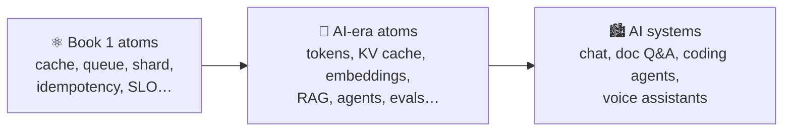
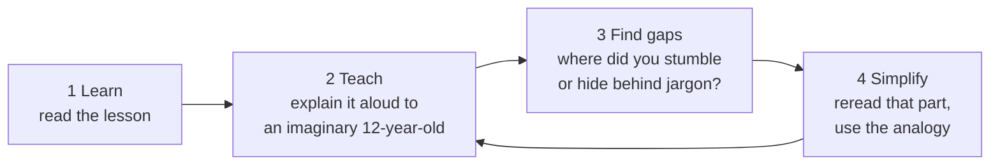

# 🚦 Start Here (Book 2)

> ⏱ 5 min. Read this once, then go straight to [Lesson 001](phases/01-ai-foundations/001-what-changes-in-the-ai-era.md).

## 1. What "system design for the AI era" means

A model is just another component, like a database or a cache. But it's a **strange** one:

| Classic component | A model |
|---|---|
| Same input → same output | Same input → **different** outputs |
| Cost per request ≈ fractions of a cent | Cost **per token**, and it adds up fast |
| Latency in milliseconds | Latency in **seconds**, streamed word by word |
| Wrong answers are bugs | Wrong answers are **normal**, and must be measured |
| Runs on CPUs | Runs on **scarce, expensive GPUs** |

This book teaches the atoms that tame those differences. Every one of them builds on an atom you already know.

## 2. What you need from Book 1

You don't need all of Book 1. You do need these ten atoms. If one feels shaky, reread it first (10 minutes each):

| Atom | Book 1 lesson |
|---|---|
| Latency & percentiles | [003](../phases/01-foundations/003-latency-numbers-and-percentiles.md) |
| Napkin estimation | [005](../phases/01-foundations/005-back-of-envelope-estimation.md) |
| SLOs & error budgets | [007](../phases/01-foundations/007-sla-slo-sli.md) |
| Real-time streaming (SSE) | [016](../phases/02-networking/016-real-time-communication.md) |
| Rate limiting | [024](../phases/03-scaling-basics/024-rate-limiting.md) |
| Caching | [027](../phases/04-caching/027-caching-basics.md) |
| Search & inverted indexes | [043](../phases/05-databases/043-search-and-inverted-index.md) |
| Idempotency | [055](../phases/06-scaling-data/055-idempotency.md) |
| Queues | [057](../phases/07-async-messaging/057-message-queues.md) |
| Observability | [067](../phases/08-reliability-ops/067-observability.md) |

## 3. The Feynman loop (do this for every lesson)

AI is full of words that *sound* like understanding: "embeddings", "attention", "agentic". The 🧪 **Feynman check** in every lesson is your jargon detector. If you can't say it without the buzzword, you don't own it yet.

## 4. ADHD-friendly by design

| Problem | What this book does |
|---|---|
| AI hype is overwhelming | **One idea per lesson, ~12 minutes**, always tied to a concrete failure |
| "Where was I?" | **Numbered lessons, 2% each**, and [PROGRESS.md](PROGRESS.md) |
| Walls of text | **Diagrams, tables, bullets, emoji signposts**, max ~4 lines per paragraph |
| Losing motivation | **A checkpoint every 10%**, and a big 🏁 at 80% |
| Unpredictability | **The same 14-section shape every lesson** |
| Forgetting | **Quick recall + checkpoints + cheatsheets** for spaced review |

### Tips that actually help
- **One lesson, then stop** is a win. Every lesson ends on a ✅ safe stopping point.
- **Read the Story, then pause and guess the fix** before scrolling. A wrong guess sticks better than no guess.
- **Do the napkin math yourself** before reading the worked example. Numbers are where AI designs live or die.
- Keep [AI-NUMBERS.md](cheatsheets/AI-NUMBERS.md) open in another tab.

👉 Ready? [Lesson 001 · What Changes in the AI Era](phases/01-ai-foundations/001-what-changes-in-the-ai-era.md)
