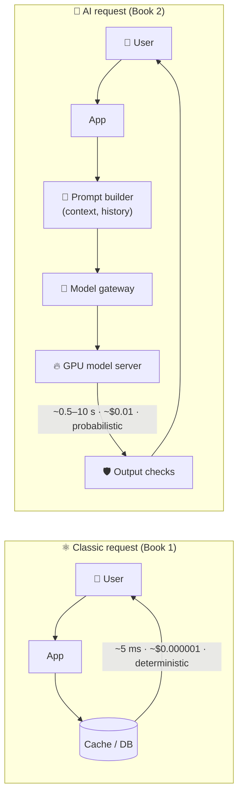

# 001 · What Changes in the AI Era

> ⏱ 10 min · 📈 2% · 🅰️ AI-era core · Phase 01: AI Foundations for System Designers
>
> `░░░░░░░░░░░░░░░░░░░░` 2% of Book 2
>
> 🧬 **Atoms used:** what is system design [B1·001] · estimation [B1·005] · latency & percentiles [B1·003] · SLOs [B1·007] · the "Ask the Chef" capstone [B1·100]

---

## 📖 Story

Tuesday, 11:00. "Ask the Chef" goes live for **10 million** Pantry customers.

By 11:20, three things have happened that never happened in Book 1.

First, a customer asks whether the satay sauce is nut-free. The assistant answers, warmly and **with total confidence**: "Yes, completely nut-free!" The sauce is **made of peanuts**.

Second, the finance dashboard refreshes. The projected bill for the model provider is **$2.1 million per day**. Pantry's entire database fleet costs less than that **per month**.

Third, the p50 response time is **8.4 seconds**. Customers stare at a blank bubble, tap "send" again, and **double the bill**.

Maya stands in front of the incident board with a marker she doesn't know where to point. Nothing is *down*. Every server is healthy. And everything is wrong.

I've been in that room. I told Maya that the model isn't magic. It's a component, like a database, but **a strange one**: slow, expensive per word, and sometimes confidently wrong. Let me show you exactly how strange.

## 🎯 One-sentence idea

**In the AI era, a model is just another component in your system, but one that is priced per token, measured in seconds, probabilistic in its correctness, and starved for scarce GPUs, so every classic atom (caching, queues, rate limits, SLOs) must be re-applied with those four facts in mind.**

## 🧸 Analogy

A **brilliant guest chef**, hired for the restaurant:

- They're **paid by the word**: every word you say to them, and every word they say back (tokens).
- They **think before speaking**, then talk slowly, one word at a time (latency, streaming).
- They're usually right, but sometimes they **invent a dish with total confidence** (hallucination).
- There are only **a few such chefs in the city**, and they're expensive to keep on staff (GPUs).

The restaurant still needs a front door, a queue, a menu, and a manager. The chef just changes **how** you design all of them.

## 🖼️ Visual

*Diagram brief:* two request paths side by side. The classic path (app → cache → database) is cheap, fast, and deterministic. The AI path (app → prompt builder → model gateway → GPU) is priced per token, measured in seconds, and needs a checker on the way out.



## 🔬 How it works

- **Cost scales with words, not requests.** You pay **per token** (~¾ of an English word), for input **and** output, so a long prompt is a cost bug. One request can cost **10,000×** a database read.
- **Latency is seconds, and it streams.** A model "thinks" over your whole prompt, then emits **one token at a time** at ~20–100 tokens/s. A 400-token answer takes **4–20 s** to finish, so you stream it, and you measure **time to first token**.
- **Correctness is probabilistic.** The same question can produce different answers, and some are **fluent and false**. Quality becomes something you **measure with evals**, like latency, rather than assert with unit tests.
- **The scarce resource is GPU memory.** A model's weights (tens to hundreds of GB) and every user's conversation state must fit in **GPU memory**. That memory, not CPU, decides how many users a server can hold.
- **Your data becomes context.** The model knows nothing about Pantry's menu or allergens until you **retrieve** facts and put them in the prompt. Retrieval, freshness, and permissions become core design problems.
- **Every Book 1 atom returns in a new costume:** caching (prompt and semantic caches), rate limiting (by **tokens**), queues (GPU request scheduling), SLOs (adding **quality** and **cost** SLIs), and idempotency (agents that place orders).

## 🧩 Worked example

**Maya's launch-day napkin, redone properly:**

```
10M DAU × 20 messages = 200M messages/day ≈ 2,300/s avg (peak ~7,000/s)
Each message: ~1,500 input tokens (system prompt + history + question)
              ~400 output tokens

Input:  200M × 1,500 = 300B tokens/day × $3 per 1M  = $900,000/day
Output: 200M ×   400 =  80B tokens/day × $15 per 1M = $1,200,000/day
                                                Total ≈ $2.1M/day 😱
```

**Classic vs AI, per request:**

| | Database read | LLM answer |
|---|---|---|
| Latency | ~5 ms | ~0.5 s to first token, ~8 s to finish |
| Cost | ~$0.000001 | ~$0.01 |
| Same input → same output? | Always | No |
| Can be confidently wrong? | No (bugs aside) | Yes, by design |

**So this means:** the model choice, the prompt length, and the answer length are **architecture decisions**, not prompt-tuning details. Cutting the system prompt from 1,000 to 300 tokens saves **$420k/day** on its own. The rest of this book shows how to do even better.

## ⚖️ Trade-offs

| Decision | You gain | You pay |
|---|---|---|
| Use a large frontier model | Best quality and reasoning | Highest cost and latency |
| Use a small model | 10–30× cheaper, faster | More mistakes on hard questions |
| Call a hosted API | No GPUs to run | Per-token price, rate limits, data leaves your network |
| Self-host open weights | Control, privacy, cheaper at scale | GPU operations become your job |

## 🌍 Real world

- Every major AI product (chat assistants, coding tools, search answers) is a **classic distributed system wrapped around a model**: gateways, queues, caches, databases, and observability.
- Providers price **input and output tokens separately**, with output usually **3–5× more expensive**.
- Open-weight serving engines like **vLLM**, **SGLang**, and **TensorRT-LLM** exist because GPU efficiency is the dominant cost.

## 📌 Cheat card

> - **A model = a slow, expensive, probabilistic, GPU-bound component.**
> - **Cost ∝ tokens in + tokens out.** Output tokens cost more.
> - **Latency = time to first token + tokens × time per token.** Stream it.
> - **Quality is measured (evals), not asserted.**
> - **Every Book 1 atom still applies**, re-applied to tokens and GPUs.

## 🧪 Feynman check

Explain the brilliant guest chef to a 12-year-old: why they're paid by the word, why they talk slowly, and why the restaurant still needs a manager checking their dishes.

⚠️ **Common confusion:** "AI systems are a new discipline, so the old system design doesn't apply." The opposite is true. The model is **one box**. Everything around it (queues, caches, rate limits, retries, observability) is classic system design, and it's where most AI products succeed or fail.

## ⚡ Quick recall

1. What are the four facts that make a model a strange component?
<details><summary>Reveal Answer</summary>

It's priced per token, its latency is measured in seconds and streams, its correctness is probabilistic, and it's bound by scarce GPU memory.
</details>

2. Roughly how many English words is one token?
<details><summary>Reveal Answer</summary>

About three-quarters of a word (≈ 4 characters of English text).
</details>

3. Why did a shorter system prompt save Pantry so much money?
<details><summary>Reveal Answer</summary>

The system prompt is sent as input tokens with every message, so 700 fewer tokens × 200M messages/day removes 140B input tokens a day.
</details>

## 🎤 Interview practice

**Q. "What's fundamentally different about designing a system that has an LLM in its critical path?"**
<details><summary>Model answer</summary>

- **Four new constraints:**
  - **Cost per token**, input and output, which makes prompt length and answer length first-class design parameters.
  - **Latency in seconds**, dominated by generation, which demands **streaming** and new metrics (TTFT, time per output token).
  - **Probabilistic correctness:** you need **evals, guardrails, and grounding** (retrieval), not just tests.
  - **GPU-bound capacity:** throughput depends on GPU memory and batching, and capacity is scarce and slow to add.
- **What stays the same:** the surrounding system is classic: a gateway with auth and **token-based rate limits**, queues for load, caching (exact prompt-prefix and semantic), SLOs, observability, and idempotency for any action the model triggers.
- **Design implication:** treat the model as an **unreliable, expensive dependency** behind a gateway, with timeouts, fallbacks to smaller models, and output validation.
- **Likely follow-up:** "How would you estimate the cost?" → messages/day × (input tokens × input price + output tokens × output price), then show how caching, shorter prompts, and smaller models cut it.
</details>

## 📖 Teaser

> 📖 *Maya now knows the model is strange. Next she has to know why it's slow: what actually happens inside those 8.4 seconds, from the moment a question leaves a customer's phone.*

---

⬅️ [📕 Book 1 · Capstone](../../../phases/11-advanced-designs/100-capstone.md) · 🗺️ [Phase map](README.md) · ➡️ [002 · The Life of an LLM Request](002-life-of-an-llm-request.md)

✅ **Safe stopping point.** Tick lesson 001 in [PROGRESS.md](../../PROGRESS.md).
