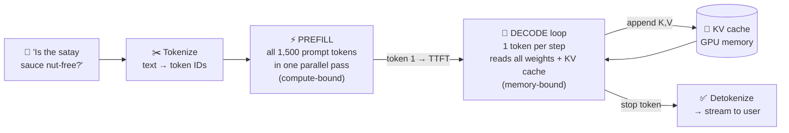

# 002 · The Life of an LLM Request

> ⏱ 12 min · 📈 4% · 🅰️ AI-era core · Phase 01: AI Foundations for System Designers
>
> `░░░░░░░░░░░░░░░░░░░░` 4% of Book 2
>
> 🧬 **Atoms used:** life of a request [B1·002] · latency vs throughput [B1·004] · real-time streaming [B1·016] · [001]

---

## 📖 Story

Maya opens a trace of one slow request. **8.4 seconds**, end to end.

She expects to find the culprit in a familiar place: a slow database, a cold cache, a DNS hiccup. She finds none of them. The app server took **11 ms**. The network took **40 ms**. Everything she knows how to fix adds up to **less than one percent**.

The other **8.3 seconds** sit inside a single span labelled `model.generate`. One grey bar, no children. A black box.

She zooms in on the GPU metrics. For the first **0.4 s**, the GPU's compute units are **pinned at 90%**. Then, for the next **7.9 s**, compute drops to **under 10%**, while memory bandwidth is maxed out. Same request, two completely different personalities.

I told Maya that this grey bar has **two phases inside it**, and they're bottlenecked on different things. Until you can see them, you can't fix either one. Let me open the black box.

## 🎯 One-sentence idea

**An LLM request has two phases: prefill, which reads the whole prompt in one parallel, compute-heavy pass and produces the first token, and decode, which generates the rest one token at a time in a memory-bandwidth-bound loop, so first-token latency and per-token speed are separate problems with separate fixes.**

## 🧸 Analogy

A **chef reading an order, then plating a tasting menu**:

- **Prefill = reading the whole order slip.** The chef reads everything at once, fast and in parallel: allergies, preferences, the full history of the table. Then they announce the first course.
- **Decode = plating one course at a time.** Each course depends on the previous one, so it can't be parallelized. And for every course, the chef walks to the **giant pantry** (GPU memory) to fetch every ingredient again.
- The reading is limited by **how fast the chef thinks** (compute). The plating is limited by **how fast they can walk to the pantry** (memory bandwidth).

## 🖼️ Visual

*Diagram brief:* a request flows left to right through tokenization, then a fat "prefill" block that processes all prompt tokens at once and emits token 1, then a loop of thin "decode" steps, each emitting one token and appending to the KV cache, until a stop token. A timeline underneath marks TTFT at the end of prefill.



## 🔬 How it works

- **Tokenize:** the text becomes integers from a fixed vocabulary (~100k–200k entries). "nut-free" might be 3 tokens. This takes **< 1 ms** on a CPU.
- **Prefill:** the model processes **every prompt token in parallel**, computing an internal summary of each (its **keys and values**). It costs roughly **2 × parameters × prompt tokens** floating-point operations, so it's **compute-bound**, and it ends by producing the **first output token**. Its duration is most of the **time to first token (TTFT)**.
- **Decode:** each new token requires a full pass through the model, **reading every weight from GPU memory** plus the cached keys and values of all previous tokens. With little math per byte read, decode is **memory-bandwidth-bound**. Its speed is the **time per output token (TPOT)**.
- **The KV cache:** the keys and values from prefill and each decode step are **kept in GPU memory**, so the model never re-reads the prompt. It grows by one entry per token, per request, and it's the main thing competing for GPU memory (lesson 011).
- **Stop and stream:** decoding ends at a stop token or a **max-token limit**. Each token is detokenized and **streamed** to the client as it's produced (lesson 014).

## 🧩 Worked example

**A 70-billion-parameter model on 2 GPUs (each ~1,000 TFLOPS, ~3.35 TB/s memory bandwidth), 1,500 prompt tokens, 400 output tokens:**

```
Prefill compute:  2 × 70B params × 1,500 tokens = 2.1 × 10¹⁴ FLOPs
                  ÷ (2 GPUs × ~500 TFLOPS achieved)   ≈ 0.21 s  → TTFT ≈ 0.25 s

Decode, per token: read all weights = 70B × 2 bytes = 140 GB
                  ÷ (2 GPUs × 3.35 TB/s)              ≈ 21 ms per token
400 tokens × 21 ms                                    ≈ 8.4 s 😬
```

**Maya's trace, decoded:** 0.4 s of prefill (compute pinned, extra queueing included), then **400 decode steps at ~20 ms each**, memory bandwidth maxed and compute idle. The "slowness" isn't a bug. It's **physics**: every token re-reads 140 GB.

**So this means:**
- To cut **TTFT**, shrink or cache the prompt (lesson 018), or add compute.
- To cut **total time**, generate **fewer output tokens**, use a **smaller or quantized model** (fewer bytes to read, lesson 012), or **predict several tokens per step** (lesson 017).
- To cut **cost**, let many requests **share each weight read** (batching, lesson 010).

## ⚖️ Trade-offs

| Lever | Helps | Costs |
|---|---|---|
| Shorter prompts | TTFT and input cost | Less context for the model |
| Shorter answers (`max_tokens`, concise style) | Total latency and output cost | Less detailed answers |
| Smaller model | Faster decode, cheaper | Lower quality |
| Bigger batches | Throughput and cost per token | Each user's TPOT rises a little |

## 🌍 Real world

- Serving engines (**vLLM, SGLang, TensorRT-LLM**) schedule prefill and decode differently, and some **split them onto separate GPUs** ("disaggregated serving") because their bottlenecks differ.
- Provider dashboards report **TTFT** and **output tokens per second** as separate metrics for exactly this reason.
- Reasoning models spend thousands of **hidden "thinking" tokens** in decode before answering, which is why they're slower and pricier.

## 📌 Cheat card

> - **Tokenize → prefill → decode loop → detokenize + stream.**
> - **Prefill:** parallel, **compute-bound**, sets **TTFT**. ~2 × params × prompt tokens FLOPs.
> - **Decode:** sequential, **memory-bound**, sets **TPOT**. Each step reads **all weights**.
> - **KV cache** stores past tokens' keys and values in GPU memory.
> - **Total ≈ TTFT + output tokens × TPOT.**

## 🧪 Feynman check

Explain the chef reading the order slip and then plating course by course: why reading is fast but plating is slow, and why the chef's walking speed to the pantry matters more than how fast they think.

⚠️ **Common confusion:** "A faster GPU (more FLOPS) makes generation faster." For decode, the limit is **memory bandwidth**, not FLOPS. A GPU with twice the compute but the same bandwidth barely changes the per-token speed of a single request.

## ⚡ Quick recall

1. Which phase determines time to first token, and what limits it?
<details><summary>Reveal Answer</summary>

Prefill. It processes the whole prompt in parallel and is limited by compute (FLOPs).
</details>

2. Why is decode memory-bandwidth-bound?
<details><summary>Reveal Answer</summary>

Each generated token requires reading all the model's weights (and the KV cache) from GPU memory, with very little computation per byte read.
</details>

3. What's the formula for total generation time?
<details><summary>Reveal Answer</summary>

Total ≈ TTFT + (number of output tokens × time per output token).
</details>

## 🎤 Interview practice

**Q. "Users complain our LLM feature is slow. How do you break down the latency and decide what to fix?"**
<details><summary>Model answer</summary>

- **Measure the phases separately:** queue wait, **TTFT** (prefill), **TPOT** (decode), output length, and network/streaming overhead. Trace them as child spans of the model call.
- **If TTFT dominates:**
  - Long prompts → trim the system prompt and history, summarize old turns, and use **prefix caching** for the shared system prompt.
  - Queueing → add capacity, or prioritize interactive traffic over batch jobs.
- **If decode dominates:**
  - Too many output tokens → set `max_tokens`, ask for concise answers, and use structured outputs.
  - Slow per token → a **smaller or quantized model**, speculative decoding, or more GPUs per replica (tensor parallelism).
- **Perceived latency:** **stream** tokens so users read while the model writes. Show progress for tool calls.
- **Likely follow-up:** "Why not just batch more to save money?" → bigger batches raise throughput and cut cost per token, but each user's TPOT rises, so set a **TPOT SLO** and cap the batch size to meet it.
</details>

## 📖 Teaser

> 📖 *The black box is open now, and every slice of it is measured in one unit Maya has never budgeted before: the token. How many fit, and what happens when a conversation runs out of room?*

---

⬅️ [001 · What Changes in the AI Era](001-what-changes-in-the-ai-era.md) · 🗺️ [Phase map](README.md) · ➡️ [003 · Tokens & Context Windows](003-tokens-and-context-windows.md)

✅ **Safe stopping point.** Tick lesson 002 in [PROGRESS.md](../../PROGRESS.md).
