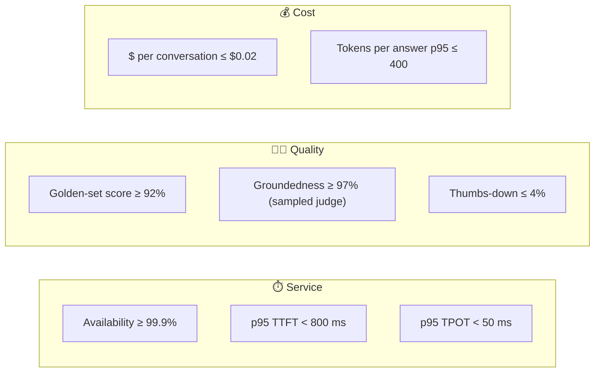

# 007 · AI SLOs: Quality, Latency & Cost

> ⏱ 11 min · 📈 14% · 🅰️ AI-era core · Phase 01: AI Foundations for System Designers
>
> `██░░░░░░░░░░░░░░░░░░` 14% of Book 2
>
> 🧬 **Atoms used:** SLA/SLO/SLI & error budgets [B1·007] · observability [B1·067] · [004] · [006]

---

## 📖 Story

Wednesday, 15:00. Every panel on Maya's SLO board is green. **Availability 99.97%. p95 TTFT 0.7 s. p95 TPOT 31 ms.**

At 15:40, the thumbs-down rate on answers jumps from **3% to 11%**. Nobody gets paged, because no SLO covers it.

By Friday, customers are posting screenshots: the chef recommends "a light **two-hour** marinade" for a dish Pantry says needs **overnight**, and it answers questions about **competitors' menus**.

The cause takes a day to find. The model provider rolled out a **new snapshot** of the model on Wednesday afternoon. Same name. Same API. Same latency. Different behaviour.

I told Maya her SLOs measured whether the chef **showed up and spoke quickly**. None of them measured whether the chef **cooked well**, or **what it cost**. In AI systems, that's two-thirds of the job. Let me show you the missing SLIs.

## 🎯 One-sentence idea

**AI features need SLOs on three axes (latency and availability as before, plus quality, measured by evals and user signals, and cost, measured per request), because a model can be fast and available while silently getting worse or more expensive.**

## 🧸 Analogy

A **restaurant inspector with three clipboards**:

- **Service:** were you seated quickly, and did the food arrive? (availability, TTFT, TPOT)
- **Taste:** was the food actually good? Blind tasting of a few plates every hour, plus how many diners sent food back. (quality)
- **Cost:** what did each plate cost the kitchen? (tokens and dollars per request)

A kitchen that's fast and cheap but serves bad food **still fails inspection**.

## 🖼️ Visual

*Diagram brief:* three SLO panels side by side, labelled Service, Quality, and Cost. Each panel lists its SLIs and SLO targets, and an error-budget gauge sits under each one. The Quality panel's gauge is draining fast, while the others are full.



## 🔬 How it works

- **Service SLIs** (from Book 1, refined): availability, error rate, **p95 TTFT** and **p95 TPOT** (lesson 004), and **goodput**.
- **Quality SLIs**, measured three ways:
  - **Offline:** a **golden set** of hundreds of real questions with expected answers, run hourly against production (lesson 037).
  - **Online:** a **sample** (e.g., 1%) of live answers scored by an **LLM judge** for groundedness and policy (lesson 038).
  - **User signals:** thumbs-down rate, regenerate rate, and human-handoff rate.
- **Cost SLIs:** **tokens and dollars per request and per conversation**, cache hit rate, and the share of traffic on expensive models. Cost regressions are outages for the business.
- **Error budgets for quality:** with "groundedness ≥ 97%" you have a **3% budget**. Burning it fast freezes prompt and model changes, just like a reliability error budget.
- **Pin and watch versions:** use **dated model snapshots**, never "latest" aliases. Record the model version on every request, and alert on any SLI shift that lines up with a version change.

## 🧩 Worked example

**Maya's AI SLO sheet for "Ask the Chef":**

| SLI | How it's measured | SLO | Window |
|---|---|---|---|
| Availability | Successful responses ÷ requests | ≥ 99.9% | 28 days |
| TTFT | p95 from the gateway | < 800 ms | 28 days |
| Golden-set score | 400 cases × 3 runs, hourly | ≥ 92% | rolling 24 h |
| Groundedness | 1% sample, LLM judge, human-audited weekly | ≥ 97% | 7 days |
| Thumbs-down rate | Explicit feedback ÷ rated answers | ≤ 4% | 7 days |
| Cost per conversation | Σ token cost ÷ conversations | ≤ $0.02 | daily |

**Wednesday, replayed with the new SLOs:**

```
15:00  model snapshot changes (the gateway logs version=2026-09-30)
15:20  hourly golden set: 94% → 86%      🔴 burn alert: quality budget
15:21  page Maya: "golden-set drop correlated with model version change"
15:30  gateway pins the previous snapshot, and the score returns to 94%
```

**Time to detect: 2 days → 20 minutes.** Customers never see the overnight-marinade advice.

## ⚖️ Trade-offs

| Decision | You gain | You pay |
|---|---|---|
| Hourly golden-set runs | Fast regression detection | Eval token costs (small vs traffic) |
| LLM-judge sampling | Coverage of real traffic | Judge errors, so calibrate with humans |
| User feedback SLIs | The ground truth of satisfaction | Sparse and slow, biased toward complainers |
| Pinned model snapshots | Stability and reproducibility | You must schedule upgrades yourself |

## 🌍 Real world

- Providers offer **dated snapshots** and deprecation schedules precisely so customers can pin behaviour.
- LLM observability platforms track **quality scores, cost, and latency** per prompt version and model version together.
- Mature AI teams gate every prompt or model change on **eval results**, like CI gates code on tests.

## 📌 Cheat card

> - **Three SLO families: service, quality, cost.**
> - **Quality = golden set (offline) + sampled judge (online) + user signals.**
> - **Cost per request/conversation is an SLI.** Alert on it.
> - **Quality error budgets** freeze changes when burned.
> - **Pin dated model versions.** Log the version on every request.

## 🧪 Feynman check

Explain the inspector with three clipboards, and why a kitchen that's fast and cheap can still fail.

⚠️ **Common confusion:** "If latency and errors are fine, the AI feature is healthy." A model can return **HTTP 200 in 700 ms with a wrong answer**. Without quality SLIs, the worst AI incidents are **invisible** to classic monitoring.

## ⚡ Quick recall

1. What are the three families of AI SLOs?
<details><summary>Reveal Answer</summary>

Service (availability and latency), quality (evals, sampled judging, user signals), and cost (tokens and dollars per request or conversation).
</details>

2. Name three ways to measure quality in production.
<details><summary>Reveal Answer</summary>

A golden set run regularly against production, an LLM judge scoring a sample of live answers, and user signals like thumbs-down or regenerate rates.
</details>

3. Why pin a dated model snapshot instead of a "latest" alias?
<details><summary>Reveal Answer</summary>

So the model's behaviour can't change under you without warning, and every quality shift can be traced to a version change you made deliberately.
</details>

## 🎤 Interview practice

**Q. "Define the SLOs and alerting for an LLM-powered support assistant. How would you catch a silent quality regression?"**
<details><summary>Model answer</summary>

- **Service:** availability ≥ 99.9%, p95 TTFT < 1 s, p95 TPOT < 50 ms, with multi-window burn-rate alerts (Book 1, lesson 007).
- **Quality:**
  - A **golden set** of ~500 representative and adversarial cases, run on a schedule against production (each case several times, because outputs vary).
  - **Online judging** of a 1–2% sample for groundedness, correctness, and policy compliance, with weekly human calibration of the judge.
  - **User signals:** thumbs-down, regenerate, escalate-to-human, and resolution rate.
- **Cost:** tokens and $ per conversation, cache hit rate, and spend per tenant, with anomaly alerts.
- **Catching silent regressions:** pin model versions, log version + prompt hash per request, run the golden set on every change **and** hourly, and alert when quality SLIs shift. A canary for prompt and model changes (lesson 044) compares quality before full rollout.
- **Likely follow-up:** "Who owns the quality budget?" → the product team owning the feature, with the same rule as reliability budgets: when it's burned, changes freeze until it recovers.
</details>

## 📖 Teaser

> 📖 *Now Maya can measure good, fast, and cheap. Then the product team asks for something far vaguer: "Make the chef smarter," and she realizes nobody has written down what smarter means.*

---

⬅️ [006 · Non-Determinism & Probabilistic Outputs](006-non-determinism.md) · 🗺️ [Phase map](README.md) · ➡️ [008 · Requirements for AI Features](008-ai-requirements.md)

✅ **Safe stopping point.** Tick lesson 007 in [PROGRESS.md](../../PROGRESS.md).
