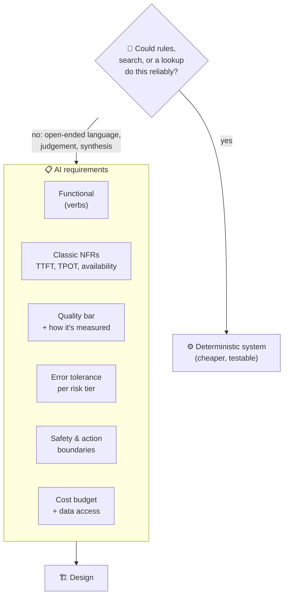

# 008 · Requirements for AI Features

> ⏱ 12 min · 📈 16% · 🅰️ AI-era core · Phase 01: AI Foundations for System Designers
>
> `███░░░░░░░░░░░░░░░░░` 16% of Book 2
>
> 🧬 **Atoms used:** functional vs non-functional requirements [B1·008] · SLOs [B1·007] · estimation [B1·005] · [006] · [007]

---

## 📖 Story

The product brief for "Ask the Chef v2" is one sentence long: **"Make the chef smarter, and let it handle orders."**

Maya's old instinct kicks in, and she starts drawing boxes: a bigger model, a vector database, an agent framework. Two hours later, the whiteboard is full, and she can't answer the simplest question in the review: **"How will we know v2 is better than v1?"**

Then come the harder ones. "What's it allowed to get wrong?" "What can it **do** without asking?" "What's the most we'll pay per conversation?" "What happens when the model is down?"

She has no answers, because nobody wrote down the **requirements**. And in AI features, the requirements that matter most aren't on any classic checklist.

I told Maya that Book 1's rule still holds: **requirements before boxes**. AI just adds five new questions to the list, and a sixth that saves the most money of all: **"Should this be AI at all?"** Let me show you the checklist.

## 🎯 One-sentence idea

**Requirements for an AI feature add five dimensions to the classic functional and non-functional list (a measurable quality bar, an explicit tolerance for errors, safety and action boundaries, a cost budget per interaction, and the data the model may see) plus one gate question: could a deterministic system do this better?**

## 🧸 Analogy

**Hiring a new chef**, not buying an oven:

- An oven has a **spec sheet**: temperature, capacity, power. (Classic requirements.)
- A chef needs a **job description**: what dishes they cook, the **taste standard** they're judged on, what mistakes are **forgivable** (a slightly salty soup) and which are **firing offences** (an allergen), what they may **buy without asking**, their **food budget**, and which recipes are **secret**.
- And before hiring anyone, ask: **is this a job for a vending machine?**

## 🖼️ Visual

*Diagram brief:* a funnel. At the top, the gate "Could rules or a lookup do this?" diverts some work to a deterministic path. Below it, six requirement boxes in a row (functional, classic non-functional, quality bar, error tolerance, safety and actions, cost and data), feeding into a single "design" box at the bottom.

## 🔬 How it works

- **The gate question:** use AI for **open-ended language, judgement, and synthesis**. Use deterministic code for **lookups, calculations, and rules** (order status, prices, allergen lists). Most AI features are **hybrids**: deterministic facts with AI phrasing.
- **Quality bar, made measurable:** "smarter" becomes "≥ 90% on a 400-case golden set of real customer questions, judged by a rubric", with a baseline from v1 and a target for v2 (lessons 007, 037).
- **Error tolerance by risk tier:** list the failure types, what each one costs, and its allowed rate. A bland suggestion: tolerable. A wrong price: < 0.1%. A wrong allergen: **0, enforced by a verifier**.
- **Safety and action boundaries:** what may it **say** (off-topic, competitors, medical claims)? What may it **do** alone (search, add to cart), and what needs a **human confirmation** (pay, refund, cancel, lesson 036)?
- **Cost and data:** a **budget per interaction** (e.g., ≤ $0.02 per conversation) that the design must fit, and an explicit list of the data the model may see, store, and send to a third party (PII, private kitchen documents, lesson 044).
- **Classic NFRs, in AI units:** TTFT and TPOT targets, availability, a **degraded mode** when the model is down (lesson 043), and peak scale in **tokens/s**, not just requests/s.

## 🧩 Worked example

**Ask the Chef v2: the one-page requirements Maya brings back:**

| Area | Requirement |
|---|---|
| Functional | Answer cooking and menu questions, recommend dishes, build a cart, place an order on confirmation, track orders |
| Deterministic parts | Prices, allergens, order status, delivery ETA: looked up, never generated |
| Quality bar | ≥ 90% on the golden set (v1 baseline: 81%), thumbs-down ≤ 4% |
| Error tolerance | Allergen: 0 (verifier). Price/status: 0 (rendered from DB). Recommendations: judged "reasonable" ≥ 95% |
| Actions | Search and add to cart: autonomous. Pay, cancel, refund: explicit user confirmation |
| Must not | Give medical or diet-treatment advice, discuss competitors, reveal the system prompt |
| Latency | p95 TTFT < 800 ms, p95 TPOT < 50 ms. An order placed within 3 s of confirmation |
| Cost | ≤ $0.02 per conversation on average, and ≤ $0.10 for any single conversation |
| Data | Order history and profile allowed. Payment details never enter a prompt. No training on customer chats without consent |
| Scale | 10M DAU, peak 7k messages/s ≈ 10M input tokens/s |
| Degraded mode | Model down → menu search + order tracking still work, with a "chef is busy" banner |

**So this means:** a third of v2 is **not AI at all**. Prices, allergens, and status come from services Maya already runs, so the model's job shrinks to understanding and phrasing, which makes a **smaller, cheaper model** viable for most turns.

## ⚖️ Trade-offs

| Decision | You gain | You pay |
|---|---|---|
| Strict quality bar | Confidence to ship | Time building the golden set |
| Zero-tolerance tiers via verifiers | Hard guarantees | Engineering per critical field |
| Human confirmation for actions | Safety, trust | Friction, lower automation rate |
| Tight cost budget | Sustainable unit economics | Forces smaller models and caching |
| Deterministic-first hybrid | Reliability, lower cost | Less "magical" flexibility |

## 🌍 Real world

- Mature AI teams write **eval-first specs**: the golden set and rubric exist **before** the prompt does.
- Responsible-AI reviews ask exactly these questions: **intended use, failure modes, human oversight, and data handling**.
- Many successful "AI features" are mostly **search, rules, and templates**, with a model handling only the language at the edges.

## 📌 Cheat card

> - **Gate first: could rules or a lookup do it?**
> - **Quality bar = golden set + rubric + baseline + target.**
> - **Error tolerance per risk tier.** Zero-tolerance → verifier.
> - **Actions: autonomous vs confirm.** "Must not" list.
> - **Cost per interaction + data boundaries + degraded mode.**

## 🧪 Feynman check

Explain the difference between buying an oven and hiring a chef, and why the job description needs a list of forgivable and unforgivable mistakes.

⚠️ **Common confusion:** "AI requirements are just 'be accurate and fast'." Without a **measurable** quality bar, error tolerances **per failure type**, action boundaries, and a cost budget, you can't decide between designs, or tell whether v2 beat v1.

## ⚡ Quick recall

1. What gate question comes before any AI design?

Reveal Answer

Could a deterministic system (rules, search, or a lookup) do this reliably and more cheaply?

2. How do you make "smarter" a requirement?

Reveal Answer

Define a golden set of real cases and a scoring rubric, measure the current baseline, and set a target score.

3. Name three AI-specific requirement areas beyond the classic ones.

Reveal Answer

Any three of: a measurable quality bar, error tolerance by risk tier, safety and action boundaries, a cost budget per interaction, and data access rules.

## 🎤 Interview practice

**Q. "You're asked to add an AI assistant that can answer questions and issue refunds for an e-commerce site. What requirements do you gather before designing?"**

Model answer

- **Gate:** refund eligibility is a **rules engine** (policy, order state, amount), not a model decision. The model's job is understanding the request and explaining the outcome.
- **Functional:** answer order and product questions, check refund eligibility, initiate refunds, and escalate to humans.
- **Quality bar:** a golden set of real support tickets, with a target resolution accuracy (e.g., ≥ 90%) and a v0 baseline.
- **Error tolerance:** a wrong refund amount = **0** (amount computed by the rules engine). A missed escalation < 1%. Tone issues tolerable.
- **Action boundaries:** refunds **≤ $50** auto-approved by policy, larger ones need human approval. Every action is idempotent and audited.
- **Safety:** no legal or medical advice, prompt-injection resistance (order notes can contain attacker text), and PII redaction in logs.
- **Latency and cost:** p95 TTFT < 1 s, ≤ $0.05 per resolved ticket (compare with ~$5 for a human agent).
- **Degraded mode:** model down → route to human queue and self-service forms.
- **Likely follow-up:** "How do you prove it's working after launch?" → online quality SLIs (resolution rate, escalation rate, refund error audits) and a quality error budget (lesson 007).

## 📖 Teaser

> 📖 *The requirements are signed, and Maya's next stop is the machine room itself: the GPUs she's been renting by the hour without knowing what's actually inside them.*

---

⬅️ [007 · AI SLOs: Quality, Latency & Cost](007-ai-slos.md) · 🗺️ [Phase map](README.md) · ➡️ [009 · GPUs & Accelerators for Designers](../02-model-serving/009-gpus-and-accelerators.md)

✅ **Safe stopping point.** Tick lesson 008 in [PROGRESS.md](../../PROGRESS.md). 🎉 **Phase 01 complete!** Skim the [Phase 01 cheatsheet](CHEATSHEET.md) and try the [interview bank](INTERVIEW-QUESTIONS.md).
