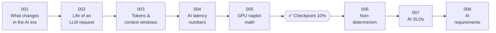

# 🧱 Phase 01: AI Foundations for System Designers

> **Lessons 001–008 · 2% → 16% · 🅰️ AI-era core**
> By the end of this phase you'll **think in tokens**, **estimate GPUs on a napkin**, and **write requirements for a feature that's sometimes wrong**.

## 📖 Chapter 1: Pantry Learns to Talk

"Ask the Chef" launched on a Tuesday, and by lunchtime it had told a customer that a peanut sauce was nut-free, run up a $2.1-million-a-day bill, and left people staring at an empty chat bubble for eight seconds. Nothing was down. Everything was wrong. In this chapter, I'll show you what Maya learned first: what actually happens inside a model call, why words cost money and time, how to size GPUs, and how to write requirements for a component that is fluent, slow, expensive, and occasionally, confidently wrong.

## 🗺️ Phase map

| # | Lesson | ⏱ | One-line idea |
|---|---|---|---|
| 001 | [What changes in the AI era](001-what-changes-in-the-ai-era.md) | 10 min | A model is a slow, expensive, probabilistic, GPU-bound component, and every classic atom still applies |
| 002 | [The life of an LLM request](002-life-of-an-llm-request.md) | 12 min | Prefill reads the prompt (compute-bound, sets TTFT). Decode writes token by token (memory-bound, sets TPOT) |
| 003 | [Tokens & context windows](003-tokens-and-context-windows.md) | 11 min | The context window is a budget: pin the rules, summarize the past, never truncate blindly |
| 004 | [AI latency numbers](004-ai-latency-numbers.md) | 11 min | TTFT, TPOT, and end-to-end at percentiles. The tail is queueing |
| 005 | [GPU napkin math](005-gpu-napkin-math.md) | 13 min | Weights + KV cache + prefill compute: the tightest budget sizes the fleet |
| ✅ | [Checkpoint 10%](checkpoint-10.md) | 20 min | |
| 006 | [Non-determinism](006-non-determinism.md) | 12 min | Outputs are samples. Ground, constrain, and verify what matters |
| 007 | [AI SLOs](007-ai-slos.md) | 11 min | Service, quality, and cost SLOs, because fast and wrong is still down |
| 008 | [Requirements for AI features](008-ai-requirements.md) | 12 min | Quality bar, error tolerance, action limits, cost, data, and "should this be AI at all?" |

📌 [Phase cheatsheet](CHEATSHEET.md) · 🎤 [Phase interview questions](INTERVIEW-QUESTIONS.md)

➡️ Next phase: [02 Model serving & inference infrastructure](../02-model-serving/README.md)
