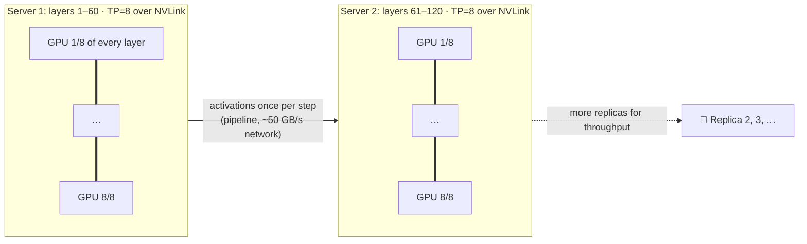

# 013 · Tensor & Pipeline Parallelism

> ⏱ 13 min · 📈 26% · 🅰️ AI-era core · Phase 02: Model Serving & Inference Infrastructure
>
> `█████░░░░░░░░░░░░░░░` 26% of Book 2
>
> 🧬 **Atoms used:** vertical vs horizontal scaling [B1·017] · sharding [B1·049] · replication [B1·046] · [005] · [009]

---

## 📖 Story

Pantry launches **"Plan My Week"**: a full seven-day meal plan, balanced for a family's diets, budget, and leftovers. The 70B model's plans keep repeating Tuesday's lasagna on Friday. The model that plans well has **400 billion parameters**.

In FP8, that's **400 GB** of weights. Maya's biggest server has **640 GB**. It fits, with **~200 GB** left for conversations, but each decode step now reads 400 GB through the whole server's bandwidth: **TPOT 18 ms** at batch 1, and rising fast as the batch grows.

Then product asks for the **long-context version**: whole family histories, 100k tokens each. That's **16 GB of KV cache per family**, and room for **twelve** families per server.

Maya considers splitting the model across **two servers**. Her first test does it naively, and TPOT goes from 18 ms to **140 ms**, because every layer now waits for a network hop.

I told Maya that when a model outgrows one GPU, **how you cut it** matters more than how many GPUs you buy. Cut along the fast wires, never across the slow ones. Let me show you the three cuts.

## 🎯 One-sentence idea

**When a model doesn't fit or isn't fast enough on one GPU, split it: tensor parallelism slices every layer across GPUs joined by fast links inside a server, pipeline parallelism places groups of layers on different servers, expert parallelism spreads a mixture-of-experts model's experts, and identical replicas add throughput.**

## 🧸 Analogy

A **giant banquet** that one kitchen can't handle:

- **Tensor parallelism:** several chefs work on **the same dish at the same time**, each chopping a portion, constantly passing bowls through a **hatch**. Fast, but only works if the hatch is right there (NVLink).
- **Pipeline parallelism:** an **assembly line across buildings**: kitchen A does starters, kitchen B the mains. Each kitchen passes plates **once** per course over the street, but someone's always waiting at the start and end.
- **Expert parallelism:** a food hall of **specialist stalls**. Each order visits only the two stalls it needs.
- **Replicas:** **more identical restaurants** for more customers.

## 🖼️ Visual

*Diagram brief:* two 8-GPU servers. Inside each server, every layer is sliced across all eight GPUs (tensor parallel), with thick NVLink bars. The first server holds layers 1–60, the second holds layers 61–120 (pipeline parallel), joined by one thin network arrow carrying activations once per step. A third, faded copy of the pair labelled "replica" sits beside them.



## 🔬 How it works

- **Tensor parallelism (TP):** split each layer's weight matrices across N GPUs. Each GPU reads **1/N of the weights**, so decode is up to **N× faster**, but every layer ends with an **all-reduce** across GPUs. Keep TP **inside one server** on NVLink (~900 GB/s). Across the network (~50 GB/s), the all-reduces dominate.
- **Pipeline parallelism (PP):** put consecutive layer groups on different GPUs or servers, passing activations **once per stage**. It's network-friendly and adds capacity, but **doesn't cut per-token latency**, and creates **bubbles** (idle stages) unless many requests are in flight.
- **Expert parallelism (EP):** in **mixture-of-experts (MoE)** models, each token activates only a few experts (e.g., 2 of 64), so compute per token is a fraction of the total parameters. Still, **all experts must be in memory** somewhere. Experts are spread across GPUs, and tokens are routed to them with all-to-all traffic.
- **Data parallelism (replicas):** copies of the whole sharded model behind a load balancer. This is how you add **throughput** once one replica meets the latency SLO.
- **The usual recipe:** **TP within a server, PP across servers only when necessary, replicas for throughput**. Size the TP degree from the TPOT SLO, and the replica count from the traffic (Little's Law).

## 🧩 Worked example

**"Plan My Week" on a 400B model, FP8 (400 GB), H100-class servers:**

```
Option A: one server, TP=8
  Weights per GPU = 400 / 8 = 50 GB → 30 GB per GPU left − overhead → ~200 GB KV per server
  Decode bytes/step ≈ 400 GB + KV → ÷ 26.8 TB/s ≈ 15–25 ms TPOT ✅
  Long-context family (100k tokens × ~0.16 MB) ≈ 16 GB → ~12 per server 😬

Option B: two servers, TP=8 within each × PP=2 across
  Weights per server = 200 GB → ~400 GB KV per server, ~800 GB per replica
  ~50 long-context families per replica (~4× option A)
  Latency: + one network hop per step for activations
    (~a few MB per step at 50 GB/s → < 1 ms) ✅

Maya's naive attempt: TP=16 ACROSS the two servers
  Every layer's all-reduce crosses the network → 120 layers × ~1 ms → TPOT 140 ms ❌
```

**The decision:** standard plans use **Option A replicas** (cheapest per token). Long-context family plans go to an **Option B pool**. Both meet the **TPOT < 40 ms** SLO.

## ⚖️ Trade-offs

| Strategy | You gain | You pay |
|---|---|---|
| Tensor parallel | Lower TPOT, more memory per replica | Needs NVLink, communication every layer |
| Pipeline parallel | Fits huge models across servers | Bubbles, no latency gain |
| Expert parallel (MoE) | Big-model quality at small-model compute | All-to-all traffic, memory for every expert |
| More replicas | Linear throughput | Linear cost |
| Higher TP degree | Faster per token | Diminishing returns, cost per token rises |

## 🌍 Real world

- **Megatron-LM** popularized tensor parallelism, and serving engines (vLLM, SGLang, TensorRT-LLM) expose `tensor_parallel_size` and `pipeline_parallel_size` settings.
- Many frontier and open models are **mixture-of-experts**, which is why "total parameters" and "active parameters" are quoted separately.
- Large deployments use **rack-scale NVLink domains** (dozens of GPUs on one fast fabric) so TP and EP can span more GPUs.

## 📌 Cheat card

> - **TP:** slice layers, **inside a server** (NVLink). Cuts TPOT.
> - **PP:** stack layers across servers. Fits giants, no latency gain.
> - **EP:** spread MoE experts. Compute ∝ **active** params, memory ∝ **total** params.
> - **Replicas:** add throughput.
> - **Never run TP over the network.**

## 🧪 Feynman check

Explain the banquet: why chefs sharing one dish need a hatch right next to them, why an assembly line across buildings doesn't serve one plate faster, and when you'd just open another restaurant.

⚠️ **Common confusion:** "A mixture-of-experts model with 400B parameters but 40B active needs only 40B of memory." It needs memory for **all 400B** (every expert must be resident somewhere). Only the **compute** per token scales with the active parameters.

## ⚡ Quick recall

1. Why must tensor parallelism stay inside a server?
<details><summary>Reveal Answer</summary>

It needs an all-reduce after every layer, which is only fast over NVLink-class links. Over the network it adds milliseconds per layer.
</details>

2. Does pipeline parallelism reduce per-token latency?
<details><summary>Reveal Answer</summary>

No. Each token still passes through every layer in sequence. It lets a model fit across more GPUs and adds throughput when many requests are in flight.
</details>

3. How do you add throughput once a replica meets the latency SLO?
<details><summary>Reveal Answer</summary>

Add more replicas (data parallelism) behind a load balancer.
</details>

## 🎤 Interview practice

**Q. "Design the serving topology for a 1-trillion-parameter mixture-of-experts model (100B active) with a 40 ms TPOT SLO."**
<details><summary>Model answer</summary>

- **Memory:** 1T params in FP8 ≈ **1 TB** of weights + KV → beyond one 8×80 GB server (640 GB). Needs ~2–3 servers per replica, or a high-memory server class (8 × 141–192 GB ≈ 1.1–1.5 TB).
- **Topology:**
  - **Expert parallelism** spreads experts across GPUs, with all-to-all token routing. Keep it within the **fastest fabric** available (one big-memory server, or a rack-scale NVLink domain).
  - **Tensor parallelism** for the dense attention layers within each server.
  - **Pipeline parallelism** across servers only if the model can't fit on one fast domain.
- **Latency:** per-token compute ∝ 100B active params, but memory reads include the active experts plus attention weights and KV. Benchmark the TPOT at the target batch size, and tune the batch cap to meet 40 ms.
- **Load balance:** monitor **expert load skew** (hot experts) and use capacity factors or replicate hot experts.
- **Throughput:** replicas behind a load balancer, sized by Little's Law. Prefix-aware routing for cache hits (lesson 018).
- **Likely follow-up:** "Why not just use a dense 100B model?" → MoE offers higher quality per unit of compute, but costs more memory and harder serving. Pick it when quality per FLOP matters more than memory simplicity.
</details>

## 📖 Teaser

> 📖 *The giant model now answers in 20 ms a token, and customers on trains, in lifts, and behind office firewalls still see the answer arrive all at once, or never.*

---

⬅️ [012 · Quantization & Model-Size Trade-offs](012-quantization.md) · 🗺️ [Phase map](README.md) · ➡️ [014 · Streaming Tokens](014-streaming-tokens.md)

✅ **Safe stopping point.** Tick lesson 013 in [PROGRESS.md](../../PROGRESS.md).
