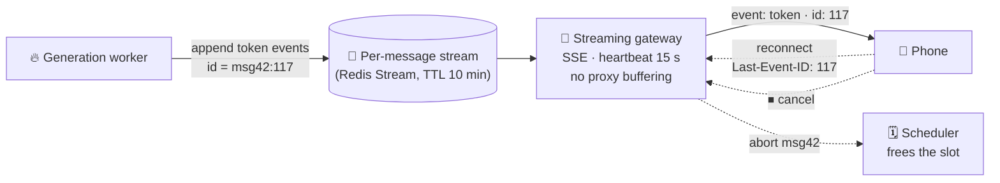

# 014 · Streaming Tokens

> ⏱ 12 min · 📈 28% · 🅰️ AI-era core · Phase 02: Model Serving & Inference Infrastructure
>
> `█████░░░░░░░░░░░░░░░` 28% of Book 2
>
> 🧬 **Atoms used:** real-time communication (SSE, WebSockets) [B1·016] · load balancers [B1·019] · idempotency [B1·055] · [004]

---

## 📖 Story

The model streams beautifully in the office: words flow at **45 tokens a second**, like someone typing.

Then the field reports come in.

On **corporate Wi-Fi**, the answer appears **all at once**, after 9 seconds of nothing: a proxy is **buffering** the stream until it ends. On **trains**, the connection drops mid-answer, the app retries, and the model generates the **whole answer again**. **4% of all answers are paid for twice.** And when a customer taps **"Stop"** because the chef is rambling, the bubble stops, but the GPU **keeps writing** to nobody for another 600 tokens.

Worst of all, long "Plan My Week" answers die at **exactly 60 seconds**: the load balancer's **idle timeout**.

I told Maya that streaming tokens isn't a feature you switch on. It's a **delivery system** with its own failure modes, like a pizza delivery that has to survive tunnels, wrong addresses, and customers who change their mind. Let me show you how to make the stream unbreakable.

## 🎯 One-sentence idea

**Stream tokens with Server-Sent Events, but decouple generation from delivery: the model writes tokens into a durable, per-message buffer, clients read from it with resumable event IDs and heartbeats, and a cancel signal travels all the way back to the GPU to free its slot.**

## 🧸 Analogy

A **live-captioned speech**:

- The speaker talks into a **recorder** (the buffer), not directly into one listener's ear.
- Each listener gets captions **line by line**, numbered. If their train goes through a tunnel, they say "I last saw **line 41**," and catch up from there, instead of asking for the **whole speech again**.
- An usher whispers "**still going**" every few seconds, so the doorman doesn't assume the room is empty (heartbeats).
- If everyone leaves, someone **tells the speaker to stop** (cancellation).

## 🖼️ Visual

*Diagram brief:* the generation worker writes numbered token events into a per-message stream buffer. A streaming gateway reads from the buffer and pushes SSE events to the phone, which reconnects with Last-Event-ID after a tunnel. A dotted cancel arrow runs from the phone back through the gateway to the scheduler that frees the GPU slot.



## 🔬 How it works

- **Protocol:** **SSE** (Server-Sent Events, Book 1 lesson 016) is the default for token streams: one-way, plain HTTP, auto-reconnect, and an `id` field per event. Use **WebSockets** only when the client also streams (voice, collaborative editing).
- **Decouple generation from the connection:** the worker appends tokens to a **per-message buffer** keyed by `message_id`. The client connection only **reads** it. A dropped connection never stops or restarts generation, and a finished answer survives a reconnect.
- **Resume, don't regenerate:** every event carries a sequence ID. On reconnect, the client sends **`Last-Event-ID`**, and the gateway replays from there. Messages are created with an **idempotency key**, so a retried "send" attaches to the existing generation instead of starting a new one (Book 1 lesson 055).
- **Survive the middleboxes:** disable proxy buffering (e.g., `X-Accel-Buffering: no`, `Cache-Control: no-cache`), send **heartbeat comments every ~15 s**, and raise load-balancer idle timeouts above the longest expected gap.
- **Cancellation and backpressure:** a "Stop" or a client gone for longer than a grace period sends an **abort** to the scheduler, which evicts the sequence and **frees its KV blocks**. Slow readers don't slow the GPU, because the buffer absorbs the difference.
- **Stream-time safety:** moderation runs on **chunks** as they're produced, holding back a small window of tokens, so a policy violation can be cut before it's shown (lesson 040).

## 🧩 Worked example

**Event format on the wire:**

```
id: msg42:117
event: token
data: {"t":" overnight"}

: heartbeat

id: msg42:118
event: done
data: {"finish_reason":"stop","usage":{"in":1480,"out":118}}
```

**Resume after a tunnel:**

```
1. Phone receives up to id msg42:117, then the connection drops
2. Generation keeps going: tokens 118–310 land in the buffer
3. Phone reconnects: GET /messages/42/stream  Last-Event-ID: msg42:117
4. Gateway replays 118–310 instantly, then streams live
```

**The field reports, replayed:**

| Problem | Before | After |
|---|---|---|
| Answers paid twice after reconnects | 4% | **0%** (resume + idempotency) |
| Buffered "all at once" streams | 7% of sessions | < 0.5% (headers + heartbeats) |
| Long answers killed at 60 s | 100% of them | 0% (timeouts + heartbeats) |
| Tokens generated after "Stop" | ~600 avg | **< 1 step** (abort frees the slot) |

At 200M messages/day, killing the double generations alone saves **8M generations a day**.

## ⚖️ Trade-offs

| Decision | You gain | You pay |
|---|---|---|
| SSE | Simple, HTTP-friendly, resumable | One-way only |
| WebSockets | Two-way, low overhead | Harder through proxies, no built-in resume |
| Durable stream buffer | Resume, no double generation | A Redis/stream tier to run |
| Continue generating after disconnect | Finished answers on return | Paying for answers nobody reads (use a grace period) |
| Chunked moderation | Stops violations mid-stream | A small display delay |

## 🌍 Real world

- Major LLM APIs stream with **SSE** (`stream: true`), sending token deltas and a final usage event.
- Chat products **keep generating** when you switch tabs and show the full answer when you return: that's a decoupled buffer.
- Reverse proxies like **NGINX** buffer responses by default, which is the classic cause of "streaming works locally but not in production".

## 📌 Cheat card

> - **SSE by default.** WebSockets only for two-way streams.
> - **Generation → buffer → gateway → client.** Never tie the GPU to the socket.
> - **Event IDs + Last-Event-ID = resume.** Idempotency keys = no double generation.
> - **No proxy buffering, heartbeats every ~15 s, long LB timeouts.**
> - **"Stop" must reach the GPU** and free the slot.

## 🧪 Feynman check

Explain the live-captioned speech: why the speaker talks into a recorder, how a listener catches up after a tunnel, and why someone has to tell the speaker when the room empties.

⚠️ **Common confusion:** "If the connection drops, just retry the request." Retrying a **generation** pays for the entire answer again and may produce a **different** answer. Retry the **delivery** (resume from the buffer), never the generation.

## ⚡ Quick recall

1. Why decouple generation from the client connection?
<details><summary>Reveal Answer</summary>

So a dropped connection doesn't stop or restart generation: the finished tokens wait in a buffer and the client resumes from where it left off.
</details>

2. What do Last-Event-ID and idempotency keys each prevent?
<details><summary>Reveal Answer</summary>

Last-Event-ID lets a reconnect resume the stream without regenerating. Idempotency keys stop a retried "send" from creating a second generation.
</details>

3. Why must "Stop" be propagated to the scheduler?
<details><summary>Reveal Answer</summary>

Otherwise the GPU keeps generating unwanted tokens, wasting money and occupying a KV slot another user could use.
</details>

## 🎤 Interview practice

**Q. "Design the streaming layer for a chat assistant used on flaky mobile networks, with 70,000 concurrent streams at peak."**
<details><summary>Model answer</summary>

- **Protocol:** SSE over HTTP/2. Events carry `id = message_id:seq`. A final `done` event carries usage and the finish reason.
- **Architecture:**
  - Generation workers append token deltas to a **per-message stream** (Redis Streams or similar) with a TTL of ~10 minutes.
  - Stateless **streaming gateways** hold the client connections (~10k per node → ~7–10 nodes + headroom) and read from the stream.
  - Final messages are persisted to the conversation store on completion.
- **Reliability:** resume via `Last-Event-ID`, idempotent message creation, heartbeats every 15 s, LB idle timeouts > 2 minutes, and proxy buffering disabled.
- **Cancellation:** a client "Stop" → abort RPC to the scheduler. On disconnect, continue for a short grace period (e.g., 30 s) and then abort if nobody resumes. Cost-sensitive tiers abort immediately.
- **Safety:** chunked moderation with a hold-back window, and the ability to retract a message.
- **Likely follow-up:** "What if Redis fails?" → buffers are replicated. Losing one means affected clients fall back to fetching the completed message from the conversation store, or regenerating once with the same idempotency key.
</details>

## 📖 Teaser

> 📖 *Streams survive tunnels now, and then the provider behind half of Pantry's features has a 40-minute outage at 19:00 on a Friday, and every team's direct integration falls over at once.*

---

⬅️ [013 · Tensor & Pipeline Parallelism](013-model-parallelism.md) · 🗺️ [Phase map](README.md) · ➡️ [015 · The Model Gateway](015-model-gateway.md)

✅ **Safe stopping point.** Tick lesson 014 in [PROGRESS.md](../../PROGRESS.md).
