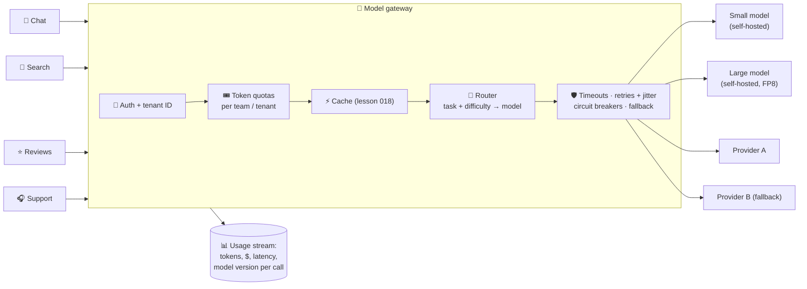

# 015 · The Model Gateway

> ⏱ 13 min · 📈 30% · 🅰️ AI-era core · Phase 02: Model Serving & Inference Infrastructure
>
> `██████░░░░░░░░░░░░░░` 30% of Book 2
>
> 🧬 **Atoms used:** API gateway [B1·022] · rate limiting [B1·024] · timeouts & retries [B1·063] · circuit breakers [B1·064] · [007] · [012]

---

## 📖 Story

Friday, 19:02. The dinner rush. Pantry's main model provider starts returning **`529 Overloaded`**.

Within ninety seconds, **fourteen** Pantry services fail at once: chat, recipe search, review summaries, the support bot, the menu translator. Every one of them calls the provider **directly**, with its own API key, its own retry loop, and **no fallback**.

The retries make it worse. Fourteen services hammering an overloaded provider with **exponential retries but no jitter** turn a 20% error rate into **90%**.

When it's over (forty minutes later), finance asks a simple question: "Which team spent the **$310,000** we were billed last week?" Nobody knows. The keys are shared, and nothing is metered.

I told Maya she'd made the same mistake every company makes with its first database: **everyone connecting directly**. The fix is the same too: **one front door**. In Book 1 it was the API gateway. In the AI era, it's the **model gateway**. Let me show you what it guards.

## 🎯 One-sentence idea

**A model gateway is the single front door between your services and every model, enforcing auth, token-based quotas, cost metering, routing to the cheapest model that's good enough, retries, and fallbacks across models and providers, so no team integrates with a model directly.**

## 🧸 Analogy

The **head waiter** at a restaurant with several kitchens:

- Every order goes **through the head waiter**, never straight into a kitchen.
- They know **which kitchen** cooks each dish best and cheapest: a simple salad doesn't go to the Michelin-star chef (routing).
- If one kitchen is on fire, orders go to **the backup kitchen** (fallback).
- They write **every order on the tab** of the table that placed it (metering), and cut off a table that's ordering absurd amounts (quotas).

## 🖼️ Visual

*Diagram brief:* fourteen service boxes on the left funnel into one gateway in the centre. Inside it are stacked layers: auth, quotas, cache, router, and resilience. On the right, arrows fan out to a small self-hosted model, a large self-hosted model, and two external providers, with a metering stream underneath feeding a cost dashboard.



## 🔬 How it works

- **One API for every model:** services call `POST /v1/generate` with a **task name** (e.g., `chat.answer`, `reviews.summarize`), not a provider URL. Keys live **only** in the gateway, so a provider switch is a config change, not 14 deploys.
- **Quotas in tokens, not requests:** a token bucket per team and tenant, charged by **input + output tokens** (Book 1 lesson 024), with priority classes, so a batch job can't starve live chat.
- **Routing:** a per-task policy picks the model: **cheap by default, escalate when needed**. Options include static rules ("summaries → small model"), a **learned router** that predicts difficulty, or a **cascade** (try small, escalate when a confidence or validation check fails). Every routing policy is eval-gated (lesson 037).
- **Resilience:** per-model **timeouts** (on TTFT, not just total time), **retries with jitter** only on retryable errors, **circuit breakers** per provider and region, and **fallback chains** (primary → same model in another region → another provider → smaller model → graceful "chef is busy").
- **Metering and governance:** emit tokens, cost, latency, model version, and prompt version **per call**, tagged by team and feature. Add PII redaction, logging policy, and allow-lists of approved models in one place.

## 🧩 Worked example

**Maya's routing table for `chat.answer`:**

| Signal | Route | Price (per 1M blended tokens, illustrative) |
|---|---|---|
| FAQ-like intent, short history | Small self-hosted model | $0.30 |
| Default | Large self-hosted model (FP8) | $1.50 |
| "Plan My Week", long reasoning | External frontier model | $10.00 |
| Any route: model error or open breaker | Next model in the chain | – |

**Cost before and after routing:**

```
Before: 100% of traffic to the frontier model → $10.00 per 1M tokens
After:  60% small × $0.30 + 35% large × $1.50 + 5% frontier × $10.00
      = $0.18 + $0.525 + $0.50 = $1.21 per 1M tokens → 88% cheaper
Golden-set score: 92.4% → 92.1% (within noise) ✅
```

**Friday 19:02, replayed:** Provider A's breaker opens after **5 s** of overload errors. "Plan My Week" fails over to **Provider B**. Everything else is self-hosted and never noticed. **Customer-visible errors: 0.3% for 40 seconds**, instead of a 40-minute outage. And finance's question gets an answer in one query: **reviews.summarize** was a runaway batch job, now capped by its own quota.

## ⚖️ Trade-offs

| Decision | You gain | You pay |
|---|---|---|
| Central gateway | One place for keys, quotas, routing, metering | One more hop (~1–5 ms), a critical component to run |
| Routing to small models | Huge cost savings | Router errors send hard questions to weak models |
| Cascades (small → large) | Pay big-model prices only when needed | Extra latency on escalations |
| Multi-provider fallback | Survives provider outages | Prompt differences, different behaviour per model |
| Token-based quotas | Fairness and cost control | Teams must forecast usage |

## 🌍 Real world

- Companies standardize on **LLM gateways** (open-source proxies and commercial "AI gateways") that offer one OpenAI-compatible API over many providers, with keys, budgets, and logging.
- Cloud API gateways and service meshes have added **token-based rate limiting** and model routing features.
- Research on **model routing and cascades** (e.g., FrugalGPT, RouteLLM) shows large cost reductions at near-equal quality.

## 📌 Cheat card

> - **No service talks to a model directly.** Tasks, not URLs. Keys in one place.
> - **Quotas in tokens**, per team and tenant, with priorities.
> - **Route cheap by default, escalate when needed.** Eval-gate the router.
> - **TTFT timeouts, jittered retries, breakers, fallback chains.**
> - **Meter every call:** tokens, $, latency, model + prompt version.

## 🧪 Feynman check

Explain the head waiter: why every order goes through them, how they decide which kitchen cooks what, and what they do when a kitchen catches fire.

⚠️ **Common confusion:** "Fallback to another provider is just changing the URL." Different models respond differently to the same prompt: formats, refusals, and quality all shift. Each fallback model needs **its own tested prompt variant** and a place in the eval suite, or your fallback becomes a quality outage.

## ⚡ Quick recall

1. Why should services call a task name instead of a specific model?
<details><summary>Reveal Answer</summary>

So the gateway can change routing, providers, and models (and apply fallbacks) centrally without redeploying every service.
</details>

2. What's a model cascade?
<details><summary>Reveal Answer</summary>

Trying a cheap model first and escalating to a stronger one only when a confidence or validation check fails.
</details>

3. Why meter tokens and cost per call by team and feature?
<details><summary>Reveal Answer</summary>

To attribute spend, enforce budgets and quotas, detect runaway jobs, and compare cost against value per feature.
</details>

## 🎤 Interview practice

**Q. "Design an LLM gateway for a company with 50 internal teams using three model providers and two self-hosted models."**
<details><summary>Model answer</summary>

- **API:** one endpoint, OpenAI-compatible, keyed by **task** plus team credentials. Streaming supported end to end.
- **Control plane:** a registry of models (capabilities, prices, context limits, regions, data-handling approvals), per-task routing policies, prompt templates per model, and per-team budgets.
- **Data plane (stateless, horizontally scaled):**
  1. Auth → tenant/team identification.
  2. **Token-bucket quotas** charged on estimated input tokens, then reconciled with actual usage.
  3. Exact/prefix/semantic cache lookups (lesson 018).
  4. Router (rules, a learned classifier, or a cascade).
  5. Resilience: TTFT timeouts, jittered retries on 429/5xx only, circuit breakers per (provider, region), fallback chains.
  6. Streaming passthrough, chunked moderation, and PII redaction.
- **Metering:** an async usage event per call to Kafka → billing tables and dashboards. Budgets alert at 80% and hard-stop (or downgrade) at 100%.
- **Scale and availability:** the gateway is on the critical path for every AI feature, so run it **multi-zone**, keep it stateless, and hold quota counters in Redis with a local fallback if Redis is unavailable.
- **Likely follow-up:** "How do you stop the gateway itself from being a single point of failure?" → stateless replicas across zones and regions, fail-open on non-critical layers (cache, metering async), and a client SDK that can reach a secondary gateway endpoint.
</details>

## 📖 Teaser

> 📖 *Routing saves a fortune on ordinary nights, but the gateway can't route around a shortage, and next Friday's rush arrives eleven minutes before the new GPUs do.*

---

⬅️ [014 · Streaming Tokens](014-streaming-tokens.md) · 🗺️ [Phase map](README.md) · ➡️ [✅ Checkpoint 30%](checkpoint-30.md)

✅ **Safe stopping point.** Tick lesson 015 in [PROGRESS.md](../../PROGRESS.md), then do the checkpoint!
