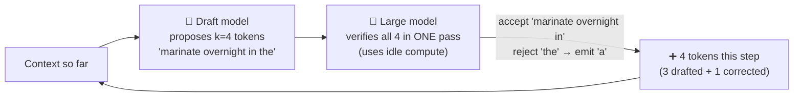

# 017 · Speculative Decoding & Latency Tricks

> ⏱ 12 min · 📈 34% · 🅰️ AI-era core · Phase 02: Model Serving & Inference Infrastructure
>
> `██████░░░░░░░░░░░░░░` 34% of Book 2
>
> 🧬 **Atoms used:** latency budgets [B1·003] · [002] · [009] · [010] · [012]

---

## 📖 Story

The voice team is prototyping **"Talk to Pantry"**: order dinner by speaking. Their latency budget is brutal: the reply must **start speaking within ~500 ms** and never stutter.

Maya's 70B model decodes at **25 ms a token**. For the agent steps behind voice ordering (search, cart, confirm), each step's full output must finish before the next begins: **150 tokens × 25 ms = 3.75 s** per step. Three steps: **over 11 seconds** of silence.

She stares at the GPU profiler during decode. Memory bandwidth: **maxed**. Compute: **8% busy**. The most expensive calculators on Earth are **idling 92% of the time**, waiting for weights to arrive.

"What if," Maya asks, "the idle compute could **guess ahead**?"

I smiled, because that's exactly the trick. A small model **drafts** several tokens. The big model **checks them all at once**, using compute it was wasting anyway. Let me show you why this gives the **same answer, faster**.

## 🎯 One-sentence idea

**Speculative decoding uses a cheap draft (a small model, extra prediction heads, or text copied from the prompt) to propose several tokens, then has the large model verify them all in one forward pass, using idle compute to emit multiple tokens per step with outputs that match what the large model alone would produce.**

## 🧸 Analogy

A **head chef and a fast apprentice**:

- The head chef is brilliant but walks slowly to the pantry for **every single step** (memory-bound decode).
- The apprentice **guesses the next four steps** of the recipe quickly: "chop, sauté, deglaze, season."
- The head chef **checks all four in one glance**. Correct guesses are kept. At the first wrong one, the chef fixes it and the apprentice guesses again.
- The dish is **exactly what the head chef would have made**, just faster, because **checking is cheaper than doing**.

## 🖼️ Visual

*Diagram brief:* a loop. A small draft model proposes four tokens. The large model verifies all four in one pass and accepts the first three, rejecting the fourth and replacing it with its own token. Output advances by four tokens in one large-model step, versus one token per step without speculation.



## 🔬 How it works

- **Why it works:** decode is memory-bound (lesson 002), so verifying **k** tokens in one pass costs about the same weight reads as generating **one**. The idle compute does the extra work.
- **Draft sources:** a **small draft model** from the same family, **extra prediction heads** trained on the big model (Medusa/EAGLE-style), or **n-gram / prompt lookup**, which copies spans from the context (great for edits, code, and quoting retrieved documents).
- **Lossless by construction:** acceptance uses a rejection-sampling rule, so the output distribution is **identical** to the big model's. Quality doesn't change, only speed.
- **Speed-up depends on the acceptance rate α** and draft length k. Expected tokens per big-model step = **(1 − α^(k+1)) ÷ (1 − α)**. Predictable text (structured output, boilerplate, quotes) accepts more.
- **It shines at small batches** (interactive, voice, agents). At large batches, compute is no longer idle, so the gain shrinks or even reverses. Engines toggle it by load.
- **Other latency tricks:** generate **fewer tokens** (concise styles, structured outputs), run **independent tool calls in parallel**, put **reusable prefixes** first (lesson 018), and use **smaller models** for intermediate agent steps.

## 🧩 Worked example

**Acceptance math** (α = 0.7, k = 4):

```
Expected tokens per verification = (1 − 0.7⁵) ÷ (1 − 0.7)
                                 = (1 − 0.168) ÷ 0.3 ≈ 2.8 tokens
Cost per verification ≈ 1.1 large steps + 4 tiny draft steps ≈ 1.25 large steps
Speed-up ≈ 2.8 ÷ 1.25 ≈ 2.2×   → TPOT 25 ms → ~11 ms
```

**"Talk to Pantry", replayed** (three agent steps, 150 tokens each):

| Change | Per step | Three steps |
|---|---|---|
| Baseline, 70B, 25 ms/token | 3.75 s | 11.3 s |
| + speculative decoding (2.2×) | 1.7 s | 5.1 s |
| + structured outputs, 150 → 40 tokens per step | 0.45 s | 1.4 s |
| + small model for the two intermediate steps | 0.2 s | **~0.8 s** |

**So this means:** speculation gives **2×**, but **writing fewer tokens** gives **4×**. The fastest token is the one you never generate.

## ⚖️ Trade-offs

| Technique | You gain | You pay |
|---|---|---|
| Draft model | 2–3× lower TPOT, lossless | Extra memory, a second model to serve |
| Prediction heads | No separate model, good acceptance | Training the heads per model |
| Prompt lookup | Free, great for copying/editing | Only helps when the output repeats the context |
| Fewer output tokens | Faster and cheaper | Less detail |
| Smaller models for sub-steps | Large speed-ups | Quality per step (eval it) |

## 🌍 Real world

- Speculative decoding was introduced by research groups at **Google** and **DeepMind** (2022–2023), and it's built into **vLLM, SGLang, and TensorRT-LLM**.
- **Medusa** and **EAGLE** add draft heads. **Prompt lookup decoding** speeds up code-editing and RAG answers that quote sources.
- Code assistants and voice products rely on these tricks to hit sub-second interaction budgets.

## 📌 Cheat card

> - **Draft k tokens cheaply, verify all k in one big-model pass.**
> - **Lossless:** same distribution as the big model.
> - **Tokens/step = (1 − α^(k+1)) ÷ (1 − α).** Typical gain 2–3×.
> - **Best at small batches.** Fades at high load.
> - **Fewer tokens beats faster tokens.**

## 🧪 Feynman check

Explain the head chef and the apprentice: why checking four guesses costs about the same as doing one step, and why the final dish is exactly the chef's own.

⚠️ **Common confusion:** "Speculative decoding trades quality for speed, like quantization." It doesn't. With correct verification, the output distribution is **mathematically identical** to the large model's. You pay in memory and compute, not quality.

## ⚡ Quick recall

1. Why can the large model verify several tokens for the cost of one?
<details><summary>Reveal Answer</summary>

Decode is memory-bound: one pass reads the weights once, and the idle compute can score several positions in the same pass.
</details>

2. What determines the speed-up?
<details><summary>Reveal Answer</summary>

The acceptance rate of drafted tokens, the draft length k, and the cost of drafting relative to the big model.
</details>

3. Why does the gain shrink at large batch sizes?
<details><summary>Reveal Answer</summary>

At large batches the GPU's compute is already busy, so the extra verification work is no longer free.
</details>

## 🎤 Interview practice

**Q. "An agent makes five sequential LLM calls per user request, and the p50 is 9 seconds. Product wants 2 seconds. What do you do?"**
<details><summary>Model answer</summary>

- **Profile each step:** TTFT, output tokens, TPOT, and tool latency. Usually output tokens and sequential dependencies dominate.
- **Cut tokens:** structured outputs (JSON with only needed fields), no verbose reasoning in intermediate steps, and tight `max_tokens`.
- **Cut steps and serialization:**
  - Merge steps where one call can do two jobs.
  - Run **independent tool calls in parallel**.
  - Use deterministic code for steps that don't need a model.
- **Faster models for sub-steps:** route classification, extraction, and planning to small models, and keep the big model for the final user-facing answer.
- **Faster decode:** speculative decoding at low batch sizes, FP8, and higher tensor parallelism for this latency-sensitive pool.
- **Faster TTFT:** prefix caching for the shared system prompt and tool definitions.
- **Perceived latency:** stream the final answer and show progress for tool steps.
- **Likely follow-up:** "How do you prevent quality loss?" → eval each change on a golden set of agent tasks (task success rate), and canary it.
</details>

## 📖 Teaser

> 📖 *Tokens fly now, but Maya's napkin from lesson 005 still has one red circle on it: the same 800-token system prompt, prefilled from scratch 2,300 times a second.*

---

⬅️ [016 · GPU Autoscaling & Cold Starts](016-gpu-autoscaling.md) · 🗺️ [Phase map](README.md) · ➡️ [018 · Prompt Caching & Semantic Caching](018-prompt-and-semantic-caching.md)

✅ **Safe stopping point.** Tick lesson 017 in [PROGRESS.md](../../PROGRESS.md).
