# ⚙️ Phase 02: Model Serving & Inference Infrastructure

> **Lessons 009–018 · 18% → 36% · 🅰️ AI-era core**
> By the end of this phase you'll **serve models fast and cheaply**: pick GPUs, batch continuously, page the KV cache, quantize, parallelize, stream, route, autoscale, and cache.

## 📖 Chapter 2: The Kitchen Behind the Model

Self-hosting looked simple on a spreadsheet. Then the "cheap" GPUs cost nine times more per token, one long recipe froze a whole batch, the GPU ran out of memory with half of it empty, a Friday provider outage took down fourteen services, and new servers arrived eleven minutes after the rush. In this chapter, I'll show you how Maya turned a pile of expensive accelerators into a serving kitchen that runs like a short-order line: full burners, no waiting, and nothing cooked twice.

## 🗺️ Phase map

```mermaid
flowchart LR
    L9["009<br/>GPUs &<br/>accelerators"] --> L10["010<br/>Continuous<br/>batching"]
    L10 --> C20{{"✅ Checkpoint 20%"}}
    C20 --> L11["011<br/>KV cache &<br/>PagedAttention"]
    L11 --> L12["012<br/>Quantization"]
    L12 --> L13["013<br/>Tensor & pipeline<br/>parallelism"]
    L13 --> L14["014<br/>Streaming<br/>tokens"]
    L14 --> L15["015<br/>Model<br/>gateway"]
    L15 --> C30{{"✅ Checkpoint 30%"}}
    C30 --> L16["016<br/>GPU<br/>autoscaling"]
    L16 --> L17["017<br/>Speculative<br/>decoding"]
    L17 --> L18["018<br/>Prompt &<br/>semantic caching"]
```

| # | Lesson | ⏱ | One-line idea |
|---|---|---|---|
| 009 | [GPUs & accelerators for designers](009-gpus-and-accelerators.md) | 12 min | Four numbers (capacity, bandwidth, FLOPS, interconnect). Compare $ per 1M tokens |
| 010 | [Static vs continuous batching](010-continuous-batching.md) | 12 min | Join and leave every decode step: 3–10× throughput, no head-of-line blocking |
| ✅ | [Checkpoint 20%](checkpoint-20.md) | 20 min | |
| 011 | [The KV cache & PagedAttention](011-kv-cache-and-pagedattention.md) | 13 min | Allocate KV in small blocks on demand: waste drops from ~70% to < 4% |
| 012 | [Quantization](012-quantization.md) | 12 min | Fewer bits per weight: 2–4× savings, but evaluate per slice |
| 013 | [Tensor & pipeline parallelism](013-model-parallelism.md) | 13 min | TP inside a server, PP across servers, EP for experts, replicas for throughput |
| 014 | [Streaming tokens](014-streaming-tokens.md) | 12 min | SSE + a durable buffer: resume, don't regenerate. "Stop" reaches the GPU |
| 015 | [The model gateway](015-model-gateway.md) | 13 min | One front door: token quotas, routing, fallbacks, and metering |
| ✅ | [Checkpoint 30%](checkpoint-30.md) | 20 min | |
| 016 | [GPU autoscaling & cold starts](016-gpu-autoscaling.md) | 12 min | Scale on queues, predict the peak, and shrink an 11-minute cold start |
| 017 | [Speculative decoding](017-speculative-decoding.md) | 12 min | Draft cheaply, verify in one pass: same output, 2–3× faster |
| 018 | [Prompt & semantic caching](018-prompt-and-semantic-caching.md) | 13 min | Prefix cache always, exact cache sometimes, semantic cache carefully |

📌 [Phase cheatsheet](CHEATSHEET.md) · 🎤 [Phase interview questions](INTERVIEW-QUESTIONS.md)

⬅️ Previous phase: [01 AI foundations](../01-ai-foundations/README.md) · ➡️ Next phase: [03 Retrieval & data for AI](../03-retrieval-data/README.md)
