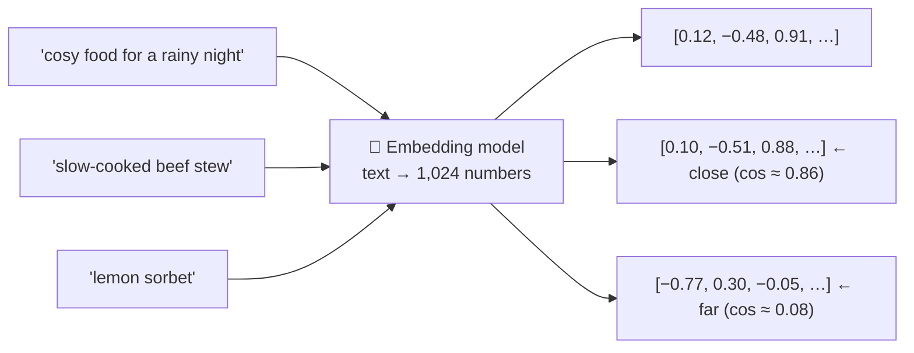

# 019 · Embeddings

> ⏱ 12 min · 📈 38% · 🅰️ AI-era core · Phase 03: Retrieval & Data for AI
>
> `███████░░░░░░░░░░░░░` 38% of Book 2
>
> 🧬 **Atoms used:** search & inverted indexes [B1·043] · specialized databases [B1·044] · [003] · [005]

---

## 📖 Story

A customer asks "Ask the Chef": **"What's the signature dish of the top-rated cook in Lisbon?"**

The model, confident as ever, describes a **coconut lamb curry** in loving detail. That cook is a **pastry** cook who has never cooked lamb in their life. Their signature is a **cardamom bun**, and Pantry's database knows it. The model simply never saw the database.

Maya's plan is obvious: **search** Pantry's recipes first, and give the model what it finds. She wires up the keyword search engine from Book 1. It works for "cardamom bun". Then she tries the questions customers actually type:

- "something **cosy** for a rainy night" → **0 results**. No recipe contains the word "cosy".
- "a **dairy-free** dessert" → it returns **"dairy-rich"** cheesecakes, because they share the word "dairy".
- "**弁当**" (bento) → nothing at all.

Keyword search matches **words**. Customers ask about **meaning**.

I told Maya she needs a way to turn meaning into **coordinates**, so that "cosy" and "warming stew" end up **close together on a map**. Let me show you the map.

## 🎯 One-sentence idea

**An embedding model turns text (or images) into a fixed-length vector of numbers, positioned so that things with similar meaning are close together, which lets you search, cluster, deduplicate, and recommend by meaning, as long as the same model embeds both the queries and the documents.**

## 🧸 Analogy

A **giant map of flavours**:

- Every dish gets **coordinates** on the map: hearty stews in one region, light salads in another, desserts on a far continent.
- "**Cosy rainy-night food**" lands right next to **stews and soups**, even though they share no words.
- To find dishes like a question, you just look at **its neighbours** on the map.
- But the map has **hundreds of directions**, not two, and only works if **one mapmaker** placed everything. Two mapmakers' maps don't line up.

## 🖼️ Visual

*Diagram brief:* sentences flow through an embedding model and become points on a 2-D projection of the vector space. Stews and "cosy rainy-night food" cluster together, desserts sit far away, and an arrow labelled "cosine similarity" measures the small angle between the query and a nearby stew.



## 🔬 How it works

- **What an embedding is:** a vector of **hundreds to a few thousand numbers** (e.g., 768–3,072) produced by a model trained so that **related texts point in similar directions**. Similarity is usually **cosine similarity** (the angle between vectors), or a dot product on normalized vectors.
- **One model, one space:** queries and documents must be embedded by the **same model and version**. Changing the model means **re-embedding everything**, so store the model version next to every vector.
- **It's cheap and fast:** embedding models are small (≈ 0.1–1B parameters). An embedding call takes **~10–50 ms**, and costs a few cents per **million tokens**.
- **Uses beyond search:** recommendations ("more like this", lesson 048), deduplication (near-identical recipes), clustering (support-ticket themes), classification, and semantic caching (lesson 018). **Multimodal** models put photos and text on the same map.
- **What embeddings miss:** they capture **topic and similarity**, not **truth or logic**. "Contains nuts" and "contains **no** nuts" sit close together. Exact identifiers (SKUs, names, codes) and rare words are often handled better by keyword search (lesson 023). Use embeddings to **find candidates**, never as the source of a fact.

## 🧩 Worked example

**Embedding all of Pantry's recipes:**

```
Corpus: 2M recipes × ~1,200 tokens = 2.4B tokens
Cost:   2.4B × ~$0.02 per 1M tokens            ≈ $48 for everything
Vectors: 2M × 1,024 dims × 4 bytes (float32)   ≈ 8.2 GB
         …in float16                            ≈ 4.1 GB  (fits in RAM)
Query:  embed the question (~20 ms) + compare against the vectors
```

**Cosine similarity, by hand** (3-dimensional toy vectors):

```
q = [0.6, 0.8, 0.0]   "cosy rainy-night food"
a = [0.5, 0.8, 0.3]   "beef stew"       cos = (0.30 + 0.64 + 0) / (1.0 × 0.99) ≈ 0.95 ✅
b = [0.0, 0.1, 0.99]  "lemon sorbet"    cos = (0 + 0.08 + 0) / (1.0 × 0.99) ≈ 0.08
```

**The three failed queries, replayed:** "cosy" → stews and soups. "Dairy-free dessert" → coconut panna cotta and sorbets. "弁当" → bento boxes, because the multilingual model maps both scripts to the same region. And the Lisbon question now retrieves the cook's **actual** recipes, which the model reads before answering (lesson 021).

## ⚖️ Trade-offs

| Decision | You gain | You pay |
|---|---|---|
| Bigger embedding models / more dimensions | Better retrieval quality | More storage, slower search, higher cost |
| Smaller dimensions (or truncatable embeddings) | Cheaper, faster search | Slightly lower quality |
| General-purpose model | No training needed | Weaker on domain jargon |
| Domain fine-tuned embeddings | Better on your vocabulary | Training, and re-embedding on upgrades |
| Multilingual model | One index for all languages | Slightly lower per-language quality |

## 🌍 Real world

- Embedding APIs from major providers and open models (e.g., the **E5, BGE, and GTE** families) are ranked on public benchmarks like **MTEB**.
- **Matryoshka**-style embeddings let you truncate vectors to fewer dimensions with graceful quality loss, trading quality for storage.
- Search engines, e-commerce, and music services use embeddings for "more like this" and semantic search alongside classic keyword search.

## 📌 Cheat card

> - **Embedding = text → vector. Close vectors = similar meaning.**
> - **Cosine similarity** measures closeness.
> - **Same model + version** for queries and documents. Upgrades = re-embed.
> - **Cheap:** ~10–50 ms, cents per 1M tokens. 1M × 1,024 float32 ≈ 4 GB.
> - **Finds candidates, not facts.** Weak on negation and exact IDs.

## 🧪 Feynman check

Explain the flavour map: why "cosy food" lands next to stews, why two mapmakers' maps can't be mixed, and why being close on the map doesn't mean being the same.

⚠️ **Common confusion:** "Embeddings understand meaning, so they can answer questions." They only measure **how similar** two pieces of text are. "Has nuts" and "has no nuts" are near neighbours. Embeddings **find candidates**, and something else (a reranker, a model reading the text, or a database) decides what's true.

## ⚡ Quick recall

1. What does cosine similarity measure?
<details><summary>Reveal Answer</summary>

The angle between two vectors: close to 1 means they point the same way (similar meaning), close to 0 means unrelated.
</details>

2. Why must queries and documents use the same embedding model?
<details><summary>Reveal Answer</summary>

Each model creates its own vector space. Vectors from different models aren't comparable, so changing models means re-embedding everything.
</details>

3. Name one thing embeddings are bad at.
<details><summary>Reveal Answer</summary>

Negation ("with nuts" vs "without nuts"), exact identifiers like SKUs or codes, rare terms, or factual truth.
</details>

## 🎤 Interview practice

**Q. "Design semantic search over 50M product descriptions in 20 languages, and plan an embedding model upgrade."**
<details><summary>Model answer</summary>

- **Embedding:** a multilingual embedding model, ~768–1,024 dims, embedding title + description + key attributes. Batch-embed offline (50M × ~200 tokens = 10B tokens: affordable), idempotent by `(product_id, content_hash, model_version)`.
- **Storage:** 50M × 1,024 × 2 B (float16) ≈ **100 GB** raw → an ANN index (lesson 020), sharded and replicated, with metadata for filters (locale, category, availability).
- **Query path:** embed the query (~20 ms) → ANN top-k → combine with keyword search for exact terms (lesson 023) → rerank.
- **Upgrade plan:**
  - Embed the whole corpus with the new model into a **new index** (blue/green), while CDC keeps both indexes fresh (lesson 024).
  - Compare **recall@k and click metrics** offline and with an online A/B test.
  - Switch traffic, keep the old index for rollback, then delete it.
- **Likely follow-up:** "How do you cut storage?" → float16 or int8 vectors, fewer dimensions (Matryoshka truncation), or product quantization.
</details>

## 📖 Teaser

> 📖 *The flavour map works beautifully on two million recipes, and then reviews, menus, and cook bios push it past fifty million points, and every search starts measuring the distance to all of them.*

---

⬅️ [018 · Prompt Caching & Semantic Caching](../02-model-serving/018-prompt-and-semantic-caching.md) · 🗺️ [Phase map](README.md) · ➡️ [020 · Vector Databases & ANN Search](020-vector-databases-ann.md)

✅ **Safe stopping point.** Tick lesson 019 in [PROGRESS.md](../../PROGRESS.md).
