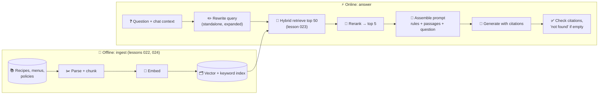

# 021 · RAG Architecture

> ⏱ 13 min · 📈 42% · 🅰️ AI-era core · Phase 03: Retrieval & Data for AI
>
> `████████░░░░░░░░░░░░` 42% of Book 2
>
> 🧬 **Atoms used:** search [B1·043] · caching [B1·027] · latency budgets [B1·003] · [003] · [006] · [019] · [020]

---

## 📖 Story

Maya wires it together: question → **embed** → **vector search** → paste the top 5 recipe snippets into the prompt → **generate**.

The lamb-curry hallucination disappears. The chef now answers: "Their signature is the **cardamom bun**: 48-hour dough, crushed green cardamom, pearl sugar." **Correct**, and it even sounds like the cook.

Then the weekly audit of 500 random answers comes back, and **9%** are still wrong. Maya sorts them into two piles.

**Pile one:** the right recipe **never reached the prompt**. "How long does the sourdough rest?" retrieved five sourdough **pizza** snippets, none about bread.

**Pile two:** the right recipe **was in the prompt**, and the model **ignored it**, answering from its own memory ("rest for 1 hour") while the snippet clearly said **12 hours**.

Two piles, two completely different bugs. And one dashboard number that hid both of them.

I told Maya she'd built **retrieval-augmented generation**, the most important pattern in AI-era system design, and that its first rule is: **measure the librarian and the writer separately**. Let me show you the whole pipeline.

## 🎯 One-sentence idea

**Retrieval-augmented generation (RAG) answers questions by first retrieving relevant passages from your own data, then asking the model to answer only from those passages with citations, which grounds answers in current facts, and it has two independent failure points (retrieval misses and unfaithful generation) that must be measured separately.**

## 🧸 Analogy

An **open-book exam** with a **research assistant**:

- The **assistant** (retrieval) runs to the library and brings back **five pages** that look relevant.
- The **student** (the model) must answer **using only those pages**, and write the **page number** next to each claim (citations).
- If the assistant brings the **wrong pages**, even a brilliant student fails. If the pages are right but the student **ignores them**, that's a different failure.
- If no page has the answer, a good student writes "**not in my sources**" rather than guessing.

## 🖼️ Visual

*Diagram brief:* two lanes. The offline lane flows from source data through parsing, chunking, embedding, and indexing into a vector and keyword index. The online lane flows from a question through query rewriting, hybrid retrieval, reranking, and prompt assembly to generation, citation checking, and the answer, with the index feeding into retrieval.



## 🔬 How it works

- **Offline ingestion:** parse sources, split them into **chunks**, embed them, and index them, with metadata (source, version, permissions). This is a data pipeline with its own freshness SLO (lessons 022, 024).
- **Query understanding:** rewrite follow-up questions into **standalone queries** ("how long does it rest?" → "sourdough bread resting time"), and optionally expand or decompose them. A small, fast model does this in ~100 ms.
- **Retrieve wide, then narrow:** fetch ~**50** candidates with **hybrid** search (vector + keyword), **rerank** to the best ~**5** (lesson 023), and include their metadata. Wide recall, precise final context, within the token budget (lesson 003).
- **Grounded generation:** the prompt says "answer **only** from the passages, **cite** them by ID, and say **'I don't know'** if they don't contain the answer". Lower the temperature, and validate that the cited IDs exist and actually support the claim (a cheap check model or rules).
- **Measure the two halves separately:** **retrieval** quality (recall@k: did the right passage reach the prompt?) and **generation** quality (faithfulness: did the answer stick to the passages? answer correctness). Each pile has different fixes (lesson 037).

## 🧩 Worked example

**Latency budget for one RAG answer:**

```
Query rewrite (small model)          100 ms
Embed query                           20 ms
Hybrid search (vector + keyword)      15 ms (parallel)
Rerank 50 → 5 (cross-encoder)         80 ms
Prompt assembly                        2 ms
TTFT (large model, ~3k-token prompt) 300 ms
─────────────────────────────────────────
Time to first token                 ≈ 520 ms ✅ (< 800 ms SLO)
```

**Maya's two piles, fixed:**

| Pile | Root cause | Fix | Result |
|---|---|---|---|
| Retrieval miss (5.5%) | "sourdough" matched pizza snippets, and chunks were missing titles | Query rewriting + recipe title in every chunk + reranker | Recall@5: 78% → 94% |
| Unfaithful answer (3.5%) | Model trusted its memory over the passage | "Answer only from sources", citations required, temperature 0.2, citation checker | Faithfulness: 91% → 98.5% |

**Audit after the fixes: 9% wrong → 1.6% wrong**, and every remaining answer cites the passage it came from, so a reviewer can check it in seconds.

## ⚖️ Trade-offs

| Decision | You gain | You pay |
|---|---|---|
| More retrieved passages | Higher recall | More tokens, more distraction, slower TTFT |
| Reranking | Much better precision | 50–150 ms |
| Query rewriting | Handles follow-ups and vague questions | An extra model call |
| Strict "only from sources" | Fewer hallucinations | More "I don't know" answers |
| Citation verification | Auditable answers | Extra checks and latency |

## 🌍 Real world

- **RAG** (Lewis et al., 2020) is now the default architecture for assistants over private data: support bots, internal search, documentation assistants.
- AI search products show **citations** with every answer, so users can verify them.
- Teams evaluate RAG with separate **retrieval metrics** (recall@k, MRR) and **generation metrics** (faithfulness, answer relevance).

## 📌 Cheat card

> - **Offline: parse → chunk → embed → index. Online: rewrite → retrieve → rerank → generate → verify.**
> - **Retrieve wide (~50), keep the best (~5).**
> - **"Answer only from sources, cite them, say 'I don't know'."**
> - **Two failure piles:** retrieval miss vs unfaithful generation.
> - **Measure recall@k and faithfulness separately.**

## 🧪 Feynman check

Explain the open-book exam: why a brilliant student fails with the wrong pages, why that's a different problem from ignoring the right pages, and why "not in my sources" is a good answer.

⚠️ **Common confusion:** "RAG eliminates hallucinations." It **reduces** them by giving the model the facts. The model can still ignore, misread, or over-generalize the passages, and retrieval can still bring the wrong ones. That's why you verify citations and measure faithfulness.

## ⚡ Quick recall

1. What are the two independent ways a RAG answer can be wrong?
<details><summary>Reveal Answer</summary>

Retrieval failure (the right passage never reached the prompt) and generation failure (the passage was there, but the model ignored or misused it).
</details>

2. Why retrieve ~50 candidates and keep ~5?
<details><summary>Reveal Answer</summary>

Wide retrieval maximizes the chance the right passage is found. Reranking then picks the most relevant few, keeping the prompt short, focused, and cheap.
</details>

3. What should a RAG system do when retrieval finds nothing relevant?
<details><summary>Reveal Answer</summary>

Say it doesn't know (or hand off), rather than letting the model answer from its own memory.
</details>

## 🎤 Interview practice

**Q. "Design a RAG-based help assistant for a product with 200,000 help articles in 12 languages. Answers must be accurate and cite sources."**
<details><summary>Model answer</summary>

- **Ingestion:** articles from the CMS via CDC (lesson 024) → parse by headings → chunks of ~300–500 tokens with the article title, section path, language, product version, and URL → embed with a multilingual model → hybrid index (vector + BM25), sharded by language.
- **Online path:**
  1. Rewrite the query into a standalone question (with chat context), and detect the language and product version.
  2. Hybrid retrieval of the top ~50, filtered by language/version.
  3. Cross-encoder rerank → top 5.
  4. Generate with "answer only from sources, cite [doc:section]", and "I don't know" + a link to search when nothing fits.
  5. Validate citations, then stream the answer.
- **Latency:** ~500–800 ms TTFT (budget as above). Cache popular answers per (article version, locale) where safe.
- **Evaluation:** a golden set of real questions with gold articles. Track **recall@5**, faithfulness, answer correctness, and deflection rate. Weekly human audits.
- **Freshness:** article changes reach the index in < 5 minutes. Deleted articles are removed immediately.
- **Likely follow-up:** "Answers mix information from two product versions. Why, and how do you fix it?" → chunks lack version metadata or the filter isn't applied, so tag every chunk and filter at retrieval time.
</details>

## 📖 Teaser

> 📖 *Pile one is shrinking, but Maya opens a few of the remaining misses and finds the strangest culprit yet: the right recipe was retrieved, cut neatly in half, with the ingredients in one piece and the steps in another.*

---

⬅️ [✅ Checkpoint 40%](checkpoint-40.md) · 🗺️ [Phase map](README.md) · ➡️ [022 · Chunking & Ingestion Pipelines](022-chunking-and-ingestion.md)

✅ **Safe stopping point.** Tick lesson 021 in [PROGRESS.md](../../PROGRESS.md).
