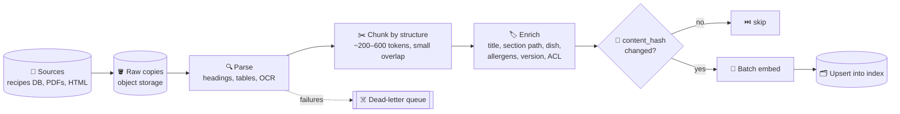

# 022 · Chunking & Ingestion Pipelines

> ⏱ 12 min · 📈 44% · 🅰️ AI-era core · Phase 03: Retrieval & Data for AI
>
> `████████░░░░░░░░░░░░` 44% of Book 2
>
> 🧬 **Atoms used:** queues [B1·057] · idempotency [B1·055] · object storage [B1·042] · batch processing [B1·091] · [019] · [021]

---

## 📖 Story

"How much garlic goes in the Sunday ragù?"

The retriever returns **step 4** of the ragù recipe: "Add the garlic and cook until fragrant." Accurate, and useless. The **quantity** lives in the ingredient list, which landed in a different chunk, because Maya split every recipe into **fixed 512-token blocks**, wherever the 512th token happened to fall.

The same blade cut through other things too. A **table** of allergens in a supplier PDF was parsed into one long line of soup: `Peanut Yes No Sesame No Yes`. A chunk that said "**Leave it overnight**" no longer said **what** to leave. And when cooks edited their recipes, the nightly re-ingest **re-embedded all 2 million recipes**, even though **only 0.8%** had changed.

I told Maya that chunking is like **cutting a cake**: cut along the layers and every slice is a complete little cake. Cut at random and someone gets all the icing, and someone else gets plain sponge. Let me show you how to slice, and how to build the kitchen that does it every day.

## 🎯 One-sentence idea

**Ingestion turns raw documents into retrievable chunks through a pipeline (parse, clean, chunk along the document's structure, enrich each chunk with context and metadata, embed, and upsert), and both the chunking strategy and the pipeline's idempotency decide retrieval quality and cost.**

## 🧸 Analogy

**Cutting a layer cake for a buffet**:

- **Cut along the layers** (headings, sections), so every slice is a **complete piece**: sponge, filling, and icing together.
- Put a **label on every plate**: "Chocolate cake, slice 3 of 8, contains nuts" (contextual metadata).
- Slices should be **bite-sized but whole**: too big and nobody finishes them (token cost and noise), too small and they lose the flavour (context).
- And if only **one cake** changes overnight, you **re-slice only that cake**.

## 🖼️ Visual

*Diagram brief:* a pipeline of boxes connected by queues. Source documents land in object storage, a parser extracts structure (headings, tables), a structural chunker produces chunks, an enricher adds titles and metadata, a hash check skips unchanged chunks, an embedder batches the rest, and an upsert writes them into the index. A dead-letter queue catches failures.



## 🔬 How it works

- **Parse faithfully:** extract **structure**, not just text: headings, lists, and **tables** (kept as Markdown or rows, never flattened into soup), with OCR for scans. Bad parsing is the most common silent RAG failure.
- **Chunk by structure:** split on headings and sections first, then by size, to **~200–600 tokens** with a small overlap (~10–15%). Keep **logical units** whole: an ingredient list, a table, a step sequence.
- **Make every chunk self-contained:** prepend **contextual headers** (recipe title, section path, cook, dish type) so "Leave it overnight" becomes "Sunday ragù › Method › Step 6: Leave it overnight". Attach **metadata** for filtering: language, version, permissions (lesson 025).
- **Small to find, big to read:** index **small chunks** for precise matching, but return their **parent section** (or neighbours) to the model for full context ("parent-child" retrieval).
- **Run it as a pipeline:** queue-driven, **idempotent** stages keyed by `(doc_id, version, content_hash)`, batch embedding (hundreds per call), retries with backoff, a **dead-letter queue** for poison documents, and **re-embed only what changed**.
- **Evaluate chunking:** the same golden set (lesson 037), measuring **recall@k** across chunking variants. There's no universal best size, only the best for your documents and questions.

## 🧩 Worked example

**The ragù, chunked two ways:**

```
FIXED 512 TOKENS                         STRUCTURAL + CONTEXT HEADER
chunk 17: "...Ingredients: 800 g beef    chunk A: "Sunday ragù › Ingredients:
  mince, 6 cloves garlic, 2 tins..."       800 g beef mince, 6 cloves garlic,
chunk 18: "...tomatoes. Method: 1. Brown    2 tins tomatoes, …"
  the beef... 4. Add the garlic..."       chunk B: "Sunday ragù › Method › Steps 1–4: …"
Q: "how much garlic?" → chunk 18 ❌      Q: "how much garlic?" → chunk A ✅ "6 cloves"
```

**Re-ingest cost, before and after hashing:**

```
Nightly full re-embed: 2M recipes × 1,200 tokens = 2.4B tokens/day
Hash-skip unchanged:   0.8% changed → 16k recipes × 1,200 = 19M tokens/day (−99%)
Pipeline time:         6 h → 4 min, freshness from "tomorrow" to "minutes" (lesson 024)
```

**Retrieval results on the golden set:** recall@5 **81% → 92%** from structural chunking + headers, and **→ 95%** with parent-child retrieval. The allergen-table questions go from **40%** correct to **97%** after fixing table parsing.

## ⚖️ Trade-offs

| Decision | You gain | You pay |
|---|---|---|
| Small chunks | Precise matching | Lost context unless you add parents |
| Large chunks | More context per hit | Noisier matches, more tokens |
| Overlap | Fewer ideas cut in half | Duplicate tokens in the index |
| Contextual headers | Self-contained chunks | Slightly larger index |
| LLM-based parsing/enrichment | Better structure for messy docs | Ingestion cost and latency |

## 🌍 Real world

- Document-parsing tools and layout-aware models exist because **PDF tables and multi-column layouts** break naive text extraction.
- **Contextual retrieval** (prepending document context to each chunk before embedding) is a widely reported technique for improving recall.
- Production RAG pipelines run on the same infrastructure as other data pipelines: **queues, workers, object storage, and DLQs**.

## 📌 Cheat card

> - **Parse structure** (headings, tables). Never flatten tables.
> - **Chunk by structure, ~200–600 tokens, small overlap.** Keep logical units whole.
> - **Context headers + metadata on every chunk.**
> - **Small to find, parent to read.**
> - **Idempotent pipeline:** hash-skip unchanged, batch embed, DLQ.

## 🧪 Feynman check

Explain cutting the layer cake: why cutting along the layers gives complete slices, why each plate needs a label, and why you only re-slice the cake that changed.

⚠️ **Common confusion:** "Chunk size is just a number to tune." The **boundaries** matter more than the size. A perfectly sized chunk that separates a quantity from its ingredient, or a table from its headers, is useless. Chunk along the document's own structure first.

## ⚡ Quick recall

1. Why add a contextual header to each chunk?
<details><summary>Reveal Answer</summary>

So each chunk is self-contained: a fragment like "leave it overnight" carries the recipe and section it belongs to, improving both retrieval and the model's understanding.
</details>

2. What is parent-child retrieval?
<details><summary>Reveal Answer</summary>

Indexing small chunks for precise matching, but giving the model their larger parent section (or neighbours) for full context.
</details>

3. How does the pipeline avoid re-embedding unchanged documents?
<details><summary>Reveal Answer</summary>

It keys work on a content hash per document or chunk and skips anything whose hash hasn't changed.
</details>

## 🎤 Interview practice

**Q. "Design the ingestion pipeline for a RAG system over 10 million documents (PDFs, HTML, and wiki pages) that change at about 1% per day."**
<details><summary>Model answer</summary>

- **Change detection:** CDC or webhooks from source systems, plus a periodic crawl for sources without events. Raw copies stored in object storage, versioned.
- **Queue-driven stages:** parse (layout-aware for PDFs, OCR fallback) → clean → structural chunking with context headers → metadata (source, version, language, ACLs) → hash check → batch embed → upsert. Each stage idempotent by `(doc_id, version, chunk_hash)`.
- **Scale:** ~100k changed docs/day ≈ ~1/s average, with bursts during bulk imports. A full backfill of 10M docs × ~2k tokens = 20B tokens: parallelize across workers and use cheap batch embedding.
- **Reliability:** retries with backoff, a DLQ for poison documents with alerts, and per-source lag metrics. Deletes propagate as tombstones immediately (lesson 024).
- **Quality:** a golden set run against chunking variants. Parse-quality sampling (especially tables), and alerts on spikes in empty or tiny chunks.
- **Likely follow-up:** "You change the chunking strategy. What happens?" → build a **new index version** in parallel (re-chunk + re-embed everything), compare recall on the golden set, then switch with a blue/green cut-over.
</details>

## 📖 Teaser

> 📖 *Every slice is whole now, and a customer types a product code, "PNTRY-4471 gochujang", and the flavour map shrugs, because numbers have no flavour.*

---

⬅️ [021 · RAG Architecture](021-rag-architecture.md) · 🗺️ [Phase map](README.md) · ➡️ [023 · Hybrid Search & Reranking](023-hybrid-search-reranking.md)

✅ **Safe stopping point.** Tick lesson 022 in [PROGRESS.md](../../PROGRESS.md).
