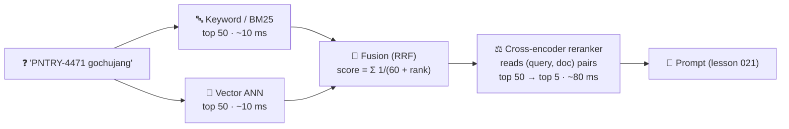

# 023 · Hybrid Search & Reranking

> ⏱ 12 min · 📈 46% · 🅰️ AI-era core · Phase 03: Retrieval & Data for AI
>
> `█████████░░░░░░░░░░░` 46% of Book 2
>
> 🧬 **Atoms used:** search & inverted indexes [B1·043] · autocomplete ranking [B1·093] · [019] · [020] · [021]

---

## 📖 Story

A wholesale customer types: **"PNTRY-4471 gochujang"**, the exact product code from their invoice.

The vector search returns five lovely Korean recipes that **use** gochujang. None of them is the product. To an embedding model, "PNTRY-4471" is a meaningless string of shapes, so it leans on the one word it understands.

Maya's old keyword engine from Book 1 finds the product **instantly**: an exact match on a rare token. But keyword search fails the other way: "**something spicy and fermented for a stew**" returns nothing, because no product description uses those words together.

Each search engine is **blind in one eye**. Vector search sees meaning but not exact strings. Keyword search sees exact strings but not meaning.

And even when both find the right item, it's often at **rank 23**, and only the top 5 reach the model.

I told Maya to stop choosing. Run **both**, merge them fairly, and then let a much more careful judge re-read the top few dozen and **put the best on top**. Let me show you the merge and the judge.

## 🎯 One-sentence idea

**Hybrid search runs keyword (BM25) and vector search in parallel and fuses their rankings (often with reciprocal rank fusion) to get the best recall from both, then a reranker (a cross-encoder that reads the query and each candidate together) reorders the top few dozen so the most relevant few reach the model.**

## 🧸 Analogy

**Two scouts and a judge** for a cooking contest:

- **Scout one** (keyword search) knows every contestant **by name and ID badge**. Ask for "#4471" and they find them instantly, but they can't judge style.
- **Scout two** (vector search) knows contestants **by cooking style**. Ask for "spicy fermented flavours" and they point the way, but they forget names.
- Both scouts bring their **shortlists**. You merge them, giving credit to anyone **near the top of either list** (fusion).
- Then the **judge** (reranker) **tastes** each finalist's dish next to your request, one by one, and picks the winners. Slow, so the judge only tastes the shortlist.

## 🖼️ Visual

*Diagram brief:* a query splits into two parallel searches, keyword BM25 and vector ANN, each returning a ranked list of 50. A fusion box merges them into one list using RRF scores. A reranker box reads the query paired with each of the top 50 candidates and outputs the final top 5, with a latency label on each stage.

## 🔬 How it works

- **Keyword search (BM25)** scores documents by **rare term matches** (Book 1 lesson 043). It's great for **IDs, codes, names, exact phrases, and rare jargon**, and blind to synonyms and paraphrases.
- **Vector search** scores by **meaning** (lesson 019). It's great for **paraphrases, vague and cross-language queries**, and weak on exact identifiers and negation.
- **Fusion:** scores from the two engines aren't comparable, so fuse **ranks**. **Reciprocal rank fusion:** each document scores **Σ 1 / (k + rank)** across lists (k ≈ 60), rewarding anything near the top of **either** list. Weighted score blending is an alternative, but it needs tuning.
- **Reranking:** a **cross-encoder** reads the query **and** each candidate **together** and outputs a relevance score. That's far more accurate than comparing two independent vectors (a "bi-encoder"), but far too slow to run on millions, so run it on the **top ~20–100** only (~50–150 ms). An LLM can also be the reranker, at higher cost.
- **Measure each stage:** **recall@50** after fusion (did the right item make the shortlist?), then **precision@5 / nDCG** after reranking (is it on top?). Tune the shortlist size against reranker latency.

## 🧩 Worked example

**Reciprocal rank fusion by hand** (k = 60):

| Document | Keyword rank | Vector rank | RRF score |
|---|---|---|---|
| Product PNTRY-4471 gochujang | 1 | 38 | 1/61 + 1/98 = 0.0266 |
| Recipe: gochujang stew | 4 | 1 | 1/64 + 1/61 = **0.0320** |
| Product: doenjang paste | — | 2 | 1/62 = 0.0161 |
| Recipe: kimchi jjigae | 12 | 3 | 1/72 + 1/63 = 0.0298 |

Fusion puts the product in the top 3, and then the **reranker**, reading "PNTRY-4471 gochujang" next to each candidate, scores the exact product **0.97** and the stew recipe **0.41**, moving the product to **#1**.

**Maya's golden-set results:**

| Setup | Recall@50 | Precision@5 | Added latency |
|---|---|---|---|
| Vector only | 84% | 61% | 12 ms |
| Keyword only | 71% | 58% | 9 ms |
| Hybrid (RRF) | **95%** | 69% | 14 ms (parallel) |
| Hybrid + cross-encoder rerank | 95% | **88%** | 94 ms |

**So this means:** fusion fixes **recall** (finding the right item at all), and the reranker fixes **precision** (putting it where the model will see it). End-to-end RAG correctness: **91% → 96%**.

## ⚖️ Trade-offs

| Decision | You gain | You pay |
|---|---|---|
| Hybrid over vector-only | Exact IDs + meaning | Two indexes to keep fresh |
| RRF | No score calibration needed | Ignores score magnitudes |
| Cross-encoder rerank | Big precision gains | 50–150 ms, GPU cost per query |
| LLM as reranker | Highest quality, handles nuance | Much higher cost and latency |
| Bigger shortlist | Higher recall into the reranker | Slower reranking |

## 🌍 Real world

- **Elasticsearch, OpenSearch, Vespa**, and many vector databases support **hybrid search with RRF** natively.
- Hosted **rerank APIs** and open cross-encoder models are standard parts of production RAG stacks.
- Web search has long used **multi-stage ranking**: cheap retrieval over billions, then heavier models on a shrinking candidate set.

## 📌 Cheat card

> - **BM25 = exact words and IDs. Vectors = meaning.** Use both.
> - **RRF: Σ 1/(60 + rank)** fuses ranks, not scores.
> - **Cross-encoder reranks the top ~50** → the best ~5.
> - **Recall@50 after fusion, precision@5 after rerank.**
> - **Multi-stage: cheap and wide → expensive and narrow.**

## 🧪 Feynman check

Explain the two scouts and the judge: why each scout misses contestants the other finds, why you merge their shortlists, and why the judge only tastes the finalists.

⚠️ **Common confusion:** "Vector search replaced keyword search." In production, the best systems use **both**, because embeddings are blind to the exact strings (codes, names, error messages) that users often search for. Keyword search is a partner, not a legacy.

## ⚡ Quick recall

1. What kinds of queries does keyword search handle better than vector search?

Reveal Answer

Exact identifiers (SKUs, codes), names, rare jargon, and exact phrases.

2. Why fuse ranks instead of raw scores?

Reveal Answer

BM25 and vector similarity scores are on different, non-comparable scales, while ranks are comparable across both lists.

3. Why does a cross-encoder rerank only the top candidates?

Reveal Answer

It reads each query–document pair jointly, which is accurate but slow, so it's only affordable on a short list of ~20–100 candidates.

## 🎤 Interview practice

**Q. "Users of your RAG assistant complain that it can't find documents by error code, and that the right document often appears too low to be used. Redesign retrieval."**

Model answer

- **Diagnose with metrics:** build a golden set including error-code queries. Measure recall@50 and precision@5 by query type. Expect vector-only recall to be poor on codes.
- **Hybrid retrieval:** add a BM25 index over the same chunks (with an analyzer that keeps codes intact, e.g., no splitting on hyphens), run both in parallel, and fuse with **RRF**. Optionally route queries that look like codes to keyword-first.
- **Reranking:** a cross-encoder over the fused top ~50 → top 5, deployed on GPUs or a hosted rerank API, with a ~100 ms budget and a timeout fallback to the fused order.
- **Context:** pass the top 5 with titles and section paths. If scores are all low, answer "not found" with links.
- **Results to verify:** recall@50 up on code queries, precision@5 up overall, end-to-end answer correctness up, and p95 latency within the SLO.
- **Likely follow-up:** "Reranking adds 100 ms. Can you avoid it?" → cache rerank results for popular queries, use a smaller reranker, rerank fewer candidates, or skip reranking when one result dominates (a large score gap).

## 📖 Teaser

> 📖 *Search finds everything now, including a recipe a cook changed on Monday to add peanuts, which the index will keep describing as nut-free until the nightly rebuild.*

---

⬅️ [022 · Chunking & Ingestion Pipelines](022-chunking-and-ingestion.md) · 🗺️ [Phase map](README.md) · ➡️ [024 · Keeping the Index Fresh](024-index-freshness.md)

✅ **Safe stopping point.** Tick lesson 023 in [PROGRESS.md](../../PROGRESS.md).
