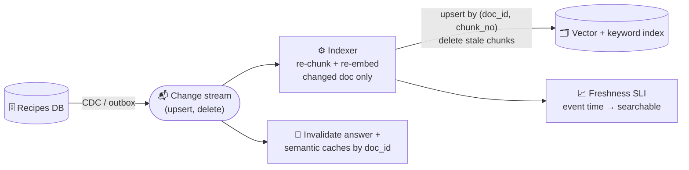

# 024 · Keeping the Index Fresh

> ⏱ 12 min · 📈 48% · 🅰️ AI-era core · Phase 03: Retrieval & Data for AI
>
> `█████████░░░░░░░░░░░` 48% of Book 2
>
> 🧬 **Atoms used:** change data capture & outbox [B1·062] · log-based streaming [B1·059] · cache invalidation [B1·031] · [022]

---

## 📖 Story

Monday, 10:14. A cook updates the "Green Curry" recipe: the paste now contains **ground peanuts**.

The allergen **fields** in the database update instantly, and the verifier from lesson 006 is happy. But the **recipe text** in the search index is rebuilt **nightly**. Until midnight, when a customer asks "what's in the green curry?", the RAG pipeline retrieves the **old** recipe and describes it lovingly: **no peanuts**.

On Wednesday, a cook who left Pantry sends a **data deletion request**. Legal confirms it's done: the database rows are gone. On Friday, "Ask the Chef" **quotes their recipe** word for word. It still lives in the vector index, in a **cached answer**, and in last week's **index snapshot** that a rollback restored.

I told Maya that an index is a **copy**, and every copy is a promise you have to keep. In Book 1 she learned that caches go stale. A RAG index is a cache of your entire knowledge base, so it goes stale **everywhere at once**. Let me show you how to keep the copy honest, and how to make "deleted" really mean deleted.

## 🎯 One-sentence idea

**A RAG index is a derived copy of your source data, so it must be kept fresh by streaming changes (change data capture → re-chunk → re-embed → upsert) with a measured freshness SLO, and deletes must propagate to every derived copy (index, caches, snapshots), while embedding-model upgrades use a blue/green rebuild.**

## 🧸 Analogy

A **restaurant's printed menus**:

- The **kitchen's recipe book** is the truth. The menus on the tables are **copies**.
- Reprinting every menu **once a night** means that, all day, diners read yesterday's dishes (batch rebuild).
- A good restaurant prints a **replacement page the moment a recipe changes**, and **pulls a dish from every menu**, including the ones in the storeroom, when it's discontinued.
- When the **menu design** changes entirely, you print a whole new set **before** swapping them onto the tables (blue/green).

## 🖼️ Visual

*Diagram brief:* the recipes database emits change events through an outbox to a stream. An indexer consumes the stream, re-chunks and re-embeds only the changed document, and upserts or deletes in the index. A side arrow invalidates the answer cache, and a lag gauge shows "p95 freshness 40 s".



## 🔬 How it works

- **Stream changes, don't rebuild nightly:** capture inserts, updates, and deletes from the source with **CDC** or the **outbox pattern** (Book 1 lesson 062), publish them to a log (lesson 059), and let an indexer process **only the changed documents**.
- **Upserts must replace, not append:** a changed document can produce **fewer chunks** than before. Key chunks by `(doc_id, chunk_no)`, write the new set, and **delete leftovers** from the old version, so stale fragments can't be retrieved. Store the source **version** on every chunk, and ignore out-of-order events with older versions.
- **Measure freshness as an SLI:** time from source commit to **searchable** (p95), e.g., **< 60 s** for menus and allergens, < 1 h for blog content. Alert on indexer lag.
- **Deletes everywhere:** a deletion must reach the vector index, the keyword index, **answer and semantic caches** (lesson 018), conversation memories, fine-tuning datasets (lesson 027), and **backups/snapshots** (by expiry or crypto-shredding). Keep a **deletion log** to re-apply after any restore.
- **Model and chunking upgrades:** build a **new index version** alongside the live one, backfill it while CDC writes to **both**, compare recall on the golden set, then switch reads and retire the old one (blue/green).

## 🧩 Worked example

**Freshness, before and after:**

| | Nightly rebuild | CDC streaming |
|---|---|---|
| Change → searchable (p95) | ~14 hours | **38 seconds** |
| Daily embedding tokens | 2.4B (everything) | 19M (changed only) |
| Stale-answer window for the green curry | 13 h 46 m | < 1 min |

**A deletion, end to end:**

```
t+0s     DB: cook rows deleted → outbox emits delete(cook_id=c88, docs=[…412 recipes])
t+5s     Indexer: delete 412 docs' chunks from vector + keyword indexes
t+5s     Cache service: purge answer/semantic cache entries tagged with those doc_ids
t+1m     Memory service: remove quotes from stored conversation summaries
nightly  Training data: exclude doc_ids from the next dataset version (lesson 027)
restore  Any index snapshot restore re-applies the deletion log before serving
```

**Friday's quote, replayed:** the restored snapshot is patched by the deletion log **before** it serves a single query. The quote never appears.

## ⚖️ Trade-offs

| Decision | You gain | You pay |
|---|---|---|
| CDC streaming | Fresh in seconds, cheap re-embeds | A streaming pipeline to operate |
| Nightly batch rebuild | Simple | Hours of staleness, full re-embed costs |
| Version on every chunk | Correct ordering, no stale fragments | Slightly more storage and logic |
| Blue/green index rebuilds | Safe upgrades, instant rollback | Double storage during the switch |
| Deletion log | Deletes survive restores | One more system of record to protect |

## 🌍 Real world

- **Debezium**-style CDC into Kafka is a common way to feed search and vector indexes from operational databases.
- Privacy laws such as **GDPR** give people a right to erasure, which applies to **derived** data like embeddings and caches, not just source rows.
- Search teams have long used **index aliases** to switch between index versions with zero downtime: the same blue/green trick.

## 📌 Cheat card

> - **The index is a copy. Stream changes into it** (CDC/outbox → re-chunk → re-embed → upsert).
> - **Replace chunk sets per doc, delete leftovers, check versions.**
> - **Freshness SLI:** source commit → searchable, p95.
> - **Deletes reach every copy:** indexes, caches, memories, datasets, snapshots.
> - **Upgrades: blue/green index + dual writes.**

## 🧪 Feynman check

Explain the printed menus: why reprinting once a night isn't enough, why a discontinued dish must be pulled from the storeroom copies too, and how you'd swap to a whole new menu design safely.

⚠️ **Common confusion:** "We deleted the user's data from the database, so it's gone." Every **derived** copy (embeddings, chunks, caches, summaries, snapshots, training sets) still holds it. Deletion is a **fan-out** problem, not a single `DELETE`.

## ⚡ Quick recall

1. Why is a nightly rebuild a problem for RAG?
<details><summary>Reveal Answer</summary>

Answers can be based on data that's up to a day stale, and every rebuild re-embeds everything, wasting cost.
</details>

2. Why must an upsert delete leftover chunks?
<details><summary>Reveal Answer</summary>

A new version can split into fewer chunks, and old chunks that aren't removed would still be retrieved with stale content.
</details>

3. Where must a deletion propagate in an AI system?
<details><summary>Reveal Answer</summary>

To vector and keyword indexes, answer and semantic caches, conversation memories, training datasets, and backups or snapshots.
</details>

## 🎤 Interview practice

**Q. "Your RAG product indexes a customer's ticketing system. Tickets change constantly, and customers can delete tickets. How do you keep answers fresh and compliant?"**
<details><summary>Model answer</summary>

- **Ingestion:** webhooks or CDC from the ticketing system → a durable log partitioned by `ticket_id` (ordering per ticket) → idempotent indexer workers.
- **Updates:** re-chunk and re-embed only the changed ticket. Replace its chunk set by `(ticket_id, version)` and delete leftovers. Drop out-of-order older versions.
- **Freshness SLO:** p95 < 2 minutes from change to searchable. Monitor consumer lag and alert.
- **Deletes:** a tombstone event deletes from all indexes immediately, purges caches by `ticket_id` tag, scrubs conversation memories that quote it, and is recorded in a deletion log applied after any restore. Backups expire or are crypto-shredded per tenant.
- **Correctness at read time:** for sensitive data, re-check each retrieved chunk's existence and permissions against the source before using it (late binding, lesson 025).
- **Upgrades:** blue/green index versions with dual writes.
- **Likely follow-up:** "What if the source API is rate-limited during a bulk import?" → backpressure: queue and throttle the indexer, prioritize deletes and recent tickets, and surface the freshness lag in the product.
</details>

## 📖 Teaser

> 📖 *Pantry for Business launches, and on day two a kitchen's search for "our signature sauce" returns another kitchen's secret recipe, perfectly fresh.*

---

⬅️ [023 · Hybrid Search & Reranking](023-hybrid-search-reranking.md) · 🗺️ [Phase map](README.md) · ➡️ [025 · Permission-Aware Retrieval](025-permission-aware-retrieval.md)

✅ **Safe stopping point.** Tick lesson 024 in [PROGRESS.md](../../PROGRESS.md).
