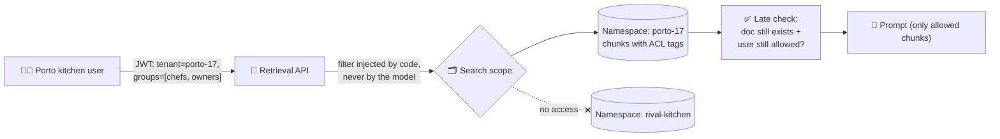

# 025 · Permission-Aware Retrieval

> ⏱ 13 min · 📈 50% · 🅰️ AI-era core · Phase 03: Retrieval & Data for AI
>
> `██████████░░░░░░░░░░` 50% of Book 2
>
> 🧬 **Atoms used:** authn, authz & JWT [B1·069] · security essentials [B1·070] · shard keys [B1·050] · [020] · [021] · [024]

---

## 📖 Story

**Pantry for Business** launches: restaurants and dark kitchens upload their **private documents** (supplier contracts, costings, **secret recipes**) and ask "Ask the Chef" about them.

Day two, 11:40. A kitchen in Porto asks: "**What's in our signature sauce?**"

The answer is detailed, confident, and perfectly sourced: a list of ingredients from **another kitchen's** secret recipe, a competitor two streets away. The retriever found the closest chunks on the whole flavour map, and "signature sauce" matched both kitchens' documents equally well.

Maya had a safeguard: the system prompt said "**Only use documents belonging to the user's organization.**" The model can't see who owns a chunk, and a sentence in a prompt isn't a security boundary.

I told Maya the rule I wish someone had told me: **the model must never be shown anything the user isn't allowed to see**. Permissions belong in the **retrieval layer**, enforced by code, before a single token reaches the prompt. Let me show you how to build the walls.

## 🎯 One-sentence idea

**Permission-aware retrieval enforces access control inside the search itself (tenant isolation through separate indexes or mandatory filters, plus per-document access lists matched against the caller's identity), so unauthorized content never reaches the prompt, and it re-checks permissions on the final results and scopes every cache.**

## 🧸 Analogy

A **shared office building with private filing rooms**:

- Each company has its **own locked room** (tenant isolation). Your keycard simply **doesn't open** the other rooms.
- Inside your room, some cabinets are **for managers only** (document-level access lists).
- The **research assistant** (retrieval) carries **your keycard**, so they can only fetch from rooms you can open.
- Telling the assistant "**please don't read other companies' files**" while handing them a master key is not security. It's a wish.

## 🖼️ Visual

*Diagram brief:* a query carrying the user's verified identity (tenant and groups) enters the retrieval service. A mandatory filter is injected from the auth token, not from the prompt, and the search runs only inside the tenant's partition, matching document ACLs. A late check re-validates the final chunks against the source system, and the cache key includes the tenant and permission set.



## 🔬 How it works

- **Identity comes from auth, not from the conversation:** the retrieval service reads the **tenant and groups from the verified token** (Book 1 lesson 069) and injects filters itself. Nothing the user or the model types can change them.
- **Tenant isolation, two ways:** **separate namespaces/indexes per tenant** (strongest isolation, easy per-tenant deletion, but many small indexes), or a **shared index with a mandatory `tenant_id` filter** applied inside the ANN search (efficient for many small tenants). Big tenants often get their own; the long tail shares.
- **Document-level ACLs:** every chunk carries the **access list of its source document** (users, groups, roles), copied at ingestion and **kept fresh by CDC** when permissions change (lesson 024). Search filters on `acl ∩ user.groups ≠ ∅`, using filter-aware search so results don't vanish (lesson 020).
- **Late binding check:** before building the prompt, re-verify the final ~5 chunks against the **source system** (does the document still exist? does this user still have access?). This closes the window between a permission change and index update.
- **Scope everything downstream:** answer caches, semantic caches, conversation memory, and logs must be keyed by **tenant and permission set**, or a cache becomes the leak (lesson 018). Audit-log which documents were used for each answer.

## 🧩 Worked example

**The retrieval call, built by code:**

```python
def retrieve(query: str, principal: Principal, k: int = 50):
    flt = {"tenant_id": principal.tenant_id,                 # from the verified JWT
           "acl_groups": {"any_of": principal.groups}}       # document-level ACL
    hits = index.hybrid_search(query, filter=flt, k=k)      # filter-aware, not post-filter
    top = rerank(query, hits)[:5]
    return [c for c in top if source.can_read(principal, c.doc_id)]   # late binding
```

**Isolation strategy for Pantry for Business:**

| Tenant size | Count | Strategy |
|---|---|---|
| Large chains (> 50k docs) | 40 | Dedicated namespace each |
| Small kitchens (< 50k docs) | 12,000 | Shared index, mandatory `tenant_id` filter, partitioned by tenant hash |
| All | – | Per-tenant encryption keys, per-tenant cache keys, per-answer audit log |

**The Porto question, replayed:** the search runs only inside `porto-17`. The rival's recipe is **not a candidate at all**: it's not filtered out after the fact, it was never reachable. Maya adds a **red-team test** to CI: 500 cross-tenant probe queries, expected leaks: **0**.

## ⚖️ Trade-offs

| Decision | You gain | You pay |
|---|---|---|
| Namespace per tenant | Strong isolation, easy deletion | Many small indexes, overhead per tenant |
| Shared index + mandatory filter | Efficient for many tenants | One bug in the filter = a leak |
| Document ACLs in the index | Fine-grained access | ACL changes must stream fast |
| Late binding check | Closes stale-permission windows | A source-system call per answer |
| Permission-scoped caches | No cache leaks | Lower cache hit rates |

## 🌍 Real world

- Enterprise search and AI assistants **inherit the permissions** of connected sources (document drives, wikis, ticketing tools), so users only see answers from documents they could open themselves.
- Vector databases offer **namespaces, partitions, and metadata filters** for multi-tenant isolation.
- Security reviews treat "**the prompt says not to reveal X**" as **no control at all**: authorization belongs in code, outside the model.

## 📌 Cheat card

> - **Never show the model what the user can't see.**
> - **Filters come from the verified token**, injected by code.
> - **Tenant isolation:** a namespace per big tenant, a mandatory filter for the long tail.
> - **Chunk ACLs** copied from sources, **kept fresh by CDC.**
> - **Late check on final chunks. Scope caches and logs by tenant + permissions.**

## 🧪 Feynman check

Explain the office building: why the assistant must carry your keycard rather than a master key, and why "please don't read other companies' files" isn't a lock.

⚠️ **Common confusion:** "The system prompt tells the model to only use the user's documents." The model can't verify ownership, and prompt instructions can be overridden by injection (lesson 041). If a chunk reaches the prompt, assume it **can** reach the user. Enforce access **before** retrieval results exist.

## ⚡ Quick recall

1. Where must the tenant and group filters come from?
<details><summary>Reveal Answer</summary>

From the caller's verified identity (e.g., the auth token), injected by the retrieval service's code, never from the prompt or the model.
</details>

2. What's the trade-off between per-tenant namespaces and a shared index?
<details><summary>Reveal Answer</summary>

Namespaces give stronger isolation and easy deletion but add overhead per tenant. A shared index is efficient for many small tenants, but a single filter bug can leak data.
</details>

3. Why re-check permissions on the final chunks?
<details><summary>Reveal Answer</summary>

The index may lag behind a permission change or deletion, so a late check against the source closes that window.
</details>

## 🎤 Interview practice

**Q. "Design an AI assistant over a company's documents from five SaaS tools, where every answer must respect each user's existing permissions."**
<details><summary>Model answer</summary>

- **Connectors:** per-source sync of documents **and their ACLs** (users, groups, sharing links), via webhooks/CDC where available, plus periodic full reconciliation. Map source identities to one corporate identity (SSO/directory groups).
- **Index:** chunks carry `tenant_id`, `source`, `doc_id`, and an **ACL principal list**. Tenant isolation by namespace (or mandatory filter). Group membership is resolved at query time from the directory, so a group change doesn't require re-indexing every document.
- **Query path:** identity from SSO → filter-aware hybrid search with `acl ∩ user_principals` → rerank → **late check** against source APIs for the final few (cached briefly) → prompt.
- **Freshness:** ACL changes must propagate fast (minutes): revocations are prioritized over content updates.
- **Downstream scoping:** caches keyed by (tenant, principal set hash), memories per user, audit logs of documents used per answer, and citations only to accessible documents.
- **Testing:** automated cross-user and cross-tenant probe suites in CI and production canaries, with an expected leak count of zero.
- **Likely follow-up:** "A user loses access while a conversation is open. What happens?" → the next retrieval excludes the document, the late check blocks reuse of previously retrieved chunks, and the conversation's stored context is re-filtered.
</details>

## 📖 Teaser

> 📖 *The walls hold, and Maya's attention turns to the other half of personalization: the "Recommended for you" model that scores beautifully in training and badly in production, because it's quietly reading different numbers in each.*

---

⬅️ [024 · Keeping the Index Fresh](024-index-freshness.md) · 🗺️ [Phase map](README.md) · ➡️ [✅ Checkpoint 50%](checkpoint-50.md)

✅ **Safe stopping point.** Tick lesson 025 in [PROGRESS.md](../../PROGRESS.md), then do the checkpoint!
