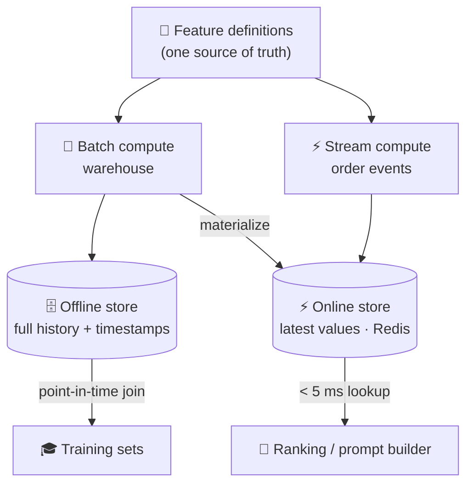

# 026 · Feature Stores

> ⏱ 12 min · 📈 52% · 🅰️ AI-era core · Phase 03: Retrieval & Data for AI
>
> `██████████░░░░░░░░░░` 52% of Book 2
>
> 🧬 **Atoms used:** OLTP vs OLAP [B1·041] · distributed caches [B1·033] · batch vs stream [B1·091] · [024]

---

## 📖 Story

Pantry's **"Recommended for you"** ranker looked brilliant in testing: offline accuracy **up 14%** over the old one. In production, click-through goes **down 6%**.

Maya spends a week finding out why. The model's favourite signal is "**orders in the last 7 days**". In training, a data scientist computed it in SQL over the warehouse. In production, an engineer re-implemented it in the app, reading a cache that **counts cancelled orders** and uses **UTC days** instead of local days.

Same name. **Different numbers.** The model learned one feature and is served another.

Then she finds something worse in the training data: for some rows, "orders in the last 7 days" included orders placed **after** the moment being predicted. The model had been quietly **peeking into the future**, which is why offline accuracy was so good.

I told Maya that features are like **ingredients prepared by two different kitchens**: if the prep kitchen and the line kitchen follow different recipes, the dish never tastes the same twice. The fix is **one recipe, two kitchens, and a calendar that never lets you cook with tomorrow's groceries**. Let me show you.

## 🎯 One-sentence idea

**A feature store defines each feature once and serves it two ways (an offline store with point-in-time-correct history for training, and a low-latency online store for serving), so training and production see identical values and models never learn from data that wasn't available at prediction time.**

## 🧸 Analogy

**A restaurant chain's central prep recipes**:

- Every kitchen makes "**house sauce**" from **one written recipe** (one feature definition), not from each cook's memory.
- The **archive kitchen** keeps a **dated jar** of sauce from every day, so you can taste exactly what was served on any past date (offline store with history).
- The **line kitchen** keeps **today's sauce** warm at the pass, ready in a second (online store).
- And when you study last March's dishes, you may only use **sauce jars dated before that dinner**: never jars from April (point-in-time correctness).

## 🖼️ Visual

*Diagram brief:* a feature definition registry at the top feeds two pipelines. A batch pipeline computes features over the warehouse into the offline store (with timestamps), used for training through point-in-time joins. A streaming pipeline computes the same features from events into the online store (Redis), read by the ranking service in milliseconds. Both pipelines share the same definition.



## 🔬 How it works

- **Define once:** each feature (e.g., `user.orders_7d`, `dish.rating_30d`, `user.cuisine_affinity`) has one definition, one owner, and a version, from which **both** pipelines are generated. No re-implementations.
- **Offline store:** the **full history** of feature values with **timestamps**, in the warehouse or a lake (Book 1 lesson 041). Training sets are built with **point-in-time joins**: for each training example at time *t*, take the latest feature value **as of *t***, never later. That prevents **leakage**.
- **Online store:** the **latest** value per entity in a low-latency key-value store (Redis, a DynamoDB-style store), for **single-digit-millisecond** lookups at serving time (Book 1 lesson 033).
- **Freshness by feature:** batch-materialized features (daily ratings) vs **streaming** features computed from events in seconds ("items in cart right now", Book 1 lesson 091). Each feature declares its freshness SLO.
- **In the AI era:** the same store feeds **ranking models**, **embedding-based recommenders** (lesson 048), and **LLM prompts** (the user-profile section of the context budget, lesson 003). Monitor **training/serving skew**: compare the distributions of features logged at serving time with those in training.

## 🧩 Worked example

**Point-in-time correctness:**

```
Training example: user u7 clicked "ramen" at 2026-03-10 19:00
Feature user.orders_7d history:
  2026-03-09 23:00 → 3
  2026-03-10 21:00 → 4   ← after the click: must NOT be used
Correct value as of 19:00 = 3 ✅ (the leaky join used 4)
```

**Serving budget for one recommendation request:**

```
Fetch 40 features for 1 user + 200 candidate dishes (batched multi-get)
Online store: 2 round trips × ~1.5 ms ≈ 3 ms
Scoring 200 candidates: ~8 ms
Total ranking ≈ 11 ms ✅ (budget 30 ms)
```

**The 6% drop, replayed:** both pipelines now compute `orders_7d` from **one definition** (completed orders, local days). Retraining with point-in-time joins lowers the offline gain from 14% to a **truthful 5%**, and production click-through rises **+4.8%**: offline and online finally agree.

## ⚖️ Trade-offs

| Decision | You gain | You pay |
|---|---|---|
| A feature store | No skew, reuse across teams | A platform to run and govern |
| Point-in-time joins | No leakage, honest offline metrics | Heavier training-set queries |
| Streaming features | Freshness in seconds | Streaming infrastructure |
| Batch-only features | Simple and cheap | Hours-old values |
| Logging served features | Skew detection, exact replays | Storage costs |

## 🌍 Real world

- **Uber's Michelangelo** popularized the feature store. Open-source **Feast** and managed feature stores in major ML platforms follow the same offline/online split.
- **Training/serving skew** is one of the most common reasons models underperform in production, and logging served features is the standard fix.
- Recommendation and fraud systems rely on **streaming features** (recent activity in seconds) alongside daily batch aggregates.

## 📌 Cheat card

> - **One feature definition → offline and online stores.**
> - **Offline:** full history, **point-in-time joins**, no leakage.
> - **Online:** latest values, **< 5 ms** lookups.
> - **Batch or streaming per feature**, with a freshness SLO.
> - **Log served features. Watch for skew.**

## 🧪 Feynman check

Explain the central prep recipes: why two kitchens with different recipes make different dishes, and why studying last March's dinners with April's sauce gives a falsely good result.

⚠️ **Common confusion:** "Our model is 14% better offline, so it'll be better in production." If training features leak future information or differ from serving features, offline metrics are **fiction**. Point-in-time correctness and one shared definition come before trusting any offline number.

## ⚡ Quick recall

1. What is training/serving skew?
<details><summary>Reveal Answer</summary>

When the features a model sees in production are computed differently from (or have different distributions than) those it was trained on.
</details>

2. What does a point-in-time join prevent?
<details><summary>Reveal Answer</summary>

Leakage: using feature values that weren't yet available at the moment of the training example.
</details>

3. What are the offline and online stores for?
<details><summary>Reveal Answer</summary>

The offline store holds the full timestamped history for building training sets. The online store holds the latest values for low-latency lookups at serving time.
</details>

## 🎤 Interview practice

**Q. "Design the feature platform behind a food-delivery recommendation model that must use both long-term preferences and what the user did in the last five minutes."**
<details><summary>Model answer</summary>

- **Definitions:** a registry of versioned features with owners and freshness SLOs: long-term (cuisine affinity over 90 days, ratings) and real-time (items viewed in the session, cart contents, time of day).
- **Batch path:** daily jobs over the warehouse write timestamped values to the offline store and **materialize** the latest values into the online store.
- **Streaming path:** click and cart events → a stream processor computing windowed features (last 5–30 minutes) → the online store within seconds, and also appended to the offline store with timestamps.
- **Serving:** the ranking service multi-gets user + candidate features from Redis-class storage (< 5 ms), scores candidates, and **logs the served feature vector** with the request ID.
- **Training:** point-in-time joins over the offline store (or over logged served features), so training matches serving exactly.
- **Monitoring:** feature freshness, null rates, and distribution drift between serving logs and training data, with alerts per feature.
- **Likely follow-up:** "The online store goes down. What happens?" → fall back to default/popular features or a simpler non-personalized ranker, rather than failing the page.
</details>

## 📖 Teaser

> 📖 *Features finally match, and Maya decides it's time to teach the small model Pantry's own way of talking, by training it on five million support chats that turn out to contain card numbers, duplicates, and the answers to her own exam.*

---

⬅️ [✅ Checkpoint 50%](checkpoint-50.md) · 🗺️ [Phase map](README.md) · ➡️ [027 · Training & Fine-Tuning Data Pipelines](027-training-data-pipelines.md)

✅ **Safe stopping point.** Tick lesson 026 in [PROGRESS.md](../../PROGRESS.md).
