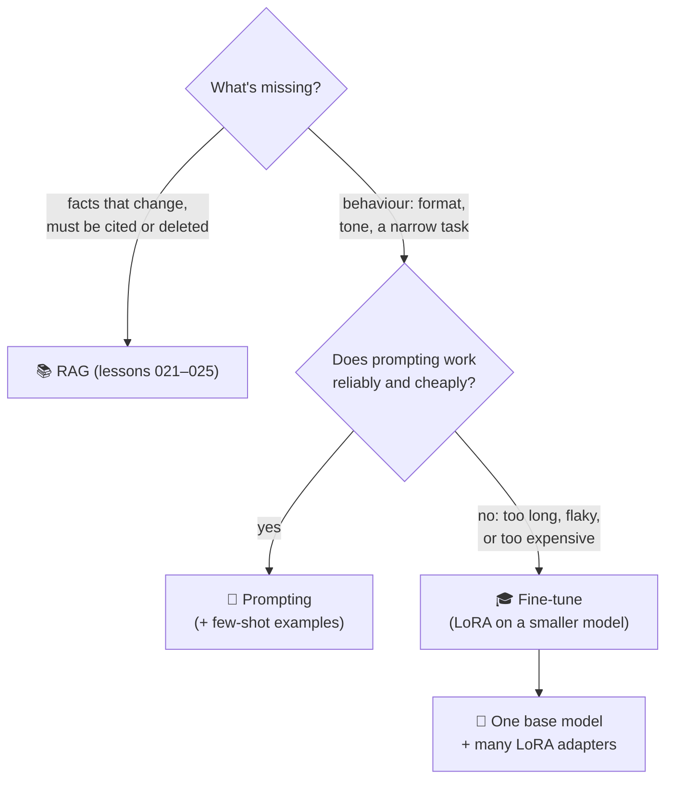

# 028 · Prompting vs RAG vs Fine-Tuning

> ⏱ 12 min · 📈 56% · 🅰️ AI-era core · Phase 03: Retrieval & Data for AI
>
> `███████████░░░░░░░░░` 56% of Book 2
>
> 🧬 **Atoms used:** [003] · [012] · [015] · [021] · [024] · [027]

---

## 📖 Story

The menu team has a proposal: "**Fine-tune the model on all 40,000 menus**, so it knows every dish by heart. No more retrieval!"

Maya runs the numbers in her head. Menus change **every day**: 0.8% of dishes, specials, prices, sold-out items. A fine-tuned model is a **snapshot**: by Thursday, it would recommend Monday's specials. A cook who leaves would stay **baked into the weights** until the next retrain. And a fine-tuned model asked about a dish it half-remembers **still hallucinates**, just more fluently.

At the same time, a different team has the **opposite** problem. They're using a giant 4,000-token prompt with 30 examples to make the big model output **order JSON** in Pantry's exact format. It works 96% of the time, costs a fortune per call, and that prompt is longer than most conversations.

Two teams, two tools, both pointed at the wrong job.

I told Maya the rule I use: **prompting tells the model what to do right now, retrieval tells it what's true right now, and fine-tuning teaches it how to behave every time**. Knowledge belongs in retrieval. Behaviour belongs in training. Let me show you how to choose.

## 🎯 One-sentence idea

**Start with prompting, use retrieval (RAG) to give the model knowledge that changes or must be cited, and use fine-tuning to teach stable behaviour (format, style, a narrow task) or to let a smaller, cheaper model match a bigger one, with lightweight adapters (LoRA) so many fine-tunes can share one base model.**

## 🧸 Analogy

Getting a **new chef** ready to work at Pantry:

- **Prompting** = the **order ticket**: instructions for this dish, right now.
- **RAG** = the **recipe binder** on the counter: today's menu, current allergens, looked up when needed, and updated every morning.
- **Fine-tuning** = **culinary training**: months that change **how** the chef cooks: knife technique, plating style, the house way of doing things. Great for habits, terrible for memorizing today's specials.
- **LoRA adapters** = **clip-on technique cards**: one well-trained chef, different style cards per restaurant.

## 🖼️ Visual

*Diagram brief:* a decision flowchart. "Is the gap knowledge or behaviour?" Knowledge that changes or needs citing leads to RAG. Behaviour (format, tone, a narrow task) leads first to "try prompting", then to fine-tuning if prompting is too long, unreliable, or costly. A side branch shows many LoRA adapters plugged into one shared base model.



## 🔬 How it works

- **Prompting first:** instructions, examples, and structured-output schemas. It's instant to change, needs no training, and works with any model. Its costs are **tokens on every call** and fragility on complex formats.
- **RAG for knowledge:** facts that **change**, must be **cited**, are **per-tenant or permissioned**, or must be **deletable** belong in retrieval (lessons 021–025). Fine-tuning can't update a price by noon, can't cite a source, and can't forget a deleted cook.
- **Fine-tuning for behaviour:** consistent **formats** (order JSON), **tone and style**, **narrow tasks** (classification, extraction), and **distillation**: training a small model to imitate a large one on your task, making it **10–30× cheaper** at similar quality. It needs a clean dataset (lesson 027) and an eval gate.
- **LoRA adapters:** instead of updating all weights, train small **low-rank adapter** matrices (often **tens to hundreds of MB** vs many GB). Many adapters can be **served on one base model**, swapped per request (multi-LoRA serving), so per-tenant or per-task fine-tunes don't need their own GPUs.
- **Combine them:** a fine-tuned small model that **follows the house format**, fed **retrieved** facts, with a short prompt, is the common production endpoint. Re-evaluate fine-tunes whenever the **base model** is upgraded: adapters don't transfer.

## 🧩 Worked example

**The order-JSON team, three options:**

| Option | Accuracy (golden set) | Prompt tokens | $ per 1M requests |
|---|---|---|---|
| Big model + 4,000-token few-shot prompt | 96.0% | 4,300 | ~$14,000 |
| Small model + same prompt | 84.5% | 4,300 | ~$1,400 |
| **Small model + LoRA fine-tune** (20k examples) + 150-token prompt | **97.3%** | 250 | **~$90** |

```
LoRA adapter (rank 16 on an 8B model): ~40M trainable params ≈ 80 MB in FP16
Training: ~3 GPU-hours. Served on the shared 8B base pool alongside 50 other adapters.
```

**The menu team, redirected:** menus stay in **RAG**, freshened by CDC within a minute (lesson 024). A small **style** fine-tune teaches the chef Pantry's warm, concise voice. Prices and specials are always current, and deleted cooks vanish the same minute.

## ⚖️ Trade-offs

| Approach | You gain | You pay |
|---|---|---|
| Prompting | Instant iteration, no training | Tokens every call, fragile for complex behaviour |
| RAG | Fresh, citable, permissioned, deletable knowledge | Retrieval infrastructure and latency |
| Full fine-tuning | Maximum behaviour change | Expensive, a whole model copy to serve |
| LoRA fine-tuning | Cheap to train, many adapters per base | Slightly less capacity than full tuning |
| Distillation | Big-model quality at small-model cost | A dataset and pipeline to maintain |

## 🌍 Real world

- **LoRA** (Hu et al., 2021) made fine-tuning cheap. **Multi-LoRA** serving (e.g., S-LoRA, Punica, and support in vLLM) serves many adapters on one base model.
- Providers offer **fine-tuning APIs** mostly for format, style, and narrow tasks, and recommend RAG for knowledge.
- **Distillation** is how many "mini" production models match larger ones on specific tasks.

## 📌 Cheat card

> - **Prompting = right now. RAG = what's true. Fine-tuning = how to behave.**
> - **Knowledge that changes, must be cited, or deleted → RAG.**
> - **Format, tone, narrow tasks, distillation → fine-tune.**
> - **LoRA: small adapters, many per base model.**
> - **Re-eval fine-tunes on every base-model upgrade.**

## 🧪 Feynman check

Explain the new chef's preparation: why training changes habits but can't keep up with today's specials, and why a binder on the counter is the better place for the menu.

⚠️ **Common confusion:** "Fine-tuning teaches the model our data, so it won't hallucinate about it." Fine-tuning shifts **behaviour** far more reliably than it implants **facts**. A fine-tuned model still confabulates details it half-learned, can't cite sources, goes stale, and can't forget. Use retrieval for facts.

## ⚡ Quick recall

1. When is RAG the right tool rather than fine-tuning?
<details><summary>Reveal Answer</summary>

When the model needs knowledge that changes, must be cited, is permissioned per user or tenant, or must be deletable.
</details>

2. What is fine-tuning best at?
<details><summary>Reveal Answer</summary>

Teaching stable behaviour: output formats, tone and style, narrow tasks, and distilling a big model's skill on a task into a smaller, cheaper model.
</details>

3. Why are LoRA adapters useful for serving?
<details><summary>Reveal Answer</summary>

They're small and attach to a shared base model, so many fine-tunes (per task or tenant) can run on the same GPUs, swapped per request.
</details>

## 🎤 Interview practice

**Q. "A SaaS company wants an AI writing assistant that uses each of its 5,000 customers' brand voice and product facts. Prompting, RAG, or fine-tuning?"**
<details><summary>Model answer</summary>

- **Product facts → RAG:** per-tenant indexes with permission-aware retrieval (lesson 025), freshened by CDC, citable and deletable.
- **Brand voice → start with prompting:** a per-tenant style guide and a few example passages, retrieved into the prompt.
- **Upgrade path for big tenants:** if prompting is unreliable or too long, train a **per-tenant LoRA adapter** on approved samples of the brand's writing, served via **multi-LoRA** on a shared base model. 5,000 full fine-tunes would be unservable, while 5,000 adapters × ~80 MB ≈ 400 GB of adapters in storage, loaded on demand with an LRU cache.
- **Global behaviour:** one shared fine-tune for the product's output format and safety behaviour.
- **Evaluation:** per-tenant golden samples for voice (judged), factual accuracy via retrieval metrics, and gating on base-model upgrades (re-train or re-validate adapters).
- **Likely follow-up:** "A tenant churns and asks for deletion." → delete their index namespace, cached outputs, and their adapter (an advantage of per-tenant adapters over mixing their data into a shared fine-tune).
</details>

## 📖 Teaser

> 📖 *The chef now knows what's true and how to talk, and it's about to get hands: Pantry wants it to actually place orders, and the very first test order buys forty-two lasagnas.*

---

⬅️ [027 · Training & Fine-Tuning Data Pipelines](027-training-data-pipelines.md) · 🗺️ [Phase map](README.md) · ➡️ [029 · Tool Calling](../04-agents/029-tool-calling.md)

✅ **Safe stopping point.** Tick lesson 028 in [PROGRESS.md](../../PROGRESS.md). 🎉 **Phase 03 complete!** Skim the [Phase 03 cheatsheet](CHEATSHEET.md) and try the [interview bank](INTERVIEW-QUESTIONS.md).
