# 📚 Phase 03: Retrieval & Data for AI

> **Lessons 019–028 · 38% → 56% · 🅰️ AI-era core**
> By the end of this phase you'll **ground models in your own data**: embeddings, vector search, RAG, chunking, hybrid ranking, freshness, permissions, features, training data, and when to fine-tune instead.

## 📖 Chapter 3: Teaching the Model What Pantry Knows

The chef could talk, fast and cheaply now, but it had never read a single Pantry recipe. It invented signature dishes, missed product codes, described a curry without the peanuts a cook had just added, and, on one awful afternoon, showed a kitchen its rival's secret sauce. In this chapter, I'll show you how Maya built the library behind the chef: a map of meaning, a fast librarian, an open-book exam with citations, and walls that keep every kitchen's secrets in their own room.

## 🗺️ Phase map

```mermaid
flowchart LR
    L19["019<br/>Embeddings"] --> L20["020<br/>Vector DBs<br/>& ANN"]
    L20 --> C40{{"✅ Checkpoint 40%"}}
    C40 --> L21["021<br/>RAG<br/>architecture"]
    L21 --> L22["022<br/>Chunking &<br/>ingestion"]
    L22 --> L23["023<br/>Hybrid search<br/>& reranking"]
    L23 --> L24["024<br/>Index<br/>freshness"]
    L24 --> L25["025<br/>Permission-aware<br/>retrieval"]
    L25 --> C50{{"✅ Checkpoint 50%"}}
    C50 --> L26["026<br/>Feature<br/>stores"]
    L26 --> L27["027<br/>Training data<br/>pipelines"]
    L27 --> L28["028<br/>Prompting vs RAG<br/>vs fine-tuning"]
```

| # | Lesson | ⏱ | One-line idea |
|---|---|---|---|
| 019 | [Embeddings](019-embeddings.md) | 12 min | Meaning becomes coordinates. Close vectors = similar meaning, not truth |
| 020 | [Vector databases & ANN](020-vector-databases-ann.md) | 13 min | HNSW, IVF, and PQ trade a little recall for huge speed. Filter before you walk |
| ✅ | [Checkpoint 40%](checkpoint-40.md) | 20 min | |
| 021 | [RAG architecture](021-rag-architecture.md) | 13 min | Retrieve, rerank, answer only from sources, cite, and measure both halves |
| 022 | [Chunking & ingestion](022-chunking-and-ingestion.md) | 12 min | Cut along the document's layers, label every slice, re-embed only what changed |
| 023 | [Hybrid search & reranking](023-hybrid-search-reranking.md) | 12 min | Keyword + vector, fused by rank, then a cross-encoder picks the top few |
| 024 | [Keeping the index fresh](024-index-freshness.md) | 12 min | Stream changes into the index. Deletes reach every copy |
| 025 | [Permission-aware retrieval](025-permission-aware-retrieval.md) | 13 min | Never show the model what the user can't see. Enforce it in code |
| ✅ | [Checkpoint 50%](checkpoint-50.md) | 25 min | |
| 026 | [Feature stores](026-feature-stores.md) | 12 min | One definition, offline + online stores, point-in-time correctness |
| 027 | [Training data pipelines](027-training-data-pipelines.md) | 13 min | Consent, scrub, dedupe, filter, decontaminate, version |
| 028 | [Prompting vs RAG vs fine-tuning](028-prompting-rag-fine-tuning.md) | 12 min | Prompts for now, RAG for facts, fine-tuning for behaviour, LoRA to share |

📌 [Phase cheatsheet](CHEATSHEET.md) · 🎤 [Phase interview questions](INTERVIEW-QUESTIONS.md)

⬅️ Previous phase: [02 Model serving](../02-model-serving/README.md) · ➡️ Next phase: [04 Agents & orchestration](../04-agents/README.md)
