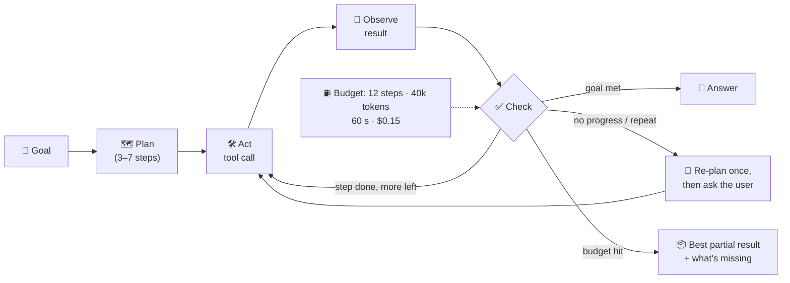

# 030 · Agent Loops & Planning

> ⏱ 12 min · 📈 60% · 🅰️ AI-era core · Phase 04: Agents & Orchestration
>
> `████████████░░░░░░░░` 60% of Book 2
>
> 🧬 **Atoms used:** timeouts & retries [B1·063] · circuit breakers [B1·064] · [004] · [015] · [029]

---

## 📖 Story

"**Plan my dinners for the week, under £60, nothing spicy, and order the groceries.**"

Maya watches the agent's trace scroll. Search "chicken". Search "chicken mild". Search "chicken mild under £8". Search "chicken" **again**. Check the budget. Search "pasta". Check the budget **again**…

**Thirty-seven tool calls.** Three minutes and twelve seconds. **$4.10** in tokens, because every step re-sent the growing history (lesson 003). And no plan at the end: the agent finally hit the provider's context limit and **crashed**, mid-thought.

Another run of the same request finishes in **six calls**, with a great plan. Same model, same tools. One run wandered and one didn't.

I told Maya that an agent is a **loop with a model inside**, and a loop without limits is the oldest bug in computing. Every loop needs a **budget, a plan, a way to notice it's going in circles, and a way out**. Let me show you how to put walls around the loop.

## 🎯 One-sentence idea

**An agent is a loop in which a model repeatedly decides the next action, calls a tool, and reads the result until the goal is met, so production agents need explicit plans, hard budgets (steps, tokens, time, money), loop and progress detection, and defined exits: finish, ask the user, or hand off.**

## 🧸 Analogy

A **personal shopper with a list, a budget, and a phone**:

- A good shopper **writes a plan first**: "dairy aisle, then vegetables, then pasta".
- They have a **fixed budget and a time limit**: £60 and one hour.
- If they've walked past the same shelf **three times**, they stop and **call you**: "they're out of mild chicken, what should I do?"
- They never wander the store **forever**, hoping the perfect chicken appears.

## 🖼️ Visual

*Diagram brief:* a loop of plan → act (tool call) → observe → check. The check box has four exits: goal met (answer), budget exhausted (best partial answer), loop detected (re-plan or ask the user), and risky action (approval). A budget meter on the side tracks steps, tokens, seconds, and dollars.



## 🔬 How it works

- **The loop (ReAct-style):** the model reasons about the next step, **acts** (a tool call), **observes** the result, and repeats. Flexible, but each iteration costs a full model call, and the history grows every step.
- **Plan first, then execute:** ask for a short **explicit plan** up front (or use a planner model), then execute steps against it, re-planning only when a step fails. This cuts wandering and makes progress **measurable**.
- **Hard budgets, enforced by code:** max **steps**, **tokens**, **wall-clock time**, and **cost** per task, sized from the task type. When a budget runs out, return the **best partial result** and say what's missing, never a crash.
- **Loop and progress detection:** detect **repeated tool calls** with the same or near-same arguments, no new information for N steps, or oscillation between two actions. Respond with one re-plan, then **ask the user** or **hand off**.
- **Keep the loop small:** compact tool results, summarize old observations (lesson 003), use **parallel tool calls** for independent lookups, use **smaller models** for simple steps, and prefer **deterministic code** for anything that doesn't need judgement (budget arithmetic, filtering).

## 🧩 Worked example

**The weekly plan, before and after:**

| | Unbounded loop | Planned + budgeted |
|---|---|---|
| Plan | none | 5 steps: constraints → candidate meals → fit budget → choose → build cart |
| Tool calls | 37 (11 duplicates) | 7 (two parallel searches) |
| Budget arithmetic | done by the model, 6 times | one deterministic `price_basket()` tool |
| Time | 3 min 12 s | 14 s |
| Cost | $4.10 | $0.09 |
| Outcome | crashed at the context limit | plan + cart for £57.40 ✅ |

**Loop detector, in a few lines:**

```python
sig = (call.name, normalize(call.args))
seen[sig] += 1
if seen[sig] >= 2 or steps_without_new_info >= 3:
    if not replanned: replan(); replanned = True
    else: return ask_user("I can't find mild chicken under £8. Swap for turkey?")
if steps > 12 or tokens > 40_000 or elapsed > 60 or cost > 0.15:
    return best_partial_result()
```

## ⚖️ Trade-offs

| Decision | You gain | You pay |
|---|---|---|
| Free-form reactive loop | Flexibility for open-ended tasks | Wandering, unpredictable cost |
| Plan-then-execute | Predictable, measurable progress | Plans can be wrong, so re-planning logic |
| Tight budgets | Bounded cost and latency | Some solvable tasks stop early |
| Asking the user | Resolves ambiguity cheaply | Friction, slower completion |
| Deterministic sub-steps | Exact, cheap, fast | Less flexible |

## 🌍 Real world

- **ReAct** (2022) formalized interleaving reasoning and acting. Most agent frameworks implement this loop with **max-iteration** limits.
- Production agent products cap **steps, time, and spend** per task, and show progress and partial results.
- Coding and research agents increasingly **plan explicitly** (todo lists) and track progress against the plan.

## 📌 Cheat card

> - **Agent = a loop: decide → act → observe → check.**
> - **Plan first** (3–7 steps), re-plan on failure.
> - **Budgets in code:** steps, tokens, time, $. Partial result on exhaustion.
> - **Detect loops:** repeated calls, no new info. Re-plan once, then ask.
> - **Deterministic tools for arithmetic and filtering.**

## 🧪 Feynman check

Explain the personal shopper: why they write a plan, what they do after passing the same shelf three times, and why a budget makes them better, not worse.

⚠️ **Common confusion:** "A smarter model will stop looping on its own." Better models loop **less**, but no model guarantees termination or bounded cost. Budgets and loop detection belong in **code**, like timeouts in any distributed system.

## ⚡ Quick recall

1. Name the four budgets an agent loop should enforce.
<details><summary>Reveal Answer</summary>

Steps (iterations), tokens, wall-clock time, and money.
</details>

2. What should happen when an agent hits its budget?
<details><summary>Reveal Answer</summary>

Return the best partial result and explain what's missing (or ask the user), rather than crashing or silently failing.
</details>

3. How can a system detect that an agent is stuck?
<details><summary>Reveal Answer</summary>

Repeated tool calls with the same or similar arguments, several steps without new information, or oscillating between actions.
</details>

## 🎤 Interview practice

**Q. "Your customer-support agent sometimes takes 40+ steps and costs dollars per ticket. Redesign it for predictable cost and latency."**
<details><summary>Model answer</summary>

- **Measure:** distribution of steps, tokens, time, and cost per ticket type. Identify loops (duplicate calls) and the step types that dominate.
- **Structure:**
  - Classify the intent first (small model), then run an **intent-specific plan** (a fixed workflow for common intents, free-form agent only for the long tail).
  - Plan-then-execute with explicit steps and re-planning on failure.
- **Bounds:** per-intent budgets (e.g., 8 steps, 30k tokens, 45 s, $0.10), loop detection, and escalation to a human with a summary when exceeded.
- **Efficiency:** parallel tool calls, compact tool results, history summarization, deterministic tools for policy and arithmetic, and small models for intermediate steps (lesson 017).
- **Measure success:** resolution rate, escalations, p95 steps and cost, and a golden set of tickets replayed on every change (lesson 037).
- **Likely follow-up:** "Won't fixed workflows make it dumber?" → workflows cover the 80% of predictable intents cheaply. The flexible agent handles the rest within budgets. Most production "agents" are mostly workflows.
</details>

## 📖 Teaser

> 📖 *The shopper stays inside its budget now, but by Wednesday it has forgotten everything from Monday: the cart, the spice preference, and the fact that the plan was for four people.*

---

⬅️ [029 · Tool Calling](029-tool-calling.md) · 🗺️ [Phase map](README.md) · ➡️ [✅ Checkpoint 60%](checkpoint-60.md)

✅ **Safe stopping point.** Tick lesson 030 in [PROGRESS.md](../../PROGRESS.md), then do the checkpoint!
