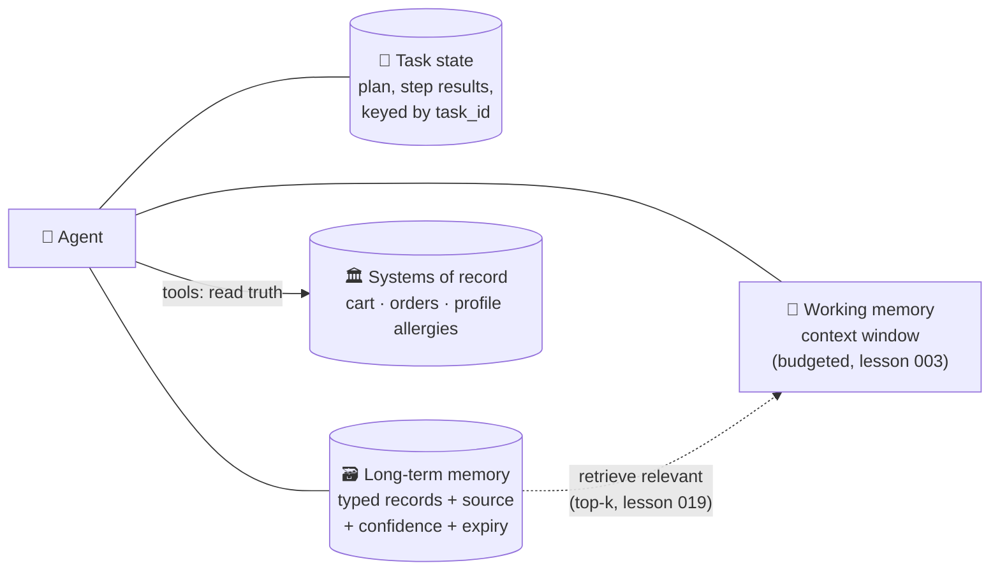

# 031 · Agent Memory & State

> ⏱ 12 min · 📈 62% · 🅰️ AI-era core · Phase 04: Agents & Orchestration
>
> `████████████░░░░░░░░` 62% of Book 2
>
> 🧬 **Atoms used:** stateless services [B1·018] · choosing a database [B1·045] · [003] · [019] · [024] · [030]

---

## 📖 Story

Monday: a customer plans the week with the agent. Four people, nothing spicy, a £60 budget, and a cart of groceries.

Wednesday: they come back. "**Swap Thursday's dinner for something with fish.**"

The agent has **no idea** what Thursday's dinner is. Monday's conversation ended, and with it, everything the agent "knew". It asks them to start over. They close the app.

Maya's first fix is brute force: **stuff every past conversation into the prompt**. By the second week, prompts are **60,000 tokens**, TTFT is **4 seconds**, and the agent confidently states the cart contains **salmon**: it remembered something the customer **said** on Monday ("maybe salmon?"), not what's actually in the cart.

Then a darker bug: a customer joked "**I'm allergic to vegetables, haha**" in March. The agent **remembered it as a fact** and has been quietly removing vegetables from their plans ever since.

I told Maya that "memory" for an agent isn't one thing. It's **three drawers**, and the most important rule is that **the state of the world never lives in the model's memory**. Let me show you the drawers.

## 🎯 One-sentence idea

**Agent memory has three layers (working memory in the context window, session and task state in structured storage, and long-term memories as typed, sourced, editable records retrieved when relevant), while facts about the world (carts, orders, allergies) are always read from systems of record, never remembered by the model.**

## 🧸 Analogy

A **personal chef's three drawers**:

- **The notepad** on the counter: what's happening **right now** in this cooking session (working memory, the context).
- **The job folder:** today's task, the plan, which steps are done (task state). Anyone can pick it up if the chef changes shifts.
- **The client card:** durable preferences ("family of four", "dislikes coriander"), each **written in ink with a date and who said it**, and the client can read and correct it (long-term memory).
- But the chef never trusts their memory for **what's in the fridge**: they **open the fridge** (system of record).

## 🖼️ Visual

*Diagram brief:* the agent in the middle, with three storage boxes around it: the context window (working memory), a task-state store (plan, step results), and a long-term memory store (typed records with source, confidence, and expiry). A separate box labelled "systems of record" (cart, orders, profile allergies) is read through tools, never written from conversation.



## 🔬 How it works

- **Working memory** is the context window: the current turn, recent history, retrieved facts. It's **budgeted** and disposable (lesson 003). Never let it be the only copy of anything important.
- **Task state** lives in a database, keyed by `task_id`: the **plan**, completed steps, and tool results. The agent process stays **stateless** (Book 1 lesson 018), so any worker can resume the task (lesson 032).
- **Long-term memory** is a set of **typed records**: `{type: preference, key: "household_size", value: 4, source: msg_123, confidence: high, expires: null}`. Store episodic **summaries** for "what we discussed", embedded for retrieval, and pull in only the **relevant** few per turn.
- **Write policy, not "remember everything":** a small extraction step proposes memories, and **rules** decide what's allowed: no jokes or hypotheticals as facts, **safety-critical facts** (allergies) only via **explicit confirmation** into the **profile**, no sensitive data without consent. Memories are **user-visible and editable**.
- **The world is read, not remembered:** carts, orders, prices, and allergies come from **systems of record via tools** at the moment they're needed. Memory stores **preferences and context**, never the authoritative state of things.

## 🧩 Worked example

**Wednesday's question, replayed:**

```
1. Load task state (task_id=wk-plan-881): plan days Mon–Sun, Thursday = "chicken pie"
2. Retrieve memories: household_size=4 (high), spice=mild (high), budget=£60 (task)
3. Tool: view_cart() → actual cart contents (truth), not what was said on Monday
4. Plan swap: search fish, mild, serves 4 → "baked cod with herb crust"
5. Update cart via tools, and update task state (Thursday = cod)
Prompt size: ~3,500 tokens (not 60,000). TTFT 0.4 s.
```

**The vegetable "allergy", replayed with a write policy:**

| Utterance | Extractor proposes | Policy decision |
|---|---|---|
| "I'm allergic to vegetables, haha" | allergy: vegetables | ❌ Rejected: humour marker, implausible, and allergies require explicit confirmation in the profile |
| "We're four at home" | household_size = 4 | ✅ Stored (preference, source msg, editable) |
| "My son is allergic to sesame" | allergy: sesame | ⏸️ Ask: "Add a sesame allergy to your profile?" → written to the profile only on yes |

## ⚖️ Trade-offs

| Decision | You gain | You pay |
|---|---|---|
| Stuff full history into context | Simple | Cost, latency, stale and conflicting "facts" |
| Typed long-term memory | Precise, auditable, editable | An extraction step and a schema |
| Retrieval of relevant memories | Small prompts, scales forever | Occasional misses |
| Strict write policy | No poisoned or false memories | Some useful facts not captured |
| Read world state via tools | Always correct | Extra tool calls |

## 🌍 Real world

- Chat assistants offer **user-visible memory** that people can review and delete, because invisible memory erodes trust.
- Agent frameworks separate **thread state** (checkpoints per conversation) from **long-term stores** (namespaced key-value or vector memories).
- Research on **memory poisoning** shows that agents that store anything they're told can be manipulated through planted "facts".

## 📌 Cheat card

> - **Three drawers: working (context), task state (DB), long-term (typed records).**
> - **Agents stay stateless.** State lives in storage, keyed by task.
> - **Retrieve the relevant few memories.** Don't stuff history.
> - **Write policy:** no jokes as facts, critical facts need confirmation, users can edit.
> - **World state comes from systems of record**, never from memory.

## 🧪 Feynman check

Explain the personal chef's three drawers, and why the chef always opens the fridge instead of remembering what's inside.

⚠️ **Common confusion:** "Give the agent memory by keeping the whole conversation history." That gives it a **pile of everything anyone said**: hypotheticals, jokes, outdated plans. Good memory is **selective, typed, sourced, and correctable**, and the truth lives elsewhere.

## ⚡ Quick recall

1. What are the three layers of agent memory?
<details><summary>Reveal Answer</summary>

Working memory (the context window), task/session state (structured storage keyed by task), and long-term memory (typed, sourced records retrieved when relevant).
</details>

2. Why should carts and allergies be read from systems of record?
<details><summary>Reveal Answer</summary>

Because memory of what was said can be outdated or wrong: the authoritative current state lives in the database and must be read at the moment it's needed.
</details>

3. What is a memory write policy for?
<details><summary>Reveal Answer</summary>

To decide what may be stored (no jokes or hypotheticals as facts, confirmation for critical facts, consent for sensitive data), preventing false or poisoned memories.
</details>

## 🎤 Interview practice

**Q. "Design memory for a personal assistant agent used daily by 5 million people over months."**
<details><summary>Model answer</summary>

- **Working memory:** a budgeted context (recent turns + task state + retrieved memories), summarizing older turns.
- **Task state:** a durable store keyed by `(user_id, task_id)` with the plan, step results, and status. Agents are stateless workers that resume from it.
- **Long-term memory:**
  - Typed records (preferences, facts, relationships) with source message, timestamp, confidence, and expiry, stored per user (document/KV store).
  - Episodic summaries embedded for retrieval (a vector index, per-user namespace).
  - Retrieval per turn: top-k relevant memories (k ≈ 5–10) + always-on core profile.
- **Write path:** an async extractor proposes memories → policy filter (sensitivity, plausibility, humour/hypothetical detection) → confirmation for critical facts → write. Conflicts resolved by recency and source.
- **User control and privacy:** a memory page to view, edit, and delete. Deletions propagate to indexes and caches (lesson 024). Consent for sensitive categories.
- **Scale:** 5M users × ~200 memories × ~1 KB ≈ 1 TB: easily sharded by `user_id`.
- **Likely follow-up:** "How do you stop someone planting memories through a shared document?" → only first-party user statements can create memories, never retrieved or tool-returned content (lesson 041).
</details>

## 📖 Teaser

> 📖 *The agent remembers the plan now, until a routine deploy restarts its server at step nine of twelve, and the restarted agent cheerfully places the grocery order a second time.*

---

⬅️ [✅ Checkpoint 60%](checkpoint-60.md) · 🗺️ [Phase map](README.md) · ➡️ [032 · Durable Execution for Agents](032-durable-agent-execution.md)

✅ **Safe stopping point.** Tick lesson 031 in [PROGRESS.md](../../PROGRESS.md).
