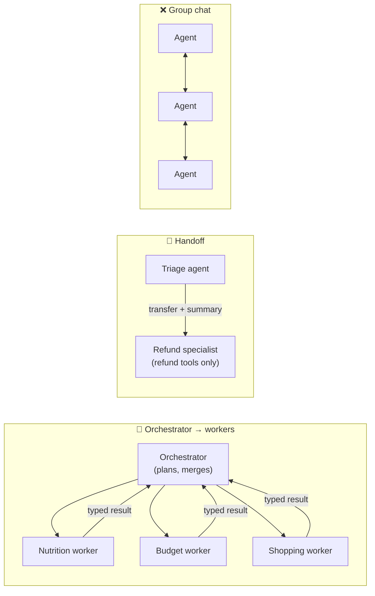

# 033 · Multi-Agent Systems

> ⏱ 12 min · 📈 66% · 🅰️ AI-era core · Phase 04: Agents & Orchestration
>
> `█████████████░░░░░░░` 66% of Book 2
>
> 🧬 **Atoms used:** monolith vs microservices [B1·026] · pub/sub & fan-out [B1·058] · [030] · [032]

---

## 📖 Story

Inspired by a conference talk, Maya rebuilds "Plan My Week" as **six specialist agents**: a Nutritionist, a Budgeter, a Shopper, a Chef, a Scheduler, and a Critic. They coordinate in a shared **group chat**, each reading everything the others say.

The demo is charming. The production numbers are not:

- **Tokens per plan: 9.3× higher.** Every agent reads every message, so the chat grows quadratically, six times over.
- **p50 latency: 14 s → 71 s.** Agents take turns politely, one at a time.
- The Budgeter and the Chef **argue** about saffron for **eleven rounds**.
- When a plan comes out wrong, nobody can tell **which agent** caused it.

And the quality? **Exactly the same** as the single agent on the golden set.

I told Maya what I learned the hard way: multi-agent systems are **microservices for reasoning**, and Book 1 already taught her when microservices pay off. Split only where there's **parallel work, separable context, or different permissions**, and connect the pieces with **contracts, not conversation**. Let me show you the patterns that earn their cost.

## 🎯 One-sentence idea

**Multi-agent designs split work across several model-driven agents (an orchestrator with workers, a pipeline, parallel fan-out, or handoffs), which helps when subtasks are parallel, need separate context windows, or need different tools and permissions, but multiplies tokens and failure modes, so start with one agent and connect any split with structured contracts.**

## 🧸 Analogy

A **restaurant kitchen brigade**:

- A **head chef** (orchestrator) breaks the order into tickets and hands them to **stations** (workers): grill, sauce, pastry, each with **its own tools** and focus.
- Stations work **in parallel** and send back **plates**, not opinions (structured outputs).
- Nobody holds a **group meeting** for every dish. That's how dinners get cold.
- And a **small café** with one excellent cook doesn't need a brigade at all.

## 🖼️ Visual

*Diagram brief:* four small patterns side by side. Orchestrator-workers: one box fanning tickets out to three workers and collecting typed results. Pipeline: three agents in a line passing artifacts. Parallel fan-out: one request split to N identical workers and merged. Handoff: a triage agent passing the whole conversation to a specialist. A crossed-out fifth pattern shows a free-for-all group chat.



## 🔬 How it works

- **Default to one agent:** a single agent with good tools and a plan (lesson 030) beats a team on most tasks: fewer tokens, one context, and easier debugging. Add agents only for a **measured** reason.
- **Valid reasons to split:**
  - **Parallelism:** independent subtasks (research 5 suppliers) run concurrently and cut latency.
  - **Context isolation:** each worker gets a clean, focused context instead of one bloated window.
  - **Different tools and permissions:** a refund specialist holds refund tools that the general agent must never have.
  - **Different models:** cheap workers, an expensive orchestrator (or the reverse).
- **Patterns:** **orchestrator-workers** (a planner delegates and merges), **pipelines** (fixed stages pass artifacts), **parallel fan-out / map-reduce** (same task over many inputs), and **handoffs** (transfer the conversation to a specialist with a summary).
- **Contracts, not chatter:** agents exchange **typed artifacts** (JSON with schemas), not free-form conversation. Shared state lives in the **task store** (lesson 031), not in a growing group transcript.
- **Costs and controls:** tokens multiply by the number of agents and rounds, failures compound (5 agents × 95% each ≈ 77% end to end), so set **per-agent budgets**, **max rounds**, and trace every hop (lesson 039). Run workers as **durable workflow activities** (lesson 032).

## 🧩 Worked example

**"Plan My Week", three architectures on the same golden set (300 plans):**

| Architecture | Tokens/plan | p50 latency | Plan quality |
|---|---|---|---|
| Six agents in a group chat | 186k | 71 s | 86% |
| Single agent + plan + tools | 20k | 14 s | 86% |
| Orchestrator + 3 parallel workers (typed contracts) | 31k | **8 s** | **88%** |

```
Why the orchestrator version wins on latency:
  nutrition check, price lookup, and stock check are independent →
  3 workers in parallel (~4 s) instead of 3 sequential steps (~10 s)
Why it costs more tokens than one agent:
  each worker gets its own system prompt + task context (+55%)
```

**The decision:** single agent for ordinary requests, orchestrator + parallel workers only for "Plan My Week", where the latency gain justifies **+55% tokens**. The group chat is retired.

## ⚖️ Trade-offs

| Decision | You gain | You pay |
|---|---|---|
| Single agent | Cheapest, simplest, debuggable | One context window, sequential steps |
| Orchestrator + workers | Parallelism, focused contexts | More tokens, orchestration logic |
| Pipelines | Predictable, testable stages | Rigid, errors propagate downstream |
| Handoffs | Least privilege per specialist | Context loss at each transfer |
| Group chat | Demos well | Quadratic tokens, loops, untraceable blame |

## 🌍 Real world

- Agent frameworks offer **supervisor/worker**, **handoff**, and **graph** patterns. Production guidance consistently says to **start with a single agent** and add structure only when needed.
- Deep-research products use **parallel sub-agents** that each explore a subtopic in their own context, then merge, trading many more tokens for breadth and speed.
- Customer-support systems use **triage → specialist handoffs** so that only specialists hold sensitive tools.

## 📌 Cheat card

> - **Start with one agent.** Split only for parallelism, context isolation, or permissions.
> - **Patterns:** orchestrator-workers, pipeline, fan-out, handoff.
> - **Typed artifacts between agents**, shared state in the task store.
> - **Tokens multiply, failures compound.** Budgets, max rounds, tracing.
> - **Measure against the single-agent baseline.**

## 🧪 Feynman check

Explain the kitchen brigade: why stations send back plates instead of opinions, why there's no group meeting per dish, and why a small café doesn't need a brigade.

⚠️ **Common confusion:** "More agents = more intelligence." Agents don't pool IQ. They pool **tokens, latency, and failure points**. A team beats a single agent only when the work genuinely splits: parallel, separable, or differently permissioned.

## ⚡ Quick recall

1. Name three valid reasons to split work across agents.
<details><summary>Reveal Answer</summary>

Parallelizable subtasks, the need for separate focused contexts, and different tools/permissions (or different models) per role.
</details>

2. Why should agents exchange typed artifacts rather than chat?
<details><summary>Reveal Answer</summary>

Typed contracts are validated, compact, and testable, while free-form chat grows quadratically, invites loops, and hides which agent caused an error.
</details>

3. If five agents in a chain each succeed 95% of the time, what's the end-to-end success rate?
<details><summary>Reveal Answer</summary>

About 0.95⁵ ≈ 77%.
</details>

## 🎤 Interview practice

**Q. "Design a research agent that answers 'compare these 10 suppliers on price, reliability, and sustainability' in under a minute."**
<details><summary>Model answer</summary>

- **Shape:** orchestrator + parallel workers. The orchestrator plans the comparison dimensions and the output schema.
- **Fan-out:** 10 worker agents (one per supplier), each with web/internal-search tools and its **own context**, returning a **typed record** (`price_index`, `on_time_rate`, `certifications`, `sources[]`). Each has a budget (e.g., 8 steps, 20k tokens, 40 s).
- **Merge:** the orchestrator validates records, flags gaps, and writes the comparison with citations. Deterministic code computes rankings from the numbers.
- **Latency:** parallel workers → ~40 s wall time instead of ~6 minutes sequentially. Partial results returned if a worker times out, marked "insufficient data".
- **Cost control:** small models for workers, the stronger model for planning and the final synthesis. Total ≈ 10 × 20k + 30k ≈ 230k tokens: price it and cap it per request.
- **Reliability:** workers as durable activities with retries. Every hop traced.
- **Likely follow-up:** "Why not one agent with all 10 suppliers?" → one context would overflow with 10 suppliers' pages, run sequentially, and mix sources. Fan-out gives isolation and parallelism.
</details>

## 📖 Teaser

> 📖 *The brigade works, but Maya counts six different home-made integrations of the same menu and order tools across Pantry's agents, and business customers are asking to plug Pantry into their own AI assistants.*

---

⬅️ [032 · Durable Execution for Agents](032-durable-agent-execution.md) · 🗺️ [Phase map](README.md) · ➡️ [034 · MCP & Tool Protocols](034-mcp-and-tool-protocols.md)

✅ **Safe stopping point.** Tick lesson 033 in [PROGRESS.md](../../PROGRESS.md).
