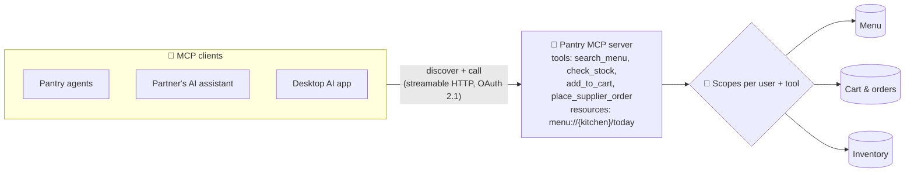

# 034 · MCP & Tool Protocols

> ⏱ 12 min · 📈 68% · 🅰️ AI-era core · Phase 04: Agents & Orchestration
>
> `█████████████░░░░░░░` 68% of Book 2
>
> 🧬 **Atoms used:** API gateway [B1·022] · authn/authz & OAuth [B1·069] · service discovery [B1·071] · [025] · [029]

---

## 📖 Story

Maya audits Pantry's agents and finds **six different integrations** of the same three tools: menu search, cart, and orders. Each team wrote its own wrapper, with **its own description**, **its own schema**, and its own bugs. One wrapper still calls an API version retired in March. Another passes the service's **admin key** to every user.

Then the business team forwards a request from Pantry's biggest restaurant chains: "Our staff use **their own AI assistants** at work. Can those assistants check Pantry stock and place supplier orders **directly**?"

Building a custom plugin for every AI client on the market would take years.

I told Maya that this is the **USB problem**. Before USB, every device needed its own port and its own driver. AI tools are going the same way, and the industry's answer is a **standard plug**: a protocol where any AI application can discover and call any tool server. Let me show you how Pantry builds **one** server that every agent, internal or external, can use.

## 🎯 One-sentence idea

**The Model Context Protocol (MCP) standardizes how AI applications connect to external tools and data: a server exposes tools, resources, and prompts with schemas, any compatible client can discover and call them, and authorization, scoping, and trust are designed in at the server, because a standard plug makes tools reusable and also makes them reachable.**

## 🧸 Analogy

A **universal power socket** for kitchen appliances:

- Before standards, every blender needed its **own special socket**, and every kitchen rewired the wall.
- With a **standard socket**, any appliance plugs into any kitchen, and the socket **declares what it supplies** (capability discovery).
- But a standard socket is also easy to plug **anything** into, so the building needs **circuit breakers and keyed sockets** for the dangerous ones (authorization and scopes).

## 🖼️ Visual

*Diagram brief:* on the left, several AI clients (Pantry's own agents, a partner's assistant, a desktop AI app). In the middle, the Pantry MCP server, exposing a list of tools and resources with schemas, protected by OAuth and per-scope permissions. On the right, the internal services it fronts: menu, cart, orders, inventory.



## 🔬 How it works

- **Roles:** an **MCP server** exposes capabilities, an **MCP client** inside an AI application connects to it, and the application's model decides when to use them. Servers run **locally** (stdio, for desktop tools) or **remotely** (streamable HTTP, for services like Pantry).
- **What a server exposes:** **tools** (actions with JSON Schema inputs, lesson 029), **resources** (readable data addressed by URI, like `menu://kitchen-17/today`), and **prompts** (reusable templates). Clients **discover** them at connect time, so tools are described and versioned **once**.
- **Authorization:** remote servers use **OAuth** so each call acts **as the signed-in user** with explicit scopes (`menu:read`, `orders:write`), never a shared admin key (Book 1 lesson 069). Tenant and ACL rules apply exactly as in retrieval (lesson 025).
- **Trust runs both ways:** clients should treat servers as **untrusted**: tool descriptions and results are text that can carry **prompt injection** (lesson 041), and a malicious server can describe a harmless-sounding tool that does something else. Allow-list servers, pin versions, and review descriptions.
- **Operate it like an API:** an MCP server is a product surface: rate limits per client, audit logs, versioned tool schemas, deprecations, and the same idempotency rules for write tools.

## 🧩 Worked example

**Pantry's MCP server, one definition for everyone:**

| Tool / resource | Scope | Notes |
|---|---|---|
| `search_menu(query, kitchen?)` | `menu:read` | Public data, rate-limited per client |
| `menu://{kitchen}/today` (resource) | `menu:read` | Daily menu as a readable document |
| `check_stock(item_ids[])` | `inventory:read` | Business accounts only, tenant-filtered |
| `add_to_cart(item_id, quantity 1–20)` | `cart:write` | Idempotency key required |
| `place_supplier_order(order)` | `orders:write` | Returns an **approval request**, not an order (lesson 036) |

**Before and after:**

```
Integrations of menu/cart/order tools:   6 home-made wrappers → 1 MCP server
Time for a partner AI client to integrate: "custom plugin, ~1 quarter" → "add the server URL + OAuth, ~1 day"
Tools reachable with an admin key:       all of them → none (user-scoped OAuth tokens)
```

## ⚖️ Trade-offs

| Decision | You gain | You pay |
|---|---|---|
| A standard protocol (MCP) | One integration for every compatible client | A protocol to keep up with as it evolves |
| Remote server + OAuth | Per-user access, central control | Auth flows, token management |
| Exposing many tools | Flexibility for agents | Bigger prompts, worse tool selection, a larger attack surface |
| Resources vs tools | Read-only data stays read-only | Two concepts to design |
| Third-party servers in your agents | Fast capability growth | Supply-chain and injection risk |

## 🌍 Real world

- **MCP** was introduced by Anthropic in late 2024 as an open protocol, and has since been adopted across many AI applications, IDEs, and agent frameworks, with official SDKs in several languages.
- SaaS companies publish **remote MCP servers** so customers' AI assistants can use their products with OAuth.
- Security researchers have documented **tool poisoning** and over-privileged servers, driving allow-lists, scoped tokens, and review processes.

## 📌 Cheat card

> - **MCP = a standard plug** between AI apps (clients) and tools/data (servers).
> - **Servers expose tools, resources, prompts** with schemas. Clients discover them.
> - **Remote servers: OAuth, per-user scopes,** never shared admin keys.
> - **Treat servers and their text as untrusted:** allow-list, pin, review.
> - **Run it like a public API:** limits, audits, versioning, idempotency.

## 🧪 Feynman check

Explain the universal power socket: why a standard socket saves every kitchen from rewiring, and why the dangerous sockets still need keys and breakers.

⚠️ **Common confusion:** "MCP handles security for us." MCP defines **how** clients and servers talk and how authorization flows plug in. Whether a tool is **safe to expose**, what scopes it needs, whether its descriptions are trustworthy, and whether a write needs approval are still **your design decisions**.

## ⚡ Quick recall

1. What three kinds of things can an MCP server expose?
<details><summary>Reveal Answer</summary>

Tools (actions), resources (readable data by URI), and prompts (reusable templates).
</details>

2. Why use OAuth for a remote MCP server?
<details><summary>Reveal Answer</summary>

So each call acts as the signed-in user with explicit, limited scopes, instead of a shared key with full access.
</details>

3. Why should clients treat MCP servers as untrusted?
<details><summary>Reveal Answer</summary>

Tool descriptions and results are text that can contain prompt injection or misleading behaviour, and a malicious or compromised server can misuse the access it's given.
</details>

## 🎤 Interview practice

**Q. "Expose your company's product to customers' AI assistants. Design the integration."**
<details><summary>Model answer</summary>

- **Surface:** a remote **MCP server** over streamable HTTP, fronting existing APIs via the API gateway. Read tools and resources first, then a few carefully chosen write tools.
- **Auth:** OAuth 2.1 with per-user consent and fine-grained scopes. Tokens map to the user's tenant and roles, with object-level authorization in the backend.
- **Tool design:** small, strict schemas, precise descriptions, compact results, idempotency keys on writes, and **approval-returning** tools for high-risk actions (lesson 036).
- **Abuse and safety:** rate limits per client and user, audit logs, anomaly detection, output size caps, and no secrets or other tenants' data in results.
- **Lifecycle:** versioned tools, deprecation notices, a conformance test suite run against popular clients, and observability per tool (latency, errors, usage).
- **Likely follow-up:** "A client's model calls `delete_project` because a document told it to." → the destructive tool requires explicit user confirmation outside the model (or isn't exposed at all), and scopes for it are opt-in.
</details>

## 📖 Teaser

> 📖 *Every agent now speaks the same plug, and Maya's supplier-order tool is drowning in replies the model was asked to format as JSON: trailing commas, chatty preambles, and delivery dates in 1987.*

---

⬅️ [033 · Multi-Agent Systems](033-multi-agent-systems.md) · 🗺️ [Phase map](README.md) · ➡️ [035 · Structured Outputs & Validation](035-structured-outputs.md)

✅ **Safe stopping point.** Tick lesson 034 in [PROGRESS.md](../../PROGRESS.md).
