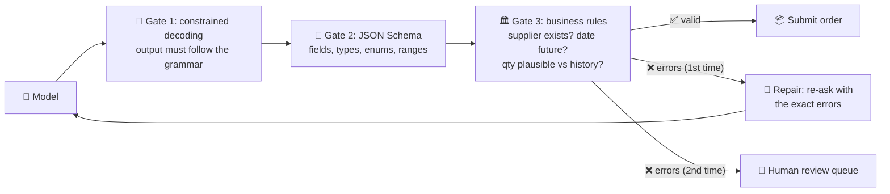

# 035 · Structured Outputs & Validation

> ⏱ 11 min · 📈 70% · 🅰️ AI-era core · Phase 04: Agents & Orchestration
>
> `██████████████░░░░░░` 70% of Book 2
>
> 🧬 **Atoms used:** REST API design & validation [B1·014] · retries [B1·063] · [006] · [017] · [029]

---

## 📖 Story

Pantry's supplier-ordering agent ends every run by asking the model to output the order **as JSON**, which a backend service then parses and submits.

**3.1%** of runs fail at parsing. Maya collects the corpses:

- `Sure! Here's your order: {"items": …}`: a **chatty preamble** before the JSON.
- `{"items": [ … ], }`: a **trailing comma**.
- A perfectly valid JSON object… with `"qty"` instead of `"quantity"`.
- And the subtle ones, which **parse fine**: a `delivery_date` of **1987-03-14**, a quantity of **-6**, and a supplier ID that **doesn't exist**.

The parse failures are loud: the order just doesn't happen. The valid-but-wrong ones are **silent**, and one almost ships 600 kilos of flour instead of 60.

I told Maya there are **three layers** of "correct output": it **parses**, it **matches the schema**, and it **makes sense for the business**. Models can be forced to get the first two right every time. The third is your code's job. Let me show you all three.

## 🎯 One-sentence idea

**Structured outputs make model responses machine-safe in three layers: constrained decoding guarantees the output parses and matches a JSON Schema, code validates business rules (ranges, references, dates), and a bounded repair loop or deterministic fallback handles what fails, so downstream systems never consume unchecked model text.**

## 🧸 Analogy

**A delivery form with boxes**, checked at the loading dock:

- A **form with printed boxes** means the order can only be written in the right shape: one item per row, a number in the quantity box (constrained decoding + schema).
- The **dock manager** checks the form against reality: does this supplier exist? Is "600 kg" plausible for a café that usually orders 60? Is the date in the future? (semantic validation)
- If something's off, the form goes **back once with a note** ("quantity looks 10× too high, please confirm"), and if it fails twice, a **person** handles it (repair, then fallback).

## 🖼️ Visual

*Diagram brief:* model output flows through three gates. Gate 1 (constrained decoding) only lets valid JSON through. Gate 2 (JSON Schema validation) checks fields and types. Gate 3 (business rules) checks references, ranges, and dates against the database. Failures at gate 3 loop back once to the model with the error message, and a second failure exits to a human queue.



## 🔬 How it works

- **Constrained decoding:** the serving engine restricts which tokens the model may produce at each step so the output **must** match a grammar or JSON Schema. Parse failures drop to **zero by construction**, with no preambles and no trailing commas. Many APIs expose this as "**strict**" structured outputs.
- **Schema design helps the model:** clear field names, `enum`s instead of free text, `minimum`/`maximum`, required fields, and short descriptions. Put a `reasoning` field **before** the answer fields if you want the model to think first (and drop it afterwards).
- **Semantic validation in code:** check what schemas can't express: **references exist** (supplier, item IDs), **dates** are in a valid window, **quantities** are plausible vs the customer's history, totals add up, and cross-field rules hold. Facts come from the **database**, not the model (lesson 006).
- **Repair loop, bounded:** on a validation failure, re-prompt **once or twice** with the **exact error list**. Still failing? Use a **deterministic fallback** (a default, a smaller form for the user to complete) or a **human queue**. Never loop forever, and never "fix" silently.
- **Measure:** schema-valid rate, semantic-valid rate, repair rate, and fallback rate per prompt version and model. A rise in repairs is an early warning of a model or prompt regression.

## 🧩 Worked example

**The order schema (abridged):**

```json
{
  "type": "object",
  "properties": {
    "supplier_id":   {"type": "string", "pattern": "^sup_[0-9]{5}$"},
    "delivery_date": {"type": "string", "format": "date"},
    "items": {"type": "array", "minItems": 1, "maxItems": 50, "items": {
        "type": "object",
        "properties": {"sku": {"type": "string"},
                       "quantity": {"type": "integer", "minimum": 1, "maximum": 1000},
                       "unit": {"enum": ["kg", "l", "unit", "case"]}},
        "required": ["sku", "quantity", "unit"], "additionalProperties": false}}
  },
  "required": ["supplier_id", "delivery_date", "items"], "additionalProperties": false
}
```

**Business rules (code):** supplier exists and serves the kitchen · delivery date between tomorrow and +30 days · each SKU in the supplier's catalogue · quantity ≤ 3× the 90-day max for that SKU, otherwise flag for confirmation.

**Results over 10,000 orders:**

| Failure | Prompted "reply in JSON" | + Constrained decoding | + Business rules + 1 repair |
|---|---|---|---|
| Unparseable | 3.1% | **0%** | 0% |
| Schema violations | 1.2% | **0%** | 0% |
| Semantically wrong, silently accepted | 0.9% | 0.9% | **0%** (0.7% repaired, 0.2% to humans) |

The flour order, replayed: `600 kg` > 3 × the 90-day max (55 kg) → flagged → the model re-asks the user: "**60 kg or 600 kg?**"

## ⚖️ Trade-offs

| Decision | You gain | You pay |
|---|---|---|
| Constrained decoding | Zero parse/schema failures | Slight latency, some schema features unsupported |
| Strict schemas (enums, ranges) | Fewer wrong values | Less flexibility for edge cases |
| Semantic validation | Catches plausible-but-wrong outputs | Business logic to maintain |
| Repair loop | Recovers most failures | Extra model calls, added latency |
| Human fallback | Safety for the hard cases | Operational cost |

## 🌍 Real world

- Major LLM APIs offer **JSON mode** and **strict JSON Schema** outputs. Open-source engines support grammar-constrained decoding (e.g., via libraries like Outlines and XGrammar).
- Libraries such as **Pydantic** or **Zod** are commonly used to define schemas once and validate model outputs in code.
- Data-extraction pipelines (invoices, forms) pair constrained outputs with **business-rule validation** and human review queues.

## 📌 Cheat card

> - **Three layers: parses → matches schema → makes business sense.**
> - **Constrained decoding** makes layers 1–2 guaranteed.
> - **Business rules in code:** references, dates, plausibility, totals.
> - **Repair once or twice with exact errors**, then fallback or human.
> - **Track valid, repaired, and fallback rates** per prompt and model.

## 🧪 Feynman check

Explain the delivery form with boxes: what the printed boxes guarantee, what the dock manager still has to check, and why the form only goes back once before a person steps in.

⚠️ **Common confusion:** "With strict JSON mode, the output is correct." It's **well-formed**, not **right**. A schema-perfect order can still name the wrong supplier, the wrong year, or ten times the flour. Semantic validation against your data is what makes it correct.

## ⚡ Quick recall

1. What does constrained decoding guarantee?
<details><summary>Reveal Answer</summary>

That the output follows the specified grammar or JSON Schema, so it always parses and has the right structure.
</details>

2. Give two examples of semantic validation.
<details><summary>Reveal Answer</summary>

Any two of: referenced IDs exist, dates fall in a valid window, quantities are plausible vs history, totals add up, cross-field rules hold.
</details>

3. Why bound the repair loop?
<details><summary>Reveal Answer</summary>

To cap cost and latency, and to send persistent failures to a deterministic fallback or a human, rather than looping forever.
</details>

## 🎤 Interview practice

**Q. "Design an LLM pipeline that extracts line items from 1 million supplier invoices a month into your accounting system, with near-zero bad entries."**
<details><summary>Model answer</summary>

- **Input:** layout-aware parsing (tables preserved), OCR for scans.
- **Extraction:** a model with **constrained decoding** to a strict invoice schema (supplier, invoice number, dates, currency, line items with SKU, qty, unit price, totals).
- **Validation in code:**
  - Arithmetic: line totals = qty × price, and Σ lines + tax = invoice total.
  - References: supplier exists, SKUs map to the catalogue, purchase order matches.
  - Dates and currencies plausible. Duplicate invoice numbers rejected (idempotency).
- **Repair:** one re-ask with the exact errors. Persistent failures go to a human queue with the source document and the extracted draft side by side.
- **Scale:** 1M/month ≈ 0.4/s average, with batch peaks at month-end, so a queue-driven, idempotent pipeline on a discounted batch tier.
- **Metrics:** auto-accept rate, repair rate, human-queue rate, and audited error rate on a sample. Gate model and prompt changes on a golden set of invoices.
- **Likely follow-up:** "How do you keep the human queue small?" → analyze failure clusters, add rules or few-shot examples per supplier layout, and fine-tune a small extractor on human-corrected cases (lesson 028).
</details>

## 📖 Teaser

> 📖 *Every order is valid and sensible now, and the agent politely approves a £480 refund for a customer who simply asked very nicely, and very persuasively.*

---

⬅️ [034 · MCP & Tool Protocols](034-mcp-and-tool-protocols.md) · 🗺️ [Phase map](README.md) · ➡️ [✅ Checkpoint 70%](checkpoint-70.md)

✅ **Safe stopping point.** Tick lesson 035 in [PROGRESS.md](../../PROGRESS.md), then do the checkpoint!
