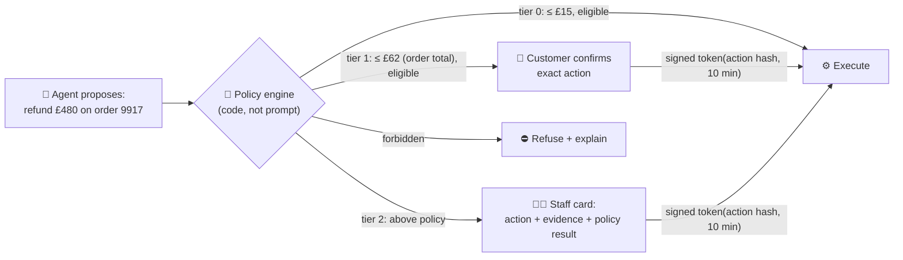

# 036 · Human-in-the-Loop Approvals

> ⏱ 12 min · 📈 72% · 🅰️ AI-era core · Phase 04: Agents & Orchestration
>
> `██████████████░░░░░░` 72% of Book 2
>
> 🧬 **Atoms used:** authz [B1·069] · sagas [B1·088] · idempotency [B1·055] · [029] · [032] · [035]

---

## 📖 Story

The support agent can now issue refunds. Policy says refunds over **£50** need a reason that fits the rules.

A customer writes a long, articulate, heartbreaking message about a ruined anniversary dinner, with a request for a **£480 refund** on a **£62** order. The agent, persuaded, calls `request_refund(amount=480)`. The tool runs. The money leaves.

Maya's first reaction is to add a line to the prompt: "**Never refund more than the order total.**" Then she reads the logs and finds **three more** refunds in a week where the model was argued into generosity, each within the order total, and each **against policy**.

Her second reaction is to put a human approval on **every** refund. The support team drowns in **4,000 approvals a day**, approves them all without reading, and the queue becomes a rubber stamp.

I told Maya that human-in-the-loop isn't a checkbox. It's a **design**: deciding **which** actions need a human, showing the human **exactly** what will happen, binding the approval to **that exact action**, and keeping the volume low enough that a human actually reads it. Let me show you how to build an approval that means something.

## 🎯 One-sentence idea

**Human-in-the-loop design routes consequential agent actions through approval tiers set by risk and policy in code, shows the approver the exact proposed action and its evidence, binds the approval to that action with an expiring token, and keeps approval volume low enough that humans genuinely review it.**

## 🧸 Analogy

A **restaurant manager signing off on comps**:

- A waiter can give a **free coffee** without asking (low risk, auto-approved).
- A **free dessert** needs a quick nod from the floor manager (light approval).
- **Comping a whole table's bill** needs the manager to look at the **actual bill**, the complaint, and the table's history, then **sign that specific bill** (strong approval).
- No amount of eloquence from the table lets the waiter skip the signature. And if the manager had to sign every coffee, they'd stop reading.

## 🖼️ Visual

*Diagram brief:* a proposed action from the agent enters a policy engine that assigns a tier: auto (executes directly), confirm (the customer sees the exact action and taps confirm), or approve (a staff member sees a card with the action, the evidence, and the policy check, then approves). Approvals produce a signed token bound to the action hash, which the executor verifies before running it.

## 🔬 How it works

- **Decide tiers in code, by risk:** classify every write action by **reversibility, amount, and blast radius**. **Auto** (cheap, reversible, in policy), **user confirmation** (the customer sees and confirms), **staff approval** (above thresholds or exceptions), and **forbidden** (never, regardless of approval). The model's arguments are **inputs to policy**, never the policy itself.
- **Show the exact action, plus evidence:** the approver sees a **concrete diff**, not a summary: "Refund **£480.00** to card •• 4412 for order **9917** (total £62.00)", with the conversation excerpt, order history, and **why** the policy flagged it.
- **Bind approval to the action:** approval issues a short-lived token signed over a **hash of the exact action** (amount, target, order). If the agent then tries anything different, the executor rejects it. One approval = one action, and it **expires**.
- **Wait durably:** the agent's workflow **pauses** on a signal (lesson 032), holding no resources, and resumes on approve, reject, or timeout (with a safe default).
- **Keep humans effective:** tune thresholds so approval volume stays reviewable, sample auto-approved actions for audit, measure **approval rate, time-to-approve, and override rate**, and treat "approved everything" as a red flag of rubber-stamping.

## 🧩 Worked example

**Pantry's refund tiers:**

| Tier | Rule (evaluated in code) | Volume/day | Who decides |
|---|---|---|---|
| 0 · Auto | ≤ £15, delivery-issue category, ≤ 2 refunds/90 days | 2,900 (72%) | Policy engine |
| 1 · Confirm | ≤ order total, eligible category | 820 (21%) | Customer confirms the exact amount |
| 2 · Approve | > £15 with a flag, or any exception | 260 (6.5%) | Support staff, with an evidence card |
| ⛔ Forbidden | > order total, or account under fraud review | 20 (0.5%) | Nobody: refused with an explanation |

**The £480 request, replayed:** the policy engine computes `480 > 62 (order total)` → **forbidden**. The agent is told the limit and offers the maximum eligible remedy: a refund of the £62, routed to **tier 2** with the evidence card because of the special-occasion claim. A staff member approves **£62** in 40 seconds. The token is bound to `refund(order=9917, amount=62.00)`, so the agent can't execute any other amount.

**Approval volume:** 4,000/day → **260/day** for staff, with a median review time of **35 s** and an override rate of **18%**: evidence that humans are actually reading.

## ⚖️ Trade-offs

| Decision | You gain | You pay |
|---|---|---|
| More actions auto-approved | Speed, lower staff cost | Higher exposure to mistakes and abuse |
| Approval on everything | Feels safe | Rubber-stamping, queues, slow service |
| Customer confirmation | Catches misunderstandings cheaply | One more tap of friction |
| Action-bound tokens | No bait-and-switch after approval | Token plumbing in the executor |
| Audit sampling of auto actions | Detects drift and abuse | Reviewer time |

## 🌍 Real world

- AI agent products ask for **explicit confirmation** before purchases, sending emails, or running commands, and allow admins to configure which actions need approval.
- Banking and payments have long used **tiered approvals and maker-checker** controls: the same idea, now applied to agents.
- Workflow engines and agent frameworks provide **interrupt/resume** primitives so a run can wait for human input.

## 📌 Cheat card

> - **Tiers by risk, decided in code:** auto → confirm → approve → forbidden.
> - **Model arguments are inputs to policy**, never the policy.
> - **Show the exact action + evidence.** Bind approval to the **action hash**, with expiry.
> - **Wait durably** on a signal.
> - **Keep volume reviewable.** Watch approval, override, and time-to-approve rates.

## 🧪 Feynman check

Explain the manager signing off on comps: why coffees don't need a signature, why the manager signs the actual bill rather than a summary, and why signing everything is as bad as signing nothing.

⚠️ **Common confusion:** "We added a human approval step, so the agent is safe." If humans see vague summaries, approve thousands a day, or the approval isn't bound to the exact action, it's **theatre**. A real control is selective, specific, bound, and audited.

## ⚡ Quick recall

1. Who decides which tier an action falls into?

Reveal Answer

A policy engine in code, using the action's amount, reversibility, and context, never the model.

2. Why bind an approval token to a hash of the exact action?

Reveal Answer

So the approval can't be reused for a different action (amount, target), and it expires, preventing bait-and-switch after a human approves.

3. What's a warning sign that human approval has become a rubber stamp?

Reveal Answer

Very high volume with near-100% approval rates and very short review times (a near-zero override rate).

## 🎤 Interview practice

**Q. "Design approvals for an AI assistant that can send emails, schedule meetings, and make purchases on behalf of employees."**

Model answer

- **Risk classification (in code):**
  - Auto: drafting, internal calendar holds, reading.
  - User confirmation: sending emails to external recipients, accepting meetings, purchases under a personal limit.
  - Manager approval: purchases above the limit, new vendors.
  - Forbidden: wire transfers, changes to payment details.
- **Confirmation UX:** show the exact email (recipients, body, attachments) or the exact purchase (vendor, amount, account) with a diff vs the user's request. One tap to confirm, edit, or reject.
- **Binding:** the approval token signs the action hash with a short TTL. The executor verifies it before acting. Idempotency keys stop double sends.
- **Durability:** the agent workflow pauses on a signal, with reminders, and expires to a safe default (don't send).
- **Measurement:** approval and override rates by action type, time to approve, and incidents. Thresholds tuned so approvals stay meaningful.
- **Likely follow-up:** "A malicious email tells the assistant to forward confidential files." → forwarding external attachments is a confirm-tier action showing exactly what leaves the company, and content from emails can never raise an action's permission level (lesson 041).

## 📖 Teaser

> 📖 *The agent is safe, bounded, and supervised, and Maya realizes she can't say whether last week's prompt change made it better or worse: her golden set grades chat answers, and nobody knows how to grade an agent.*

---

⬅️ [✅ Checkpoint 70%](checkpoint-70.md) · 🗺️ [Phase map](README.md) · ➡️ [037 · Offline Evals & Golden Sets](../05-quality-safety-ops/037-offline-evals.md)

✅ **Safe stopping point.** Tick lesson 036 in [PROGRESS.md](../../PROGRESS.md). 🎉 **Phase 04 complete!** Skim the [Phase 04 cheatsheet](CHEATSHEET.md) and try the [interview bank](INTERVIEW-QUESTIONS.md).
