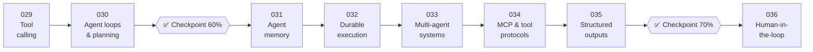

# 🤖 Phase 04: Agents & Orchestration

> **Lessons 029–036 · 58% → 72% · 🅰️ AI-era core**
> By the end of this phase you'll **give models hands safely**: tools, bounded loops, memory, durable execution, multi-agent patterns, MCP, structured outputs, and human approvals.

## 📖 Chapter 4: The Model Gets Hands

The chef learned to act, and the first test order bought forty-two lasagnas. Then it looped thirty-seven times, forgot Monday's plan by Wednesday, ordered groceries twice after a deploy, argued with itself in a six-agent group chat, and refunded £480 on a £62 order because someone asked nicely. In this chapter, I'll show you how Maya turned an eager improviser into a trustworthy assistant: forms instead of hands, budgets instead of hope, tick boxes instead of memory, and signatures that actually mean something.

## 🗺️ Phase map

| # | Lesson | ⏱ | One-line idea |
|---|---|---|---|
| 029 | [Tool calling](029-tool-calling.md) | 12 min | The model writes requests. Your code validates, authorizes, and executes them |
| 030 | [Agent loops & planning](030-agent-loops.md) | 12 min | Plan first, enforce budgets in code, detect loops, exit gracefully |
| ✅ | [Checkpoint 60%](checkpoint-60.md) | 20 min | |
| 031 | [Agent memory & state](031-agent-memory.md) | 12 min | Three drawers: context, task state, typed long-term memory. The world is read, not remembered |
| 032 | [Durable execution for agents](032-durable-agent-execution.md) | 13 min | Record every step. Crash → replay, not restart |
| 033 | [Multi-agent systems](033-multi-agent-systems.md) | 12 min | Start with one agent. Split for parallelism, isolation, or permissions |
| 034 | [MCP & tool protocols](034-mcp-and-tool-protocols.md) | 12 min | One standard plug for every AI client, with OAuth and untrusted-by-default servers |
| 035 | [Structured outputs](035-structured-outputs.md) | 11 min | Parses, matches the schema, makes business sense: three layers |
| ✅ | [Checkpoint 70%](checkpoint-70.md) | 25 min | |
| 036 | [Human-in-the-loop approvals](036-human-in-the-loop.md) | 12 min | Risk tiers in code, exact actions, bound tokens, reviewable volume |

📌 [Phase cheatsheet](CHEATSHEET.md) · 🎤 [Phase interview questions](INTERVIEW-QUESTIONS.md)

⬅️ Previous phase: [03 Retrieval & data](../03-retrieval-data/README.md) · ➡️ Next phase: [05 Quality, safety & AI ops](../05-quality-safety-ops/README.md)
