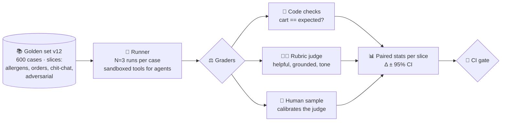

# 037 · Offline Evals & Golden Sets

> ⏱ 13 min · 📈 74% · 🅰️ AI-era core · Phase 05: Quality, Safety & AI Ops
>
> `██████████████░░░░░░` 74% of Book 2
>
> 🧬 **Atoms used:** SLOs [B1·007] · deployment strategies [B1·068] · [006] · [007] · [027] · [030]

---

## 📖 Story

Last Tuesday, someone changed one line in the agent's system prompt: "Be **concise**." Since then, the support team has noticed… something. Fewer complaints about rambling, maybe. More orders missing a side dish, maybe.

Maya can't tell. Her golden set (lesson 007) grades **chat answers** against reference text. It has no idea how to grade an **agent** whose "answer" is a cart, an order, and seven tool calls.

She tries anyway: runs the old and new prompts on 100 agent tasks, eyeballs the results, and sees **84 vs 82**. Is the new prompt worse? She runs it again: **81 vs 85**. Now it's **better**?

Two runs, two opposite conclusions. The numbers are **noise wearing a lab coat**.

I told Maya that evals are the **unit tests of AI**, but with two twists: the code under test is **random**, and "correct" is often a **judgement**. So you need the right **cases**, the right **graders**, and enough **statistics** to tell a real change from a coin flip. Let me show you how to build an exam you can trust.

## 🎯 One-sentence idea

**Offline evals run a versioned golden set of representative, adversarial, and sliced cases through the system, score each with the cheapest reliable grader (code checks, rubric-based model judges, or humans), repeat to average out randomness, and compare versions with paired statistics, so every prompt, model, or agent change is gated on evidence.**

## 🧸 Analogy

A **cooking school's practical exam**:

- A fixed **set of dishes** to cook, covering easy staples, tricky techniques, and known disasters (golden set + slices + adversarial cases).
- **Graders** for each dish: a **thermometer** for "is the chicken cooked?" (code checks), a **trained taster with a rubric** for flavour (model judge), and a **head chef** who calibrates the tasters (humans).
- Each dish is cooked **several times**, because any chef can have one lucky plate.
- And you compare two chefs on the **same dishes**, side by side, not on different days with different menus (paired comparison).

## 🖼️ Visual

*Diagram brief:* a pipeline from a versioned golden set (with slices) into a runner that executes each case N times against a candidate version, inside a sandbox for agents. Results go to graders (code, rubric judge, human sample), then to a statistics box that compares candidate vs baseline per slice with confidence intervals, and finally to a CI gate that passes or blocks.



## 🔬 How it works

- **Build the golden set from reality:** sample real traffic (anonymized), add **known failures** from incidents, **adversarial** cases (injection, edge inputs), and label **slices** (intent, language, risk tier). Version it, and **keep it out of training data** (lesson 027). Grow it with every incident.
- **Use the cheapest reliable grader per check:** **code** for anything checkable (JSON valid, the cart equals the expected cart, a citation exists, no allergen error), **rubric-based model judges** for qualities like helpfulness and tone, and **humans** on a sample to calibrate the judges (lesson 038).
- **Agents are graded on outcomes and trajectories:** run them in a **sandbox** with fake services, then check the **final state** (order placed correctly?) plus trajectory metrics (steps, cost, forbidden actions attempted).
- **Respect the randomness:** run each case **N times** (3–5), report **pass rates**, and compare versions **paired on the same cases**. A 400-case set has roughly a **±3-point** 95% confidence interval on its own, so look at **paired differences** and slices, not just two headline numbers.
- **Gate changes like code:** every prompt, model, retrieval, or tool change runs the eval suite in CI. **Block** on any statistically significant regression in a **critical slice**, even if the average improves.

## 🧩 Worked example

**Why 84 vs 82 meant nothing:**

```
Standard error of one pass rate (p ≈ 0.83, n = 100): √(0.83 × 0.17 / 100) ≈ 0.038
95% CI ≈ ± 7.4 points per version → a 2-point gap is pure noise
```

**Maya's fix: 600 cases × 3 runs, paired by case:**

| Slice | Baseline | "Be concise" | Paired Δ (95% CI) | Gate |
|---|---|---|---|---|
| Overall | 86.1% | 85.4% | −0.7 (−2.1, +0.7) | ✅ no significant change |
| Order completeness | 94.0% | 88.5% | **−5.5 (−8.0, −3.0)** | ❌ **block** |
| Tone ("not rambling") | 71.0% | 83.0% | +12.0 (+8.6, +15.4) | ✅ |

**So this means:** "concise" made the agent **drop side dishes when summarizing orders**. The average hid it. Maya changes the prompt to "be concise **in explanations; always list every order line**", and re-runs: tone +11, completeness **+0.3**. Ship.

## ⚖️ Trade-offs

| Decision | You gain | You pay |
|---|---|---|
| Bigger golden sets | Tighter confidence intervals | Labelling and run costs |
| Code graders | Exact, cheap, reproducible | Only for checkable properties |
| Model judges | Scale for subjective qualities | Bias and drift, so calibrate |
| Multiple runs per case | Honest pass rates | N× eval cost |
| Hard gates on critical slices | No silent regressions | Some good changes need rework |

## 🌍 Real world

- Mature AI teams treat **evals as CI**: prompt and model changes ship only through an eval pipeline, often with open-source or commercial eval frameworks.
- Agent benchmarks grade **task success in sandboxed environments** (e.g., software-engineering and web-navigation benchmarks), checking end state rather than text.
- Public benchmark scores are increasingly distrusted because of **contamination**, so companies rely on **private, versioned** golden sets.

## 📌 Cheat card

> - **Golden set = real traffic + incidents + adversarial, sliced and versioned.**
> - **Graders: code first, rubric judges second, humans to calibrate.**
> - **Agents: grade final state + trajectory in a sandbox.**
> - **N runs per case. Paired comparisons. Confidence intervals.**
> - **Gate in CI. Block on critical-slice regressions**, whatever the average says.

## 🧪 Feynman check

Explain the cooking school's practical exam: why each dish is cooked several times, why two chefs must cook the same dishes, and why a thermometer beats a taster when it can be used.

⚠️ **Common confusion:** "The new version scored 2 points higher, so it's better." With small sets and random outputs, a 2-point gap is often **noise**. Without repeated runs, paired comparisons, and confidence intervals, an eval is a horoscope with numbers.

## ⚡ Quick recall

1. What should a golden set contain?
<details><summary>Reveal Answer</summary>

Representative real cases, known failures from incidents, adversarial cases, and labelled slices, versioned and excluded from training data.
</details>

2. How are agents evaluated offline?
<details><summary>Reveal Answer</summary>

By running tasks in a sandbox with fake services and checking the final state (task success) plus trajectory metrics such as steps, cost, and forbidden actions.
</details>

3. Why compare versions on the same cases (paired)?
<details><summary>Reveal Answer</summary>

Per-case difficulty varies a lot, so pairing removes that variance and makes real differences detectable with fewer cases.
</details>

## 🎤 Interview practice

**Q. "Design the evaluation system that gates every prompt and model change for an AI support agent."**
<details><summary>Model answer</summary>

- **Golden set:** ~500–1,000 cases from anonymized real tickets, stratified by intent, language, and risk, plus incident regressions and adversarial cases (injection, abuse). Versioned. Decontaminated from training data.
- **Sandbox:** fake order, refund, and CRM services seeded per case. The agent runs end to end with real prompts and tools.
- **Graders:**
  - Code: final state (refund amount, order changes), forbidden actions, schema validity, policy compliance.
  - Rubric judge: resolution quality, tone, groundedness, calibrated against weekly human labels.
- **Statistics:** 3 runs per case, paired comparison vs the production baseline, 95% CIs per slice, plus cost and latency per task.
- **Gates:** block on significant regressions in critical slices (refund correctness, safety), warn on others. Results posted to the PR.
- **Cadence:** on every change + nightly against production (lesson 007). Cases added after every incident.
- **Likely follow-up:** "Evals take 2 hours. Too slow for CI?" → a fast smoke subset (100 critical cases) per commit, the full suite before release, with parallel runs and cached baselines.
</details>

## 📖 Teaser

> 📖 *The exam is trustworthy now, and the new recommendation prompt passes it with flying colours, then quietly lowers real orders by 2% in its first week in production.*

---

⬅️ [036 · Human-in-the-Loop Approvals](../04-agents/036-human-in-the-loop.md) · 🗺️ [Phase map](README.md) · ➡️ [038 · Online Evals, A/B Tests & LLM-as-Judge](038-online-evals.md)

✅ **Safe stopping point.** Tick lesson 037 in [PROGRESS.md](../../PROGRESS.md).
