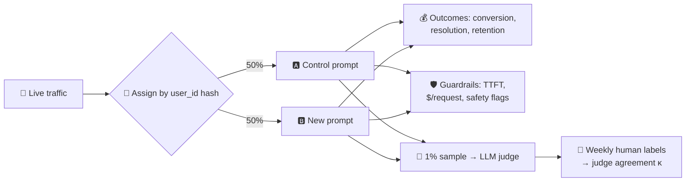

# 038 · Online Evals, A/B Tests & LLM-as-Judge

> ⏱ 12 min · 📈 76% · 🅰️ AI-era core · Phase 05: Quality, Safety & AI Ops
>
> `███████████████░░░░░` 76% of Book 2
>
> 🧬 **Atoms used:** deployment strategies (canary) [B1·068] · observability [B1·067] · [007] · [037]

---

## 📖 Story

The new "dish suggestion" prompt passes the offline exam: **+4 points** on helpfulness, no slice regressions.

It ships to everyone on Monday. By Friday, **order conversion from suggestions is down 2.1%**. Nobody notices for a week, because nothing broke: no errors, no latency spikes, and the answers **read** better.

Maya digs in. The new prompt writes richer descriptions, and **longer** ones. On phones, the "Add to cart" button got pushed **below the fold**. The golden set measured **writing quality**. Customers vote with **orders**.

Meanwhile, her plan to monitor live quality with an **LLM judge** on sampled traffic hits its own snag: the judge loves the new prompt. Of course it does: it prefers **longer answers**, and it was asked to judge text, not outcomes.

I told Maya that offline evals tell you whether a change **can** be good. Only production tells you whether it **is**. And the tools for production are old friends from Book 1: **canaries, A/B tests, and honest metrics**, plus one new tool, the model judge, which must itself be judged. Let me show you.

## 🎯 One-sentence idea

**Online evaluation measures AI changes on real traffic, with A/B tests on business outcomes (conversion, resolution) plus guardrail metrics (latency, cost, safety), and with LLM judges scoring samples of live answers, calibrated against human labels and checked for known biases.**

## 🧸 Analogy

A **new dish on the menu**:

- The kitchen's **tasting panel** loved it (offline eval).
- But the real test is the **dining room**: half the tables get the new dish, half the old one, and you count **how many plates come back empty** and how many diners reorder (A/B test on outcomes).
- A **food critic** samples a few plates each night (LLM judge), but you first check the critic's taste against your **head chef's** on the same plates, because this critic is known to favour **big portions** (judge calibration and bias).

## 🖼️ Visual

*Diagram brief:* live traffic splits into control and treatment arms at the gateway. Each arm feeds three metric streams: business outcomes (conversion), guardrails (latency, cost, safety), and sampled judge scores. A calibration loop compares judge scores with weekly human labels on the same sample, producing an agreement score.



## 🔬 How it works

- **A/B test on outcomes:** randomize by **user** (not request) so each person has a consistent experience. Pick one **primary metric** tied to value (order conversion, resolution without escalation) and size the test **before** starting.
- **Guardrail metrics:** latency (TTFT, end to end), **cost per request**, safety and policy flags, refusal rate, and complaint rate. A win on the primary metric doesn't ship if a guardrail breaks.
- **LLM-as-judge on live samples:** score a sample (e.g., 1%) for groundedness, correctness, and policy, with a **rubric** and structured outputs. It gives you fast, broad coverage of **quality** on real traffic, including slices your golden set lacks.
- **Judge the judge:** measure agreement with human labels (accuracy or **Cohen's κ**) on a weekly sample. Correct known biases: **verbosity** (preferring longer answers), **position** (preferring the first option in pairwise comparisons, so swap orders), and **self-preference** (preferring its own model family's style). Re-calibrate when the judge model changes.
- **Ramp safely:** **shadow** (run the new version without showing it), then **canary** (1–5%), then the A/B test at full power, with automatic rollback on guardrail breaches (lesson 044).

## 🧩 Worked example

**Sizing the A/B test** (baseline conversion 20%, detect a 1-point absolute change, ~80% power, 5% significance):

```
n per arm ≈ 16 × p(1 − p) ÷ δ² = 16 × 0.20 × 0.80 ÷ 0.01² ≈ 25,600 users
Pantry's suggestion traffic: ~400k users/day → ~1 day per arm at 50/50
→ run ≥ 7 days anyway, to cover weekday/weekend patterns
```

**The suggestion prompt, re-run as an A/B test:**

| Metric | Control | New prompt | Verdict |
|---|---|---|---|
| Judge "helpfulness" | 3.9 / 5 | 4.4 / 5 | 🟢 (but see the bias check) |
| Suggestion → cart conversion | 20.3% | **18.2%** | 🔴 significant drop |
| Avg answer length | 62 tokens | 141 tokens | 🟡 cost +38% |
| Judge vs human agreement (κ) | – | 0.41 | 🔴 the judge over-rewards length |

**The fix:** cap suggestions at 60 tokens with the button rendered **above** the description. Retest: conversion **20.9%** (+0.6, significant). The judge's rubric gains "**penalize unnecessary length**", and its agreement with humans rises to **κ = 0.72**.

## ⚖️ Trade-offs

| Decision | You gain | You pay |
|---|---|---|
| A/B tests on outcomes | The truth about value | Time and traffic to reach significance |
| LLM judges on samples | Broad, fast quality signals | Biases, so ongoing calibration |
| Human labels | Ground truth | Slow and expensive |
| Shadow mode | Zero user risk | Doesn't measure user behaviour |
| Randomize by user | Consistent experience, valid stats | Fewer independent units than requests |

## 🌍 Real world

- **LLM-as-judge** research (e.g., MT-Bench and Chatbot Arena work) documented position, verbosity, and self-preference biases, and showed strong judges can agree with humans at roughly human-human levels when well designed.
- Product teams run AI changes through the same **experimentation platforms** as other features, with guardrail metrics.
- Observability and eval vendors offer **online evaluators** that score sampled production traces.

## 📌 Cheat card

> - **Offline says "can". Online says "is".**
> - **A/B on outcomes**, randomized by user, sized up front, ≥ 1 week.
> - **Guardrails:** latency, cost, safety, refusals, complaints.
> - **Judges on samples, calibrated with humans (κ).** Watch verbosity, position, and self-preference bias.
> - **Shadow → canary → A/B → rollout.**

## 🧪 Feynman check

Explain the new dish on the menu: why the tasting panel isn't enough, why you count empty plates, and why you test the critic's taste before trusting it.

⚠️ **Common confusion:** "The LLM judge scored it higher, so users will like it more." A judge measures **text against a rubric**, with known biases. Users respond with **behaviour**. When they disagree, behaviour wins, and the judge's rubric needs fixing.

## ⚡ Quick recall

1. Why randomize A/B tests by user rather than by request?
<details><summary>Reveal Answer</summary>

So each user has a consistent experience, and so outcomes that span several requests (like conversion) are attributed to one arm validly.
</details>

2. Name three known biases of LLM judges.
<details><summary>Reveal Answer</summary>

Verbosity bias (preferring longer answers), position bias (preferring the first option), and self-preference (favouring outputs like its own).
</details>

3. How do you know whether a judge is trustworthy?
<details><summary>Reveal Answer</summary>

Measure its agreement with human labels on the same sample (e.g., accuracy or Cohen's kappa), regularly, and re-calibrate when it drifts.
</details>

## 🎤 Interview practice

**Q. "You've built a new RAG pipeline that scores better offline. How do you prove it's better in production and roll it out safely?"**
<details><summary>Model answer</summary>

- **Pre-launch:** a shadow run on live traffic (no user exposure) to check latency, cost, error rates, and judge scores on real queries.
- **Canary:** 2–5% of users, with automatic rollback on guardrail breaches (p95 TTFT, error rate, safety flags, $/request).
- **A/B test:** randomized by user. Primary metric: resolution without escalation (or answer acceptance). Sample size computed up front, run ≥ 1 week.
- **Quality monitoring:** a calibrated LLM judge on 1% of both arms (groundedness, correctness), plus thumbs and regenerate rates. Human audits of disagreements.
- **Decision:** ship if the primary metric improves significantly with no guardrail regressions. Analyze slices (language, intent) for hidden losses.
- **Likely follow-up:** "Traffic is too small for significance." → use more sensitive metrics (paired judge scores, interleaving for ranking), longer tests, or accept larger minimum detectable effects explicitly.
</details>

## 📖 Teaser

> 📖 *Pantry can now measure quality offline and online, and still, when a customer says "the agent ordered the wrong thing last Tuesday", Maya's logs only say: 200 OK, 3.2 seconds.*

---

⬅️ [037 · Offline Evals & Golden Sets](037-offline-evals.md) · 🗺️ [Phase map](README.md) · ➡️ [039 · LLM Observability & Tracing](039-llm-observability.md)

✅ **Safe stopping point.** Tick lesson 038 in [PROGRESS.md](../../PROGRESS.md).
