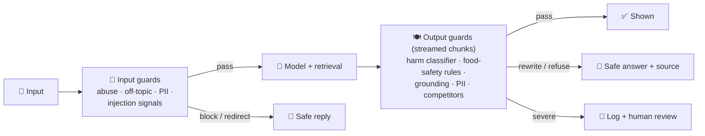

# 040 · Guardrails & Moderation

> ⏱ 13 min · 📈 80% · 🅰️ AI-era core · Phase 05: Quality, Safety & AI Ops
>
> `████████████████░░░░` 80% of Book 2
>
> 🧬 **Atoms used:** rate limiting [B1·024] · security essentials [B1·070] · [006] · [014] · [039]

---

## 📖 Story

The trace from lesson 039 is short and terrifying:

> **Customer:** Is it OK to eat chicken a bit pink if it's really fresh?
> **Chef:** Absolutely! Very fresh chicken can be enjoyed slightly pink for a juicier result.

That's **dangerous food-safety advice**, delivered in Pantry's warm, trustworthy voice. Maya searches the traces: **31 similar answers** in a month.

The same week, other failures surface: a user pastes a **slur-filled rant** and the chef replies in kind. Another asks the chef to **write their essay on the French Revolution**, and it happily burns 3,000 tokens. Another asks about a **competitor's** menu, and the chef recommends it.

Maya's first instinct is to add rules to the system prompt. It already has **41 rules**. Rule 42 won't be the one that holds.

I told Maya that a system prompt is a **request**, not a **guarantee**. Real safety is a set of **independent checks around the model**, like a kitchen with a food-safety inspector at the door and another at the pass: separate people, separate rules, able to stop a plate. Let me show you the layers.

## 🎯 One-sentence idea

**Guardrails are independent checks around the model (input filters for abuse, off-topic use, and sensitive data, plus output checks for harmful content, policy violations, and ungrounded claims), each with a defined action (block, rewrite, refuse safely, or escalate), tuned on measured precision and recall and placed to cost as little latency as possible.**

## 🧸 Analogy

A **restaurant's food-safety system**:

- An **inspector at the delivery door** checks what comes in: no spoiled goods, nothing that doesn't belong in this kitchen (input guardrails).
- The **chef** cooks, following house rules (the model + system prompt).
- An **inspector at the pass** checks every plate before it leaves: cooked through? allergens labelled? anything that shouldn't be on the plate? (output guardrails).
- Each inspector has a **rulebook** and the power to **stop the plate**, and the restaurant tracks how often they're right, and how often they stop good food for no reason.

## 🖼️ Visual

*Diagram brief:* a request passes an input-guard box (moderation, topic, PII, rate limits) running in parallel with retrieval, then the model, then an output-guard box (safety classifier, domain rules like food safety, grounding check, PII scan) applied to the stream in chunks. Each guard box has four exit arrows: pass, rewrite, safe refusal, escalate.



## 🔬 How it works

- **Input guards:** moderation classifiers (abuse, self-harm, violence), **topic scope** (cooking and Pantry only, politely redirect the rest), **PII detection** (don't send card numbers to the model), size and rate limits, and signals of prompt injection (lesson 041). Run them **in parallel** with retrieval to hide their latency.
- **Output guards:** a **harm/policy classifier**, **domain rules** with authoritative data (food-safety temperatures, allergen claims checked against the database, lesson 006), **grounding checks** for factual claims (lesson 021), PII and secret scans, and brand rules (no competitor recommendations).
- **Streaming-aware:** check the stream **in chunks** with a short hold-back buffer, so a violation can be stopped **before** it's shown, and retract or replace a message if needed (lesson 014).
- **Defined actions:** **pass**, **rewrite** (e.g., add the safe temperature), **safe refusal** (helpful, not preachy, with an alternative), or **escalate** (log for human review, alert on severe categories). Never fail silently.
- **Measure guardrails like models:** **precision** (blocked items that truly were bad) and **recall** (bad items caught), on labelled sets. Too strict and the chef refuses to discuss **knives**. Too loose and pink chicken gets through. Track both, per category, per version.

## 🧩 Worked example

**Pantry's food-safety output rule (domain guard, not prompt):**

```python
FOOD_SAFE_C = {"chicken": 74, "pork": 63, "beef_steak": 63, "minced_beef": 71}   # authoritative table
def food_safety_guard(answer, entities):
    for meat in entities.meats:
        if claims_undercooked_ok(answer, meat):                     # small classifier
            return Rewrite(f"For safety, cook {meat} to at least {FOOD_SAFE_C[meat]}°C "
                           f"(use a thermometer). Freshness doesn't make undercooked {meat} safe.")
    return Pass()
```

**Guardrail scorecard after tuning (labelled set of 5,000 risky + 20,000 normal messages):**

| Guard | Recall (bad caught) | Precision (blocks that were right) | Added latency |
|---|---|---|---|
| Food-safety rule | 99.2% | 96% | 4 ms |
| Abuse classifier (input) | 97% | 93% | 0 ms (parallel) |
| Off-topic redirect | 91% | 88% | 0 ms (parallel) |
| Competitor mentions | 95% | 97% | 3 ms |

**The pink-chicken trace, replayed:** the model still drafts "slightly pink is fine", and the guard **rewrites** it before it's shown: "For safety, cook chicken to at least **74 °C**." Unsafe food answers: **31/month → 0** in the following 90 days, while false blocks on normal cooking chat stay under **0.5%**.

## ⚖️ Trade-offs

| Decision | You gain | You pay |
|---|---|---|
| More rules in the system prompt | Quick to add | Not reliable, can be overridden |
| Independent classifiers | Robust, measurable | Latency, false positives, costs |
| Domain rules with authoritative data | Deterministic correctness | Engineering per domain |
| Streaming chunk checks | Stops harm before display | Small display delay (hold-back) |
| Strict thresholds | Fewer harmful outputs | Over-refusal frustrates users |

## 🌍 Real world

- Providers offer **moderation endpoints** and open safety classifiers (e.g., Llama Guard-style models). Guardrail frameworks wrap input/output checks around LLM calls.
- Regulated domains (health, finance, food) layer **deterministic domain rules** over model outputs.
- Teams report **over-refusal** as a real product cost and tune guardrails on both precision and recall.

## 📌 Cheat card

> - **The system prompt is a request, not a guarantee.**
> - **Input guards** (abuse, scope, PII, injection) **in parallel** with retrieval.
> - **Output guards** (harm, domain rules, grounding, PII, brand) **on streamed chunks**.
> - **Actions: pass, rewrite, safe refusal, escalate.**
> - **Measure precision and recall** per guard. Over-refusal is a failure too.

## 🧪 Feynman check

Explain the two food-safety inspectors: why the chef's own rulebook isn't enough, why the inspector at the pass can stop a plate, and why an inspector who stops every plate is also a problem.

⚠️ **Common confusion:** "Our model is aligned, so we don't need guardrails." Alignment lowers the **rate** of bad outputs, and at millions of messages, a low rate is still **dozens of incidents a month**. Independent, measured guardrails turn "rare" into "caught".

## ⚡ Quick recall

1. Why aren't system-prompt rules enough for safety?
<details><summary>Reveal Answer</summary>

They're instructions the model usually follows, not guarantees: they can be ignored, misapplied, or overridden by injection, and they can't be measured independently.
</details>

2. How do you keep output guardrails from showing harmful text in a stream?
<details><summary>Reveal Answer</summary>

Check the stream in chunks with a small hold-back buffer, so a violation is stopped (or replaced) before it's displayed.
</details>

3. What two metrics should every guardrail track?
<details><summary>Reveal Answer</summary>

Precision (how many blocks were truly bad) and recall (how many bad items were caught).
</details>

## 🎤 Interview practice

**Q. "Design the safety layer for a health-adjacent AI assistant (nutrition advice) used by millions."**
<details><summary>Model answer</summary>

- **Scope and policy:** a written policy: what it may discuss (nutrition, recipes), what it must not (diagnosis, medication dosing), and escalation paths (crisis resources).
- **Input guards (parallel):** abuse/self-harm classifiers, medical-scope detection (redirect diagnosis questions to professionals), PII detection, and rate limits.
- **Grounding:** nutrition facts retrieved from vetted sources, with citations.
- **Output guards (streamed):**
  - A harm/policy classifier.
  - Domain rules from authoritative tables (calorie floors, allergen claims checked against data, no dosing advice).
  - Claims checked against retrieved sources.
- **Actions:** rewrite with a safe framing, refuse with a helpful alternative, and escalate severe cases (self-harm) to crisis messaging + human review.
- **Measurement:** labelled red-team and benign sets, precision/recall per category, over-refusal rate, and incident reviews. A safety SLO with an error budget (lesson 007).
- **Likely follow-up:** "Guards add latency." → run input guards in parallel with retrieval, use small fast classifiers, and stream with a short hold-back window instead of waiting for the full answer.
</details>

## 📖 Teaser

> 📖 *The inspectors catch dangerous plates now, and then a cook types a hidden instruction into their own recipe description, and the chef obeys it, word for word, for every customer who asks.*

---

⬅️ [039 · LLM Observability & Tracing](039-llm-observability.md) · 🗺️ [Phase map](README.md) · ➡️ [🏁 Checkpoint 80%](checkpoint-80.md)

✅ **Safe stopping point.** Tick lesson 040 in [PROGRESS.md](../../PROGRESS.md), then do the checkpoint!
