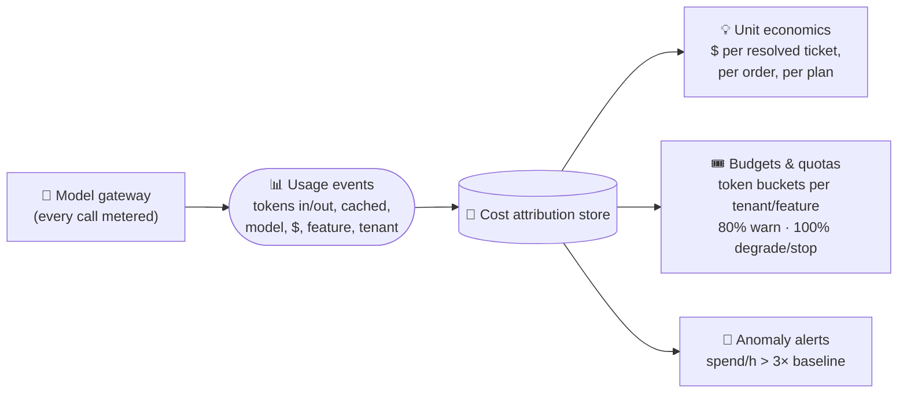

# 042 · Cost Engineering & Token Budgets

> ⏱ 13 min · 📈 84% · 🅱️ Production & case studies · Phase 05: Quality, Safety & AI Ops
>
> `████████████████░░░░` 84% of Book 2
>
> 🧬 **Atoms used:** rate limiting [B1·024] · estimation [B1·005] · [005] · [015] · [018] · [039]

---

## 📖 Story

Month-end. The AI bill is **$2.9 million**, up **70%**. The CFO wants three answers: **who** spent it, **was it worth it**, and **how do we stop the surprises**.

Maya's traces (lesson 039) give her the "who" in an afternoon, and the answers are embarrassing:

- **38%** of all tokens came from **one batch job** (review summarization) re-summarizing **unchanged** reviews every night.
- An agent bug made "Plan My Week" **loop** for a single tenant: **$41,000** in three days, with nobody alerted.
- Every chat request carries a **3,100-token** tool list, because all 40 tools are always included.
- The frontier model handles **"what time do you close?"**

None of these are hard problems. They're **invisible** ones. Nobody saw the meter running.

I told Maya that in the AI era, **cost is a reliability concern**: an unbounded bill is an outage for the business. You manage it the way you manage latency: **measure it per unit of value, budget it, rate-limit it, and alert on it**. Let me show you the levers.

## 🎯 One-sentence idea

**AI cost engineering attributes every token to a feature, tenant, and outcome, measures unit economics (cost per resolved task vs value), pulls the main levers (routing to smaller models, caching, shorter prompts and outputs, batch discounts, and self-hosting where utilization is high), and enforces token-based quotas, budgets, and anomaly alerts so no loop or job can run up an unbounded bill.**

## 🧸 Analogy

**Running a restaurant's food budget**:

- Every ingredient is **charged to a dish** (attribution), so you know the **cost per plate** vs its **menu price** (unit economics).
- You don't use **truffle** in the staff meal (routing), you **prep in bulk** (caching), you **trim portions** nobody finishes (shorter outputs), and you buy **wholesale** for planned meals (batch discounts).
- Each station has a **weekly budget**, and the manager gets a call the moment one station spends **ten times** its usual (quotas and anomaly alerts).

## 🖼️ Visual

*Diagram brief:* a funnel from the gateway's usage stream into a cost-attribution store, sliced by feature, tenant, model, and prompt version. From there, three outputs: unit-economics dashboards (cost per resolved task), budget enforcement (token buckets per tenant and feature, with soft and hard limits), and anomaly alerts (spend per hour vs baseline).



## 🔬 How it works

- **Attribute everything:** every call through the gateway (lesson 015) records tokens (input, **cached**, output), model, price, **feature, tenant, prompt version, and outcome ID**. Cost becomes a column on every trace (lesson 039).
- **Unit economics:** divide cost by **units of value**: $ per resolved support ticket, per completed order, per weekly plan. Compare with the value (a human-handled ticket costs ~$5). A feature can be expensive **and** worth it, or cheap **and** wasteful.
- **The big levers, roughly in order of payoff:**
  - **Route** easy traffic to small models (lesson 015).
  - **Cache** prefixes, plus exact and safe semantic caches (lesson 018).
  - **Shrink prompts:** load only the relevant tools, trim history, retrieve fewer and better chunks.
  - **Shrink outputs:** `max_tokens`, concise formats, structured outputs.
  - **Batch APIs** or off-peak self-hosted capacity for non-interactive work (often ~50% cheaper).
  - **Self-host** where utilization is steady and high (lesson 005).
- **Quotas in tokens:** token buckets per tenant, feature, and user (Book 1 lesson 024), charged on **estimated** input tokens up front and reconciled with actual usage. Agents get **per-task budgets** (lesson 030). Batch jobs get their own pools.
- **Budgets and alerts:** monthly budgets per feature and tenant with **80% warnings** and **100% actions** (degrade to a smaller model, queue, or stop). **Anomaly alerts** on spend per hour vs a baseline catch loops in **minutes**, not at month-end.

## 🧩 Worked example

**Maya's fixes, with their savings (monthly):**

| Problem | Fix | Saving |
|---|---|---|
| Review summaries re-run nightly on unchanged reviews | Hash-skip unchanged (lesson 022) + batch API | −$1.01M |
| 3,100-token tool list on every chat call | Load tools per intent: 3,100 → 600 tokens + prefix cache | −$420k |
| Frontier model for FAQs | Route 60% of chat to a small model | −$310k |
| Agent loop for one tenant | Per-task budget + spend anomaly alert (> 3× hourly baseline) | −$41k incident → caught in **12 min** next time |
| **Total** | | **$2.9M → ~$1.1M/month** |

**Self-host break-even napkin** (steady 8B-model traffic):

```
API price (small model):        $0.30 per 1M tokens
Self-hosted (lesson 009):       $2.50/GPU-hour ÷ 33M tokens/hour ≈ $0.08 per 1M at 100% load
At 40% average utilization:     $0.08 ÷ 0.4 = $0.20 per 1M → still cheaper, + engineering cost
Break-even utilization ≈ 0.08 / 0.30 ≈ 27% → self-host only if you keep GPUs > ~30–40% busy
```

## ⚖️ Trade-offs

| Lever | You gain | You pay |
|---|---|---|
| Routing to small models | Big savings | Quality risk, so eval-gate it |
| Caching | Savings + speed | Freshness and correctness discipline |
| Shorter prompts/outputs | Savings + speed | Less context or detail |
| Batch APIs / off-peak | ~50% cheaper | Hours of latency |
| Self-hosting | Cheapest at high utilization | Ops burden, idle cost when quiet |
| Hard budget stops | No runaway bills | Possible feature outages, so degrade instead |

## 🌍 Real world

- Providers offer **batch APIs** at discounted prices and **cached-input pricing**, rewarding exactly these optimizations.
- **FinOps** practices are extending to AI: per-team showback, budgets, and anomaly detection on token spend.
- AI gateways provide **per-key budgets, token rate limits**, and spend alerts as standard features.

## 📌 Cheat card

> - **Cost is reliability.** An unbounded bill is an outage.
> - **Attribute every token:** feature, tenant, model, prompt version, outcome.
> - **Unit economics:** $ per resolved task vs its value.
> - **Levers:** route, cache, trim prompts, trim outputs, batch, self-host at high utilization.
> - **Token quotas, per-task budgets, 80%/100% actions, hourly anomaly alerts.**

## 🧪 Feynman check

Explain the restaurant's food budget: why every ingredient is charged to a dish, why truffle doesn't go in the staff meal, and why the manager wants a call the moment a station overspends.

⚠️ **Common confusion:** "Our cost per token is low, so we're efficient." Cost per **token** says nothing about tokens per **task**. A cheap model that loops 30 times, or a prompt with 3,000 unused tokens, is expensive. Measure cost per **unit of value**.

## ⚡ Quick recall

1. What does "unit economics" mean for an AI feature?
<details><summary>Reveal Answer</summary>

Cost per unit of value delivered (e.g., per resolved ticket or completed order), compared with what that unit is worth.
</details>

2. Name three cost levers besides choosing a cheaper model.
<details><summary>Reveal Answer</summary>

Any three of: caching (prefix, exact, semantic), shorter prompts (dynamic tool loading, trimmed history), shorter outputs, batch APIs or off-peak capacity, self-hosting at high utilization.
</details>

3. How do you catch a runaway agent loop quickly?
<details><summary>Reveal Answer</summary>

Per-task budgets enforced in code, plus anomaly alerts on spend per hour (per tenant and feature) against a baseline.
</details>

## 🎤 Interview practice

**Q. "Your AI product's gross margin is negative. You have one quarter. What do you do?"**
<details><summary>Model answer</summary>

- **Week 1, measure:** attribute cost per feature, tenant, model, and prompt version via gateway metering. Compute $ per unit of value. Find the top 5 cost drivers (usually 80% of spend).
- **Quick wins (weeks 2–4):**
  - Prompt diet: dynamic tool loading, history summarization, fewer retrieved chunks. Static-first layout + prefix caching.
  - Output caps and concise formats.
  - Move non-interactive jobs to batch APIs. Skip unchanged inputs.
- **Structural (weeks 4–10):**
  - Routing and cascades to small models (eval-gated).
  - Distill or fine-tune small models for high-volume narrow tasks (lesson 028).
  - Self-host steady high-volume workloads if utilization will stay > ~40%.
- **Controls:** token quotas per tenant tier, per-task budgets, budget alerts, and spend anomaly detection. Pricing aligned with cost (usage tiers for heavy users).
- **Guardrails:** quality SLOs and A/B tests on every cost change (lessons 037–038).
- **Likely follow-up:** "One enterprise tenant is 30% of cost on a flat-fee plan." → show them usage data, apply fair-use quotas or usage-based pricing, and optimize their specific workload.
</details>

## 📖 Teaser

> 📖 *The bill is under control, and then, at the height of a Saturday rush, the model provider's region goes dark, and Pantry's checkout freezes because the cart page waits politely for the chef to say hello.*

---

⬅️ [041 · Prompt Injection & AI Security](041-prompt-injection-security.md) · 🗺️ [Phase map](README.md) · ➡️ [043 · AI Reliability: Fallbacks & Degraded Modes](043-ai-reliability.md)

✅ **Safe stopping point.** Tick lesson 042 in [PROGRESS.md](../../PROGRESS.md).
