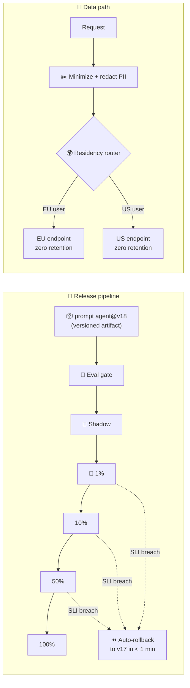

# 044 · Privacy, PII & Model Rollouts

> ⏱ 13 min · 📈 88% · 🅱️ Production & case studies · Phase 05: Quality, Safety & AI Ops
>
> `█████████████████░░░` 88% of Book 2
>
> 🧬 **Atoms used:** deployment strategies [B1·068] · security essentials [B1·070] · multi-region [B1·066] · [007] · [024] · [037] · [038] · [039]

---

## 📖 Story

Monday, 09:00. A prompt update ships: a "friendlier tone" for the chef. It goes to **100% of users at once**, because "it's just a prompt". By 11:00, **refusals are up 4%**: the new wording made the model nervous about anything involving knives, blowtorches, or alcohol in cooking. Rolling back takes **two hours**, because nobody can find the previous prompt version.

Wednesday brings a compliance audit. The findings:

- Customers' **home addresses and phone numbers** are inside prompts, because the order context was pasted in whole, and they're stored in the provider's logs for **30 days**.
- European customers' prompts are processed in a **US region**, against Pantry's data-residency commitments.
- Nobody can say which **model version** answered a disputed refund question in July.

I told Maya that in the AI era, **prompts and models are code**, and **prompts are also data flows**. Both deserve the discipline Book 1 gave to deployments and security: versioned artifacts, staged rollouts with automatic rollback, data minimization, and routing that respects where data may go. Let me show you both halves.

## 🎯 One-sentence idea

**Ship AI changes like code (prompts, models, and retrieval configs as versioned artifacts that pass eval gates and roll out through shadow, canary, and staged percentages with automatic rollback on quality, safety, latency, or cost SLIs) and handle AI data like regulated data (minimize and redact PII before it enters prompts or logs, route by data residency, use zero-retention terms, and record versions per request).**

## 🧸 Analogy

A **restaurant chain changing a recipe and handling customer details**:

- A new recipe is **written down with a version number**, tasted by the panel (evals), served first in **one branch** (canary), then rolled out region by region, and **pulled instantly** if complaints rise (rollback).
- Waiters write **"table 12, nut allergy"** on the ticket, **not** the customer's home address and card number (minimization).
- Tickets for **French diners** are cooked in the **French kitchen** (residency), and the kitchen **shreds tickets** at closing (zero retention).

## 🖼️ Visual

*Diagram brief:* left, a release pipeline: a versioned prompt/model change passes an offline eval gate, runs in shadow, then canary at 1%, 10%, 50%, and 100%, with an automatic rollback arrow at each stage fed by quality, safety, latency, and cost SLIs. Right, a data path: raw request → PII redaction/minimization → a region router (EU → EU endpoint, US → US endpoint) → a provider with zero-retention → traces storing the version IDs.

## 🔬 How it works

- **Version everything that changes behaviour:** prompt templates, model IDs (dated snapshots, lesson 007), retrieval and index configs, tool definitions, and guardrail thresholds live in a **registry** as immutable versions. Every request's trace records all of them (lesson 039), so "what answered in July?" has an answer.
- **Staged rollouts:** **eval gate** (lesson 037) → **shadow** on live traffic → **canary** (1% → 10% → 50% → 100%) with **automatic rollback** when quality (judge scores, refusal rate, thumbs), safety flags, latency, or cost SLIs breach. Use **feature flags**, so rollback is a config flip, not a redeploy (Book 1 lesson 068).
- **Data minimization:** put **only what the task needs** in the prompt (the allergy, not the address), **redact or pseudonymize PII** before prompts and logs, and keep payment data out of AI paths entirely.
- **Residency and retention:** route each request to model endpoints in **allowed regions** (EU data → EU), use providers' **zero-data-retention** options where available, and set retention for your own payload logs (lesson 039).
- **Consent and rights:** honour opt-outs for training (lesson 027), propagate deletions to every derived copy (lesson 024), and document the data flows (what goes to which provider, why, and for how long) for audits and impact assessments.

## 🧩 Worked example

**Monday's prompt change, replayed through the pipeline:**

| Stage | Duration | Watched SLIs | Outcome |
|---|---|---|---|
| Eval gate | 40 min | Golden set by slice | ✅ Pass (refusal slice +0.6, within CI) |
| Shadow | 2 h | Judge scores, refusal rate | ⚠️ Refusals +3.8% on "equipment/alcohol" intents |
| Canary 1% | – | Refusal rate > baseline + 1% for 10 min | ⏪ **Auto-rollback in 40 s** |

**Users affected: ~0.4% for 10 minutes**, instead of 100% for two hours. The fix adds 30 knife/blowtorch/flambé cases to the golden set, so the eval gate catches the next one before shadow.

**The audit findings, fixed:**

| Finding | Control |
|---|---|
| Addresses and phones in prompts | Context builder whitelists fields: `{allergies, diet, household_size, order_items}`. PII redactor on free text (`<PHONE>`, `<ADDRESS>`) |
| Provider logs kept 30 days | Zero-retention agreement. Payloads in Pantry's own logs redacted, 30-day retention |
| EU prompts processed in the US | Residency router by account region. EU-only endpoints and fallbacks (lesson 043 ladder per region) |
| Unknown model for July's answer | Model, prompt, index, and guard versions on every trace, retained 13 months |

## ⚖️ Trade-offs

| Decision | You gain | You pay |
|---|---|---|
| Staged rollouts with auto-rollback | Small blast radius | Slower releases, SLI plumbing |
| Shadow mode | Risk-free real-traffic testing | Double cost during shadow |
| Field-level minimization | Less exposure, simpler compliance | Less context for the model |
| Regional routing | Residency compliance | Fewer fallback options per region |
| Zero-retention providers | Lower exposure | Less provider-side debugging help |

## 🌍 Real world

- Teams manage prompts in **prompt registries** with versions, environments, and rollbacks, often integrated with eval and observability tools.
- Providers offer **regional processing** and **zero-data-retention** options for enterprise customers, driven by GDPR and similar laws.
- The **EU AI Act** and privacy regulations push for documented data flows, risk assessments, and traceability of AI system behaviour.

## 📌 Cheat card

> - **Prompts, models, configs = versioned artifacts.** Record versions per request.
> - **Eval gate → shadow → canary 1/10/50/100 → auto-rollback** on quality, safety, latency, cost.
> - **Flags, not redeploys.**
> - **Minimize fields, redact PII,** no payment data in AI paths.
> - **Route by residency. Zero retention. Honour consent and deletion.**

## 🧪 Feynman check

Explain the restaurant chain: how a new recipe reaches every branch safely, and why the ticket says "nut allergy" but not the diner's address.

⚠️ **Common confusion:** "It's just a prompt change, so it doesn't need a release process." A prompt change **is** a behaviour change for every user at once, often bigger than a code change. And a prompt is a **data flow** to a third party. Both deserve versioning, staged rollout, and review.

## ⚡ Quick recall

1. What should every AI request's trace record for traceability?

Reveal Answer

The versions of the model, prompt template, retrieval/index configuration, tools, and guardrails that served it.

2. Which SLIs should trigger an automatic rollback of a prompt change?

Reveal Answer

Quality signals (judge scores, refusal rate, thumbs-down), safety flags, latency, and cost per request, each compared with the baseline.

3. Name two ways to reduce PII exposure in AI requests.

Reveal Answer

Any two of: whitelist only the fields the task needs, redact or pseudonymize PII in free text, keep payment data out of AI paths, use zero-retention providers, route by residency.

## 🎤 Interview practice

**Q. "Design the release and data-governance process for LLM features at a company operating in the EU and US."**

Model answer

- **Artifacts:** a registry for prompts, model IDs, retrieval configs, tool schemas, and guardrail thresholds. Immutable versions, environments, owners, and change review (like code review).
- **Pipeline:** eval gate (golden set by slice, safety and red-team suites) → shadow → canary 1/10/50/100% with automatic rollback on quality, safety, latency, and cost SLIs. Feature flags for instant rollback.
- **Traceability:** version IDs on every trace. Retention long enough for disputes and audits.
- **Data minimization:** a context builder with field whitelists, PII redaction on free text, and no payment or special-category data in prompts unless strictly needed and approved.
- **Residency:** a router by user region to in-region model endpoints (and in-region fallbacks). Zero-retention terms with providers. Data-processing agreements.
- **Rights and consent:** training opt-outs enforced at dataset build, deletion fan-out to indexes, caches, memories, and logs, and documented data flows for DPIAs / AI Act obligations.
- **Likely follow-up:** "An EU region provider outage: can you fail over to the US?" → not for personal data without a legal basis. Fall back to an in-region smaller model or a non-AI mode instead.

## 📖 Teaser

> 📖 *Pantry's AI is fast, grounded, safe, measured, affordable, resilient, and lawful, and now Maya gets the invitations every senior engineer waits for: five design reviews, starting with the one everyone asks about first.*

---

⬅️ [043 · AI Reliability: Fallbacks & Degraded Modes](043-ai-reliability.md) · 🗺️ [Phase map](README.md) · ➡️ [045 · Design a ChatGPT-Style Assistant](../06-ai-case-studies/045-design-chatgpt.md)

✅ **Safe stopping point.** Tick lesson 044 in [PROGRESS.md](../../PROGRESS.md). 🎉 **Phase 05 complete!** Skim the [Phase 05 cheatsheet](CHEATSHEET.md) and try the [interview bank](INTERVIEW-QUESTIONS.md).
