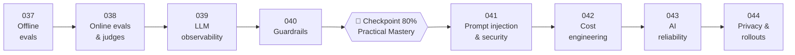

# 🛡️ Phase 05: Quality, Safety & AI Ops

> **Lessons 037–044 · 74% → 88% · 🅰️ core (037–040) + 🅱️ production (041–044)**
> By the end of this phase you'll **operate AI with evidence**: offline and online evals, AI tracing, guardrails, prompt-injection defence, cost engineering, graceful degradation, and safe, private rollouts.

## 📖 Chapter 5: Trust, Measured

Maya's chef could now think, read, and act, and nobody could prove whether last week's change made it better. Then it told a customer pink chicken was fine, obeyed a sentence hidden in a recipe, ran up a 70% bigger bill, froze checkout during an outage, and shipped a prompt to everyone at once. In this chapter, I'll show you how Maya turned "it seems fine" into numbers: exams you can trust, recordings of every decision, inspectors at the door and the pass, safe rooms for gullible geniuses, and releases that roll back on their own.

## 🗺️ Phase map

| # | Lesson | ⏱ | One-line idea |
|---|---|---|---|
| 037 | [Offline evals & golden sets](037-offline-evals.md) | 13 min | Sliced golden sets, the right graders, repeated runs, paired stats, CI gates |
| 038 | [Online evals, A/B & LLM-as-judge](038-online-evals.md) | 12 min | Offline says "can", online says "is". Judge the judge |
| 039 | [LLM observability & tracing](039-llm-observability.md) | 12 min | Span every AI step with versions, tokens, and cost. Sample payloads, redact PII |
| 040 | [Guardrails & moderation](040-guardrails-and-moderation.md) | 13 min | Independent input and output checks with actions, measured on precision and recall |
| 🏁 | [Checkpoint 80%](checkpoint-80.md) | 30–45 min | **The AI-era Practical Mastery gate** |
| 041 | [Prompt injection & AI security](041-prompt-injection-security.md) | 14 min | Assume the model is fooled. Contain it with privileges, quarantine, and closed channels |
| 042 | [Cost engineering & token budgets](042-cost-engineering.md) | 13 min | Attribute every token, measure unit economics, pull the levers, cap the loops |
| 043 | [AI reliability](043-ai-reliability.md) | 12 min | Core never waits on AI. TTFT timeouts, breakers, and a fallback ladder |
| 044 | [Privacy, PII & model rollouts](044-privacy-and-model-rollout.md) | 13 min | Version and canary prompts like code. Minimize, redact, and route by residency |

📌 [Phase cheatsheet](CHEATSHEET.md) · 🎤 [Phase interview questions](INTERVIEW-QUESTIONS.md)

⬅️ Previous phase: [04 Agents & orchestration](../04-agents/README.md) · ➡️ Next phase: [06 AI case studies & capstone](../06-ai-case-studies/README.md)
