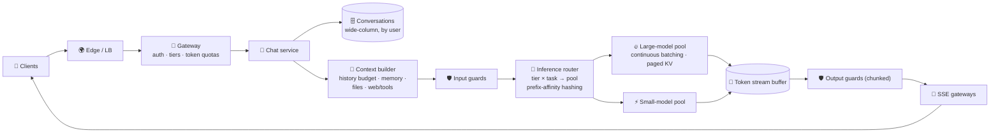

# 045 · Design a ChatGPT-Style Assistant

> ⏱ 15 min · 📈 90% · 🅱️ Production & case studies · Phase 06: AI Case Studies & Capstone
>
> `██████████████████░░` 90% of Book 2
>
> 🧬 **Atoms used:** design framework [B1·073] · chat app [B1·077] · [004] · [005] · [010] · [011] · [014] · [015] · [018] · [040] · [043]

---

## 📖 Story

Maya's first design review of the season. The panel slides a card across the table: **"Design a ChatGPT-style assistant. 100 million daily users."**

Two years ago, she'd have started drawing a model in the middle of the whiteboard and arrows pointing at it. Today she puts the marker down and asks questions first. Which **tiers** (free, paid)? Which **features** (files, web search, memory)? What **latency** do users feel? What's the **cost ceiling** per user?

Then she writes the number that frames everything: **~775,000 conversations streaming at the same moment** at peak. Every one of them occupies GPU memory for **fifteen seconds**.

"The model," she tells the panel, "is the **easy** part. You rent or train it. The **system** around it decides whether those 775,000 streams are fast, affordable, safe, and still there when a region goes down."

I sat at the back of the room. Let me walk you through what she drew.

## 🎯 One-sentence idea

**A ChatGPT-scale assistant is a streaming, stateful chat system wrapped around a GPU inference fleet: a gateway with token-based quotas per tier, a conversation store and context builder, an inference router that maximizes batching and prefix-cache reuse, durable token streams, safety layers, and a fallback ladder, all sized by Little's Law on tokens.**

## 🧸 Analogy

A **24-hour food hall for 100 million people**:

- A **host at the door** checks memberships and how many dishes each guest may order (gateway, tiers, quotas).
- Each guest's **order history** is on file, and a **waiter** prepares a concise ticket from it (conversation store + context builder).
- A **dispatcher** sends tickets to the right kitchen, preferring the kitchen that already has the **sauce base** prepped (router + prefix cache).
- Kitchens cook **many orders at once on every burner** (continuous batching), and **runners** deliver course by course, even through tunnels (streaming).
- **Inspectors** at the door and the pass, and backup kitchens if one closes (safety + fallbacks).

## 🖼️ Visual

*Diagram brief:* clients connect through the edge to a gateway (auth, tiers, token quotas). The chat service persists messages and calls the context builder (history, memory, tools such as web search and file parsing). The inference router chooses a model pool by tier and task and routes by prefix affinity. GPU pools use continuous batching with paged KV. Tokens flow into a durable stream buffer, out through streaming gateways (SSE), with safety checks on both sides.



## 🔬 How it works

- **Requirements and napkin:** **100M DAU × 15 messages = 1.5B messages/day ≈ 17k/s average, ~50k/s peak.** ~2,000 input tokens (with history) and ~500 output tokens each → **3T input + 0.75T output tokens/day**. Each stream lives ≈ 0.5 s TTFT + 500 × 30 ms ≈ **15.5 s**, so peak concurrency ≈ 50k × 15.5 ≈ **775k streams**. SLOs: p95 TTFT < 1 s, TPOT < 50 ms, 99.9% availability, per-tier cost ceilings.
- **Gateway and tiers:** auth, abuse controls, and **token-bucket quotas per tier** (free users get a smaller model and tighter limits, paid users get priority queues). Requests carry a priority class into the scheduler (lessons 010, 042).
- **Conversations and context:** messages in a **wide-column store** keyed by `(user_id, conversation_id, seq)` (~2.5 KB per message ≈ **3.75 TB/day**). The context builder enforces the **token budget**: pinned system prompt, user memory (lesson 031), summarized history (lesson 003), and tool results (web search, file parsing via object storage + chunking).
- **Inference fleet:** separate **pools per model** (large, small, reasoning). Continuous batching, paged FP8 KV, tensor parallelism inside servers (lessons 010–013). The **router** picks the pool by tier and task, and hashes the **conversation prefix** so follow-up turns land where their KV/prefix cache lives (lesson 018), with load-aware spillover.
- **Streaming and safety:** tokens go to a **durable per-message buffer**, served over SSE with resume and cancel (lesson 014). Input guards run in parallel with context building, and output guards check streamed chunks (lesson 040). Uploaded files and web pages are **untrusted content** (lesson 041).
- **Capacity and resilience:** predictive scaling + warm pools (lesson 016), shed free-tier and batch traffic first under pressure, a fallback ladder across regions and model sizes (lesson 043), and metering of every token by user and tier (lesson 042).

## 🧩 Worked example

**GPU napkin for the large-model pool** (assume 70% of traffic → large model, FP8, ~1,000 concurrent streams per 8-GPU server at the TPOT SLO):

```
Concurrent streams on the large pool ≈ 0.7 × 775k ≈ 540k
Servers by memory/batching ≈ 540k ÷ 1,000 ≈ 540 servers (4,320 GPUs)

Prefill check: 0.7 × 50k msg/s × 2,000 tokens = 70M tokens/s at peak
  With prefix caching of history across turns (~70% of each prompt reused): ~21M new tokens/s
  If the large model has ~40B active params (MoE): 2 × 40B × 21M ≈ 1.7 × 10¹⁸ FLOPs/s
  ÷ ~4 × 10¹⁵ per server ≈ 420 servers → same order as memory ✅ (without caching: ~1,400 😱)
```

**So this means:** **prefix caching with conversation-affinity routing is worth ~1,000 servers** at peak. Losing affinity (random routing) would triple the prefill fleet.

**Request path for one message (p50):** gateway 5 ms → load conversation + build context 25 ms → input guards (parallel) → route 2 ms → queue + prefill **~300 ms (cache hit)** → first token streamed. **TTFT ≈ 350 ms.**

## ⚖️ Trade-offs

| Decision | Choice | Trade-off |
|---|---|---|
| Model per tier | Small for free, large for paid, routed by task | Cost control vs quality differences |
| Routing | Prefix/conversation affinity + spillover | Cache hits vs hot-spot risk |
| History | Budgeted + summarized | Bounded cost vs lost detail |
| Streaming | Durable buffer + SSE resume | No double generation vs an extra tier to run |
| Capacity | Reserved baseline + predictive + warm pools | Availability vs idle GPU cost |

## 🌍 Real world

- Large assistants publish **tiered model access and rate limits** (messages or tokens per window), which are exactly the gateway quotas described here.
- Public engineering write-ups from AI providers describe **GPU capacity** as the defining constraint, with heavy investment in batching, caching, and scheduling.
- Inference engines with **prefix caching** (vLLM, SGLang) and **cache-aware routers** exist because multi-turn chat repeats most of every prompt.

## 📌 Cheat card

> - **Napkin:** msgs/s × stream lifetime = concurrent streams (Little's Law).
> - **Gateway with tiers + token quotas.** Priority into the scheduler.
> - **Conversation store + budgeted context builder.**
> - **Router: tier × task → pool, conversation-affinity hashing** for prefix-cache hits.
> - **Durable streams, guards on both sides, fallback ladder, metered tokens.**

## 🧪 Feynman check

Explain the 24-hour food hall: why the dispatcher prefers the kitchen that already has the sauce base prepped, and why the runners deliver course by course.

⚠️ **Common confusion:** "Designing ChatGPT is mostly about the model." In an interview (and in reality), the model is a box you **rent or train**. The design is about **concurrency, GPU capacity, caching, streaming, state, safety, and cost**: the classic distributed-systems problems at token scale.

## ⚡ Quick recall

1. How do you estimate peak concurrent streams?
<details><summary>Reveal Answer</summary>

Little's Law: peak messages per second × average stream lifetime (TTFT + output tokens × TPOT).
</details>

2. Why route follow-up turns to the same replica?
<details><summary>Reveal Answer</summary>

So the conversation's prefix (and its KV) is already cached there, cutting prefill compute and TTFT dramatically.
</details>

3. How do tiers show up in the architecture?
<details><summary>Reveal Answer</summary>

Different token quotas and rate limits at the gateway, different model pools via routing, and different scheduling priorities under load.
</details>

## 🎤 Interview practice

**Q. "Design ChatGPT. Then: a new model doubles quality but costs 3× more per token. How do you roll it out?"**
<details><summary>Model answer</summary>

- **Core design:** as above: napkin (1.5B msgs/day, ~775k concurrent streams), gateway with tiers and token quotas, conversation store, a budgeted context builder, a router with prefix affinity, GPU pools with continuous batching and paged KV, durable SSE streaming, guards, fallbacks, and metering.
- **Rolling out the expensive model:**
  - **Capacity first:** 3× cost per token ≈ 3× GPU per stream. Measure tokens/s/GPU at the SLO and plan reserved capacity, or start with a constrained quota.
  - **Target it:** paid tiers first, and **route by task difficulty** (lesson 015), so only hard prompts use it, with an eval-gated router.
  - **Release:** eval gate → shadow → canary by tier → A/B on outcomes (retention, satisfaction) with cost guardrails (lessons 038, 044).
  - **Controls:** per-tier quotas for the new model, fallback to the old model under pressure, and unit economics per tier (revenue vs token cost).
- **Likely follow-up:** "GPUs for it are scarce for 3 months." → limited access with queues/quotas, priority for high-value users, and aggressive caching, quantization, and speculative decoding to stretch capacity.
</details>

## 📖 Teaser

> 📖 *The panel nods, and slides the second card across: "Now do it for companies, where every answer must respect who's allowed to read what."*

---

⬅️ [044 · Privacy, PII & Model Rollouts](../05-quality-safety-ops/044-privacy-and-model-rollout.md) · 🗺️ [Phase map](README.md) · ➡️ [✅ Checkpoint 90%](checkpoint-90.md)

✅ **Safe stopping point.** Tick lesson 045 in [PROGRESS.md](../../PROGRESS.md), then do the checkpoint!
