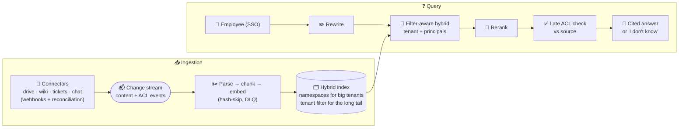

# 046 · Design Enterprise Document Q&A

> ⏱ 15 min · 📈 92% · 🅱️ Production & case studies · Phase 06: AI Case Studies & Capstone
>
> `██████████████████░░` 92% of Book 2
>
> 🧬 **Atoms used:** [019] · [020] · [021] · [022] · [023] · [024] · [025] · [037] · [039] · [041]

---

## 📖 Story

The second card reads: **"Design an AI assistant over a company's internal documents (drives, wikis, tickets, chat), for 2,000 enterprise customers."**

Maya smiles, because she has lived this: **Pantry for Business** taught her every way it can go wrong. The rival kitchen's secret sauce. The stale peanut recipe. The deleted cook who kept being quoted. The supplier email that tried to leak orders.

She writes three promises on the whiteboard before drawing a single box:

1. **Never show anyone a document they couldn't open themselves.**
2. **Never answer from a document that's changed or gone.**
3. **Every answer cites its sources, or says "I don't know".**

"Everything else," she says, "is in service of those three lines."

## 🎯 One-sentence idea

**Enterprise document Q&A is permission-aware RAG at scale: connectors that sync documents and their access lists, an ingestion pipeline that chunks and embeds incrementally, a multi-tenant hybrid index with identity-derived filters, a query path with reranking, late permission checks, and cited answers, and per-tenant evaluation, freshness, and deletion guarantees.**

## 🧸 Analogy

A **reference librarian for a building full of companies**:

- **Couriers** bring copies of every company's files each time they change, with the **lock list** for each file (connectors + ACLs).
- The librarian **cuts, labels, and shelves** them in each company's locked room (ingestion + multi-tenant index).
- When an employee asks a question, the librarian searches **only rooms and cabinets their badge opens**, double-checks with the original office that the file is still there and still theirs, and answers with **page references**.

## 🖼️ Visual

*Diagram brief:* left, connectors for drive, wiki, tickets, and chat feed a change stream (content + ACL events). The ingestion pipeline parses, chunks, embeds, and writes to a multi-tenant hybrid index (big tenants in their own namespace, the long tail sharded with mandatory tenant filters). Right, a user's query flows with their SSO identity through rewrite, filter-aware hybrid retrieval, rerank, a late ACL check against the source, and a grounded, cited answer.



## 🔬 How it works

- **Requirements and napkin:** 2,000 tenants × ~100k documents = **200M documents** → ~**1B chunks**. Users: 2M × 10 questions/day = **20M queries/day ≈ 230/s, ~700/s peak**. Freshness: content < 5 min, **revocations < 1 min**. Zero cross-tenant or cross-user leaks. Cited answers, p95 TTFT < 2 s.
- **Connectors:** per-source sync of **content and ACLs** (users, groups, sharing links) via webhooks/CDC, plus periodic **reconciliation** to catch missed events. Identities are mapped to the company directory, and group membership is resolved at **query time**.
- **Ingestion:** layout-aware parsing, structural chunking with context headers, ACL and tenant metadata on every chunk, hash-skip incremental embedding, and deletes as top-priority tombstones (lessons 022, 024).
- **Index:** **hybrid** (BM25 + vectors). At 1B chunks, store compressed vectors (PQ, ~96 B → ~100 GB of codes) with full vectors on SSD for re-scoring (lesson 020). **Namespaces** for the largest tenants, sharded **mandatory-filter** partitions for the long tail (lesson 025).
- **Query path:** rewrite → filter-aware hybrid top 50 (tenant + user principals from SSO) → cross-encoder rerank → **late ACL check** on the final ~5 against the source (cached briefly) → grounded generation with citations → citation verification. Retrieved content is **untrusted**: no tools in the answer step, and no rendering of links outside allow-lists (lesson 041).
- **Operations:** per-tenant golden sets (recall@5, faithfulness), **cross-tenant probe suites** in CI, freshness and deletion SLOs, per-tenant cost metering, and redacted traces with tenant-scoped access (lesson 039).

## 🧩 Worked example

**Index sizing:**

```
Chunks: 1B × 768 dims
  Full float16 vectors on NVMe: 1B × 768 × 2 B ≈ 1.5 TB (for re-scoring)
  PQ codes in RAM:             1B × 96 B      ≈ 96 GB
  BM25 postings:               ~1B chunks × ~300 tokens → ~0.5–1 TB compressed
Shards: ~40 shards × 3 replicas; big tenants pinned to dedicated shards
```

**Latency budget for one question (p95):**

```
Rewrite 120 ms → embed 20 → hybrid search 40 (fan-out to tenant's shards) → rerank 120
→ late ACL check 60 (cached ~80% of the time) → TTFT 400 ≈ 760 ms ✅ (SLO 2 s)
```

**Revocation, end to end:** an employee is removed from the "Finance" group at 10:00:00. The directory event invalidates their cached principal set at **10:00:04**. The next query at 10:00:30 excludes Finance-only chunks at search time, and the late check would have blocked them anyway. **Leak window: ~4 s.**

## ⚖️ Trade-offs

| Decision | Choice | Trade-off |
|---|---|---|
| ACL evaluation | Principals resolved at query time | Fresh group changes vs a directory lookup per query |
| Index layout | Namespaces for big tenants, shared + filter for the rest | Isolation vs efficiency |
| Vectors at 1B scale | PQ in RAM + full on SSD | Memory cost vs recall (fixed by re-scoring) |
| Late ACL check | On the final 5 chunks | Safety vs ~60 ms and source-API load |
| Answer policy | Cite or "I don't know" | Trust vs fewer answers |

## 🌍 Real world

- Enterprise AI search products (workplace search and assistants built into office suites) are built on **connectors that sync permissions**, so answers respect source-system access.
- Vector databases and search engines offer **namespaces/partitions** and metadata filters for multi-tenancy.
- Security reviews of these products focus on **permission propagation lag**, **cross-tenant isolation**, and **injection via shared documents**.

## 📌 Cheat card

> - **Three promises:** no unauthorized docs, no stale or deleted docs, cite or "I don't know".
> - **Connectors sync content + ACLs**, with reconciliation. Revocations first.
> - **Hybrid index, PQ at scale, namespaces + mandatory filters.**
> - **Identity → filters → rerank → late ACL check → cited answer.**
> - **Per-tenant evals, leak probes, freshness/deletion SLOs.**

## 🧪 Feynman check

Explain the reference librarian for a building full of companies: what the couriers bring, why the librarian only searches rooms your badge opens, and why they double-check with the original office before answering.

⚠️ **Common confusion:** "Index each tenant's documents and filter by tenant, and we're secure." Inside a tenant, **document-level** permissions vary per user and change constantly. Tenant filtering is necessary, but per-user ACLs, fast revocation, and late checks are what make it safe.

## ⚡ Quick recall

1. Why do connectors sync ACLs as well as content?
<details><summary>Reveal Answer</summary>

So retrieval can filter by each user's actual permissions in the source systems, and permission changes propagate to the index.
</details>

2. Why resolve group membership at query time?
<details><summary>Reveal Answer</summary>

A group change then applies instantly without re-indexing every document that the group can access.
</details>

3. How do you fit 1B chunk vectors economically?
<details><summary>Reveal Answer</summary>

Compressed PQ codes in RAM for search, full-precision vectors on SSD for re-scoring the top candidates.
</details>

## 🎤 Interview practice

**Q. "Design the assistant, then explain how you'd prove to a bank's security team that it can't leak documents."**
<details><summary>Model answer</summary>

- **Design:** connectors with ACL sync and reconciliation, an incremental ingestion pipeline, a multi-tenant hybrid index (dedicated namespace and encryption keys for the bank), a filter-aware query path with late ACL checks, cited answers, and untrusted-content handling.
- **Proof for the security team:**
  - **Architecture:** filters derived from SSO identity in code. No path from the model to unfiltered search. A dedicated namespace and per-tenant keys. The answer model has no tools.
  - **Tests:** automated **probe suites** (thousands of queries by users without access to seeded canary documents) in CI and in production, with an expected leak count of 0.
  - **Freshness SLOs:** revocation propagation measured continuously (p99 < 1 min), plus the late check as a backstop.
  - **Audit:** per-answer logs of which documents were retrieved and shown, available to the bank. Penetration tests including prompt-injection documents.
  - **Data handling:** in-region processing, zero-retention model endpoints, and deletion fan-out with verification.
- **Likely follow-up:** "A shared link grants 'anyone with the link' access. Do you index it for everyone?" → treat link-shared documents as accessible only to users who've actually opened them (or per the bank's policy), never as public to the whole tenant by default.
</details>

## 📖 Teaser

> 📖 *Card three makes the room lean forward: "Design an agent that writes and ships code in your repositories, by itself."*

---

⬅️ [✅ Checkpoint 90%](checkpoint-90.md) · 🗺️ [Phase map](README.md) · ➡️ [047 · Design an AI Coding Agent](047-design-coding-agent.md)

✅ **Safe stopping point.** Tick lesson 046 in [PROGRESS.md](../../PROGRESS.md).
