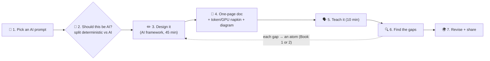

# 050 · Capstone: Design It & Teach It Back

> ⏱ 60–120 min (split it across sittings!) · 📈 100% · 🅱️ Production & case studies · Phase 06: AI Case Studies & Capstone
>
> `████████████████████` 100% of Book 2
>
> 🧬 **Atoms used:** all of them, from both books. This is where you prove it.

---

## 📖 Story

The review room empties. Maya stays behind, caps the marker, and looks at the five designs still on the walls: a chat assistant, a document oracle, a coding agent, a recommender, and a voice on the phone.

She thinks back to the Tuesday "Ask the Chef" launched: the peanut sauce called nut-free, the **$2.1-million** day, the eight seconds of silence. Every one of those failures became an **atom**: tokens, prefill and decode, the KV cache, embeddings, retrieval, tools, budgets, evals, guardrails, fallbacks.

None of the atoms were magic. Every one was a **classic idea from Book 1, re-applied to a new kind of component**: slow, expensive, probabilistic, and occasionally brilliant.

I've walked beside Maya for a hundred and fifty lessons now. She doesn't need me in the room any more.

This last lesson isn't hers. It's **yours**. I'm handing you the marker.

## 🎯 One-sentence idea

**Mastery of AI-era system design, the Feynman way, means taking an AI product you've never seen, deciding what should and shouldn't be AI, designing it with requirements, token and GPU numbers, grounding, actions, evals, safety, and cost, and teaching it so clearly that a beginner can redraw it, then publishing it.**

## 🧸 Analogy

The **final exam at a cooking school for the future**:

- You've mastered the classic techniques (Book 1) **and** the new equipment: a brilliant, expensive, unpredictable robot chef (Book 2).
- The judges hand you a **mystery basket** and a guest list.
- You must design the whole service: which dishes the robot cooks, which the line cooks make by hand, how you'll **taste-test** everything, what happens when the robot breaks down mid-service, and what each plate **costs**.
- Then you **explain every choice** to the judges. Passing means you can run **any** kitchen, robot or not.

## 🖼️ Visual

*Diagram brief:* the seven-station loop from Book 1's capstone, upgraded for AI. A die picks the prompt, then "Should this be AI?" splits the design into deterministic and AI parts, followed by the one-page doc, a teach-it-aloud step, a gap finder with arrows back to atom lessons in both books, a revise step, and a globe for publishing.

## 🔬 How it works

- **Pick an AI prompt you haven't studied** (or roll a die 🎲):

  | # | Prompt | Hard parts to deep-dive |
  |---|---|---|
  | 1 | **AI meeting notes** (record, transcribe, summarize, action items) | Streaming ASR, speaker labels, PII, permissions on recordings |
  | 2 | **AI customer-support platform** (multi-tenant, for SaaS companies) | Permission-aware RAG, handoffs, approval tiers, per-tenant evals |
  | 3 | **AI image generation service** | GPU queueing for long jobs, safety classifiers, prompt caching, cost per image |
  | 4 | **AI-powered search engine with answers** | Web crawl + index, hybrid retrieval, citations, freshness, injection from web pages |
  | 5 | **An LLM API platform** (be the provider) | Multi-model serving, tiers and quotas, batching, metering, fair scheduling |
  | 6 | **A personal AI assistant with memory** across email, calendar, docs | Memory write policy, connectors, prompt injection, action approvals |
  | 7 | **Fraud detection with LLM explanations** | Real-time features, ML scoring, LLM only for analyst summaries |
  | 8 | **An AI tutor for children** | Safety for minors, voice, curriculum grounding, parental controls |
  | 9 | **A code review bot** for a large monorepo | Diff-scoped context, code search, false-positive rates, cost per PR |
  | 10 | **A document-processing pipeline** (invoices, contracts) at 10M pages/day | Layout parsing, structured outputs, validation, human queues, batch economics |

- **Design it** with the [AI interview framework](../../cheatsheets/AI-INTERVIEW-FRAMEWORK.md): 45 minutes, on paper. Start with "should this be AI?", then requirements with a **quality bar, error tolerance, and cost budget**.
- **Write a one-page doc:** context and goals, non-goals, deterministic vs AI split, requirements with numbers, **token and GPU napkin math**, architecture (gateway, context, retrieval, models, tools), 2–3 deep dives, **evals and quality SLOs**, safety and security (injection, PII), failure and degraded modes, cost per unit of value, and open questions.
- **Teach it (the Feynman core):** 10 minutes, out loud, to a friend, a study group, or a voice recording. Every buzzword ("agentic", "RAG", "embeddings") must come with a plain-words explanation.
- **Find the gaps and revise:** every "um, the model just handles that…" is a gap. Map each one to its atom via [COVERAGE.md](../../COVERAGE.md) (or Book 1's [COVERAGE.md](../../../COVERAGE.md)), relearn it, and deepen two hard parts.
- **Share it:** a blog post, a gist, or a talk. Publishing forces clarity and invites feedback.

## 🧩 Worked example

**A mini walkthrough of prompt #3, "AI image generation service" (the depth expected):**

- **Should this be AI?** Generation, yes. Safety policy, quotas, billing, and storage: deterministic.
- **Requirements:** 5M DAU × 8 images = **40M images/day ≈ 460/s average, ~1,400/s peak**. p50 < 8 s per image. ≤ $0.01 per image. Zero tolerance for prohibited content.
- **Napkin:** ~2 s of GPU time per image (diffusion steps) → peak 1,400/s × 2 s = **2,800 GPUs busy** at peak (Little's Law), + headroom. Batching several images per GPU step improves throughput ~2–3× → **~1,200–1,500 GPUs**.
- **Architecture:** gateway (tiers, **image-count quotas**) → input safety classifier (prompt policy) → **job queue** with priorities (paid first) → GPU workers (batched, warm pools, lesson 016) → output safety classifier (image) → object storage + CDN → client via a progress stream (SSE).
- **Deep dives:**
  - **Queueing at peak:** show queue position, shed free-tier traffic first, and fall back to fewer steps or a smaller model under load.
  - **Safety:** input and output classifiers with measured precision and recall, hash-matching against known prohibited content, and appeal flows.
  - **Cost:** $/image from GPU-seconds, cache identical prompt + seed requests, and run batch generation off-peak.
- **Failure modes:** a GPU node dies mid-job → idempotent job retry (`job_id`). A classifier outage → **fail closed** (hold results) rather than publish unchecked images.

## ⚖️ Trade-offs

Your capstone doc must contain **at least three explicit trade-off decisions** in this shape:

| Decision | Options considered | Chosen | Because (requirement + number) | Cost we accept |
|---|---|---|---|---|
| Model per request | One large model vs routed small/large | Routed | 70% of requests are easy, ~5× cheaper at equal golden-set score | Router errors on ~2% of hard requests |
| Grounding | Fine-tune vs RAG | RAG | Facts change daily and must be cited and deletable | Retrieval latency (~150 ms) and an index to run |
| Safety on outage | Fail open vs fail closed | Fail closed | Zero tolerance for prohibited content | Users wait or retry during classifier outages |

## 🌍 Real world

- AI teams write **design docs with eval plans, safety reviews, and cost models** before building, and review each other's, exactly like this.
- **AI system design interviews** increasingly ask for these designs (chat assistants, RAG, agents, recommendation, voice), scored on requirements, numbers, trade-offs, and safety.
- **Teaching** (posts, talks, internal brown-bags) is how engineers cement expertise in a field that changes monthly. The atoms are what stay constant.

## 📌 Cheat card

> - **Pick → Should this be AI? → Design → Write → Teach → Find gaps → Revise → Share.**
> - **Every choice = requirement + number + trade-off.**
> - **Always include:** token/GPU napkin, evals + quality SLOs, safety, failure modes, unit cost.
> - **Gaps are gifts.** Map each to an atom in Book 1 or Book 2.
> - **One AI capstone a month** keeps you current.

## 🧪 Feynman check

The whole capstone *is* the Feynman check. The final test: **could a smart 16-year-old follow your 10-minute explanation, redraw your diagram from memory, and tell you which parts are AI and why?** If yes, you've mastered it.

⚠️ **Common confusion:** "Mastery in the AI era means knowing the latest model and framework." Models change every few months. Mastery means **reasoning from atoms** (tokens, memory, batching, retrieval, budgets, evals, permissions, fallbacks) to a sound design, **explaining it simply**, and **knowing what to measure**. Those don't change.

## ⚡ Quick recall

1. What question comes before any AI design?

Reveal Answer

Should this be AI at all? Split the problem into deterministic parts and the parts that genuinely need a model.

2. What must every AI capstone doc include beyond a classic design doc?

Reveal Answer

Token and GPU napkin math, a quality bar with evals and quality SLOs, safety and security (injection, PII), degraded modes, and cost per unit of value.

3. How do you use your gaps?

Reveal Answer

Map each one to the relevant atom lesson in Book 1 or Book 2 (via COVERAGE.md), relearn it, and update the design.

## 🎤 Interview practice

**Q. "Tell me about an AI system you designed." (Use your capstone, then run it as a 45-minute mock.)**

Model answer

- **The 5-minute story:**
  1. **Context and goals** (1 min), and **what you chose not to make AI**.
  2. **Requirements with numbers:** traffic in tokens, latency (TTFT/TPOT), quality bar, cost per unit.
  3. **The architecture in one diagram**, and the **two hardest problems**: for example, grounding with permissions, or GPU capacity at peak.
  4. **How you measured quality** (golden set, online evals) and **kept it safe** (guardrails, injection containment, approvals).
  5. **Trade-offs**, and what you'd change at 100× scale or with a model 10× cheaper.
- **The 45-minute mock:**
  - A friend reads a prompt and answers clarifying questions with reasonable assumptions.
  - At minute ~20 they inject a twist: **"the model provider is down"**, **"cost must halve"**, **"a document contains a prompt injection"**, or **"now it must work by voice"**.
  - Afterwards, score yourself with the [🏁 80% gate rubric](../05-quality-safety-ops/checkpoint-80.md), then swap roles.
- **Likely follow-up:** "What would you do differently?" → name one real weakness (an unmeasured slice, a correlated fallback, an unbounded agent loop), the signal that would reveal it, and the atom that fixes it.

## 📖 Teaser

> 📖 *That's the end of Maya's second story, and the next system, built on atoms you now own, is yours to design.*

---

⬅️ [049 · Design a Real-Time Voice Assistant](049-design-voice-assistant.md) · 🗺️ [Phase map](README.md) · ➡️ [🎓 Checkpoint 100%](checkpoint-100.md)

✅ **Safe stopping point.** Tick lesson 050 in [PROGRESS.md](../../PROGRESS.md), then do the checkpoint!
