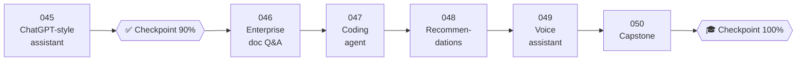

# 🏛️ Phase 06: AI Case Studies & Capstone

> **Lessons 045–050 · 90% → 100% · 🅱️ Production & case studies**
> By the end of this phase you'll **design complete AI systems end to end**, interview style: a ChatGPT-scale assistant, enterprise document Q&A, a coding agent, a recommender, a voice assistant, and your own capstone.

## 📖 Chapter 6: The Design Reviews

Maya walks into the review room with five cards waiting on the table. Each one is a famous AI system, and each one is really a story she has already lived at Pantry: the eight-second silence, the rival's secret sauce, the duplicate grocery order, the carousel that showed everyone the same curry, the phone call where silence felt broken. In this chapter, I'll watch with you as every atom from both books combines into complete designs, and then I'll hand you the marker.

## 🗺️ Phase map

| # | Lesson | ⏱ | One-line idea |
|---|---|---|---|
| 045 | [Design a ChatGPT-style assistant](045-design-chatgpt.md) | 15 min | Little's Law on tokens, tiers and quotas, affinity routing, durable streams |
| ✅ | [Checkpoint 90%](checkpoint-90.md) | 25 min | |
| 046 | [Design enterprise document Q&A](046-design-enterprise-rag.md) | 15 min | Permission-aware RAG at a billion chunks: connectors, ACLs, late checks, citations |
| 047 | [Design an AI coding agent](047-design-coding-agent.md) | 15 min | A sandbox per task, repo tools, durable budgeted loops, PRs reviewed by humans |
| 048 | [Design embedding-based recommendations](048-design-recommendations.md) | 14 min | Two-tower retrieval → ranking → rules, in under 100 ms |
| 049 | [Design a real-time voice assistant](049-design-voice-assistant.md) | 15 min | Everything streams: an ~800 ms voice-to-voice budget, barge-in, read-backs |
| 050 | [Capstone: design it & teach it back](050-capstone.md) | 60–120 min | Should this be AI? Then design, write, teach, find gaps, and share |
| 🎓 | [Checkpoint 100%](checkpoint-100.md) | 45 min | |

📌 [Phase cheatsheet](CHEATSHEET.md) · 🎤 [Phase interview questions](INTERVIEW-QUESTIONS.md)

⬅️ Previous phase: [05 Quality, safety & AI ops](../05-quality-safety-ops/README.md) · 🏠 [Book 2 home](../../README.md)
