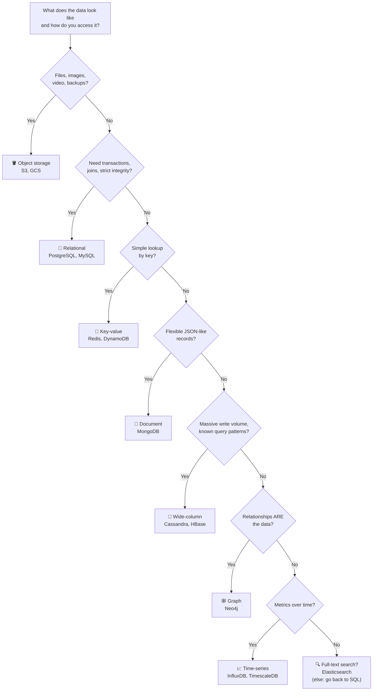

# 🗄️ Database Chooser

> **Default to a relational database (PostgreSQL/MySQL)** unless you have a clear reason not to. Most "we need NoSQL" decisions are premature.
> Taught in [Lesson 045](../phases/05-databases/045-choosing-a-database.md).

---

## 🌳 Decision tree

---

## 📋 Quick table

| Type | Examples | Great at | Weak at | Classic use |
|---|---|---|---|---|
| **Relational (SQL)** | PostgreSQL, MySQL | Transactions, joins, constraints, ad-hoc queries | Horizontal write scaling (it's possible, but takes work) | Users, orders, payments, most apps |
| **Key-value** | Redis, DynamoDB, Memcached | Very fast get/put by key | Queries by anything other than the key | Sessions, caches, carts, counters |
| **Document** | MongoDB, Couchbase | Flexible nested records | Cross-document joins and transactions (limited) | Product catalogs, CMS, user profiles |
| **Wide-column** | Cassandra, HBase, ScyllaDB | Huge write throughput, scales linearly | Ad-hoc queries (you design around the queries) | Messages, activity logs, IoT |
| **Graph** | Neo4j, Neptune | Traversing relationships | Bulk analytics, simple lookups | Social graphs, fraud rings, recommendations |
| **Time-series** | InfluxDB, TimescaleDB, Prometheus | Append-heavy, time-range queries, downsampling | Random updates | Metrics, monitoring, sensors |
| **Search engine** | Elasticsearch, OpenSearch | Full-text search, relevance, facets | Being the source of truth | Product search, log search |
| **Columnar / warehouse** | BigQuery, Snowflake, Redshift, ClickHouse | Scanning billions of rows for analytics | Small, frequent transactional writes | Reports, BI dashboards |
| **Object storage** | S3, GCS, Azure Blob | Cheap, durable, huge blobs | Low-latency small updates, queries | Images, video, backups, data lakes |
| **NewSQL** | Spanner, CockroachDB, Yugabyte | SQL + horizontal scale + strong consistency | Cost, complexity, latency | Global transactional systems |

---

## 🎯 Rules of thumb

- **"It depends" is the start of an answer.** Follow it with *access pattern + consistency need + scale*.
- **Polyglot persistence is normal.** A real system might use Postgres (orders), Redis (cache), S3 (images), Elasticsearch (search), and Kafka (events).
- **The source of truth should be boring and durable.** Caches and search indexes are *derived* from it.
- **Choose based on the queries, not the data.** NoSQL modelling starts with "what questions will I ask?"
- **Scale limits come later than you think.** A single tuned Postgres handles thousands of writes/s and terabytes of data.

---

⬅️ [PATTERNS.md](PATTERNS.md) · ➡️ [INTERVIEW-FRAMEWORK.md](INTERVIEW-FRAMEWORK.md)
