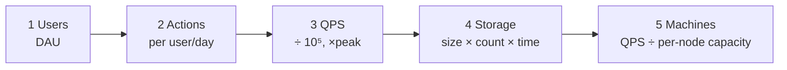

# 🧮 Back-of-Envelope Estimation Tricks

> The goal is **the right order of magnitude**, not a precise number. Is it 10 servers or 10,000? That's what matters.
> Taught in [Lesson 005](../phases/01-foundations/005-back-of-envelope-estimation.md).

---

## 🪜 The 5-step recipe



1. **Users:** daily active users (DAU). If you only know MAU, DAU ≈ 20–50% of MAU.
2. **Actions:** how many reads and writes each user does per day.
3. **QPS:** total per day ÷ 10⁵, then × 2–3 for peak.
4. **Storage:** size per item × items per day × days retained × replication (3).
5. **Machines / bandwidth:** QPS ÷ what one node handles, and bytes/s in and out.

---

## ⚡ The shortcuts

| Trick | Why it works |
|---|---|
| **1 day ≈ 10⁵ seconds** | 86,400 rounded up. It's easy to divide by. |
| **1M requests/day ≈ 12 QPS** | 10⁶ ÷ 10⁵ = 10, and it's really about 11.6 |
| **1 year ≈ 3 × 10⁷ s** | 365 × 10⁵ ≈ 3.65 × 10⁷ |
| **Peak = 2–3 × average** | Traffic bunches up at certain hours |
| **2¹⁰ ≈ 10³** | Switch freely between KB/MB/GB and thousands/millions/billions |
| **Read:write ratio** | Social apps are often 100:1, e-commerce about 10:1, logging/IoT is write-heavy |
| **80/20 rule** | 20% of the data gets 80% of the traffic, so cache about 20% of the daily data |
| **×3 for replication** | Most storage systems keep 3 copies |
| **Round aggressively** | 86,400 → 100,000. 365 → 400. It's fine. |
| **Write units** | Always say "per second" or "per day", and KB/MB/GB |

### Multiplying big numbers without panic

Convert to powers of 10 and **add exponents**:

```
300 million users × 2 KB each
= 3 × 10⁸ × 2 × 10³ bytes
= 6 × 10¹¹ bytes
= 600 GB
```

### Byte-size ladder (powers of 10)

```
10³  = KB  (thousand)
10⁶  = MB  (million)
10⁹  = GB  (billion)
10¹² = TB  (trillion)
10¹⁵ = PB  (quadrillion)
```

---

## 🧩 Worked template (fill in the blanks)

```
DAU                     = ______
Writes per user per day = ______   → write QPS = DAU × w ÷ 10⁵   = ______ (peak ×3 = ___)
Reads per user per day  = ______   → read QPS  = DAU × r ÷ 10⁵   = ______ (peak ×3 = ___)
Size per write          = ______   → daily storage = writes/day × size = ______
Retention (years)       = ______   → total = daily × 365 × years × 3 replicas = ______
Cache (hot 20% of daily reads)     → ______
Bandwidth out           = read QPS × response size = ______ /s
Servers                 = peak QPS ÷ ~10k per server (simple API) = ______
```

### Example: a Twitter-like app

```
DAU = 200M, 2 tweets/user/day, 100 reads/user/day, 300 bytes/tweet (text only)

Write QPS = 200M × 2 / 10⁵        = 4,000/s   (peak ~12k/s)
Read QPS  = 200M × 100 / 10⁵      = 200,000/s (peak ~600k/s)
Storage/day = 400M tweets × 300 B = 120 GB/day
5 years   = 120 GB × 365 × 5 × 3  ≈ 660 TB   (text only; media is far bigger)
```

Takeaway: it's **read-heavy**, so caching and precomputed feeds matter most.

---

## 🧠 Sanity checks

- **Is it more than about 10k QPS?** Then one box isn't enough. Plan a load balancer and replicas.
- **Is it more than a few TB?** Then one database node won't be comfortable. Think about sharding or object storage.
- **Is it more than about 100k QPS of reads?** Then caching is required, not optional.
- **Is it media (images/video)?** Then storage and bandwidth dominate. Use object storage plus a CDN.
- **Little's Law:** `concurrent requests = arrival rate × time in system`. 1,000 req/s × 0.2 s = **200 in flight** at once. This sizes thread pools and connection pools.

---

⬅️ [NUMBERS.md](NUMBERS.md) · ➡️ [TRADEOFFS.md](TRADEOFFS.md)
