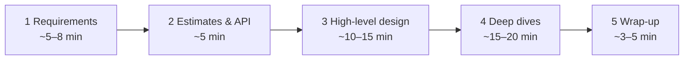

# 🎤 The System Design Interview Framework

> A 45–60 minute design interview is **a conversation, not an exam.** The interviewer wants to see *how you think*: structured, trade-off-aware, and collaborative.
> Taught in [Lesson 073](../phases/09-core-case-studies/073-design-framework.md).

---

## 🗺️ The 4 steps (plus a wrap-up)

### 1️⃣ Requirements (don't skip this!)

- **Functional:** what the system *does*. Pick the **top 3 features** and say what's out of scope.
- **Non-functional:** scale, latency, availability vs consistency, durability.
- Useful phrases:
  - "Who are the users, and how many?"
  - "Which matters more here, consistency or availability?"
  - "Is this read-heavy or write-heavy?"
  - "Can I assume X? I'll note it as an assumption."

### 2️⃣ Estimates & API

- **Estimates:** QPS (average and peak), storage, bandwidth. Keep it to 2 minutes and round aggressively. See [ESTIMATION-TRICKS](ESTIMATION-TRICKS.md).
- **API:** list 3–5 endpoints or RPCs with inputs and outputs.
- **Data model:** the main entities and their key fields. Mention which DB and why.

### 3️⃣ High-level design

- Draw boxes: **client → LB → services → cache → DB**, plus a queue or object store if needed.
- Walk through **one read path** and **one write path** end to end.
- Get the interviewer to agree on this before going deeper: "Does this look reasonable before I go deeper?"

### 4️⃣ Deep dives (where you earn senior points)

Pick 2–3 of these, or let the interviewer pick:

- **Bottlenecks:** what breaks first at 10× scale?
- **Data:** sharding key, replication, consistency choice.
- **Hot spots:** celebrities, viral content, hot keys.
- **Failure:** what happens when X dies? Retries, idempotency, failover.
- **Special algorithms:** feed ranking, geohash, rate limiter, ID generation.

### 5️⃣ Wrap-up

- Recap the design in 30 seconds.
- Name **trade-offs you made** and **what you'd improve** with more time: monitoring, security, cost, multi-region.

---

## ✅ Do / ❌ Don't

| ✅ Do | ❌ Don't |
|---|---|
| Ask clarifying questions first | Jump straight into drawing boxes |
| State assumptions out loud | Silently assume |
| Say "the trade-off here is…" | Present one option as the only answer |
| Start simple, then scale | Start with 30 microservices |
| Use numbers to justify choices | Say "it's scalable" with no reasoning |
| Check in with the interviewer | Monologue for 20 minutes |
| Admit what you don't know, then reason about it | Bluff |

## 🗣️ Magic phrases

- "Let me start simple and then scale it up."
- "The bottleneck here would be ___, so I'd ___."
- "We could do A or B. A gives us ___ but costs ___. Given the requirement for ___, I'd pick A."
- "If this component fails, then ___. To handle that, ___."
- "For v1 I'd keep it as ___, and move to ___ once we hit ___ scale."

## 🧰 The standard toolbox (the "atoms" you'll combine)

`DNS · CDN · Load balancer · API gateway · Stateless app servers · Cache (Redis) · SQL DB + replicas · NoSQL · Sharding · Object storage · Message queue / Kafka · Workers · Search index · Rate limiter · Monitoring`

---

⬅️ [DATABASE-CHOOSER.md](DATABASE-CHOOSER.md) · ➡️ [MNEMONICS.md](MNEMONICS.md)
