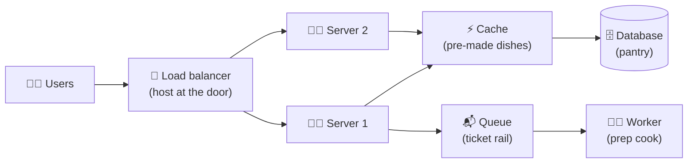

# 001 · What Is System Design?

> ⏱ 7 min · 📈 1% · 🅰️ Part A (core) · Phase 01: Foundations
>
> `░░░░░░░░░░░░░░░░░░░░` 1% of the whole guide

---

## 📖 Story

Pull up a chair. I'm your author, and I want to tell you about Maya.

It's 11 p.m. in a tiny apartment kitchen. A laptop sits on the counter, fan whirring, next to a cold cup of tea. On its screen is **Pantry**, a website where neighbours sell home-cooked meals to each other. Maya built it in three weekends. It runs on that one laptop: one web server, one Postgres database, one power cable.

Tonight, forty people ordered dinner. It worked.

Then Maya writes the question that starts this whole guide on a sticky note and presses it to the screen: **"What happens when it's forty *thousand*?"**

She doesn't know. I didn't either at her age. Right now, neither do you. That's exactly where we start.

## 🎯 One-sentence idea

**System design is choosing and connecting building blocks (servers, databases, caches, queues) so that software stays fast, correct, and available as it grows, and every choice you make is a trade-off.**

## 🧸 Analogy

Think of a **restaurant**.

- Day one: 1 cook, 1 table, 1 fridge. Easy.
- Then 500 people show up. Now you need **more cooks** (servers), a **host at the door** (load balancer), **pre-made popular dishes** (cache), a **ticket rail** so orders don't get lost (queue), and a **bigger pantry split across rooms** (sharded database).

Nobody asks "what's the *correct* restaurant?" They ask "what's the right restaurant **for this many customers, this menu, and this budget**?" That question is system design.

## 🖼️ Visual

*Diagram brief:* users on the left flow through a door (load balancer) to two cooks (servers). Both cooks share a shelf of pre-made dishes (cache) in front of a big pantry (database). One cook drops slow jobs onto a ticket rail (queue) that a prep cook (worker) picks up.

## 🔬 How it works

- **Atoms:** a small, reusable set of parts (DNS, load balancers, app servers, caches, databases, queues, object storage, CDNs). Every large system is built from these. This guide teaches them one at a time.
- **Requirements drive every choice:** *functional* requirements say what the system does. *Non-functional* requirements say how well it must do it: p99 latency, requests per second, uptime, durability.
- **The six forces you balance:** scalability, latency, availability, consistency, durability, and cost/simplicity. Improving one almost always costs another.
- **Scale changes the answer:** a design that is perfect at 1,000 users can collapse at 10 million. Good designs **start simple and evolve** when measurements show a real bottleneck.
- **Every boundary is a failure point:** each new network hop adds latency and a new way to break. Distribution buys scale and you pay for it in complexity.

## 🧩 Worked example

**The same app at three scales.**

| Stage | Users | Peak req/s | Design |
|---|---|---|---|
| 🐣 Launch | 1,000 | ~5 | 1 server running the app and Postgres on the same box |
| 🐥 Growing | 100,000 | ~500 | Database on its own server, photos in object storage (S3), a CDN in front |
| 🦅 Big | 10,000,000 | ~50,000 | Load balancer, many stateless app servers, a Redis cache, DB read replicas, and a queue for slow jobs |

Nothing was *wrong* at launch. Building the 🦅 design on day one would have spent months and thousands of dollars solving problems Maya didn't have yet. Choosing not to build it is a trade-off too.

## ⚖️ Trade-offs

| Maya's choice | What she gains | What she pays |
|---|---|---|
| One server | Dead simple, cheap, easy to debug | One failure takes everything down, and it can't scale out |
| A distributed design | Scale and redundancy | Complexity, cost, harder debugging |
| Strong correctness | No wrong balances or double bookings | Higher latency, lower availability |
| Speed and availability first | Snappy, always-on pages | Data can be briefly stale |

## 🌍 Real world

- **Instagram** reached about 30 million users with a tiny team on boring technology (Django, Postgres, Redis). Simple designs go further than people expect.
- **Netflix, Uber, and Amazon** split into hundreds of services only *after* they hit real limits in a monolith.

## 📌 Cheat card

> - System design = **atoms + trade-offs + requirements**.
> - The six forces: **Scale, Speed, Uptime, Consistency, Durability, Cost** ("**Some Sysadmins Use Coffee Daily, Constantly**").
> - **Start simple, measure, then evolve.** Never over-engineer on day one.
> - The honest first answer to any design question is **"It depends on…"**, followed by the requirements.

## 🧪 Feynman check

Explain to a friend, in **3 sentences**, what system design is and why there's no single right answer. Use the restaurant, and don't say "scalability" without explaining it.

⚠️ **Common confusion:** System design is **not** drawing boxes or listing technologies. It's **justifying choices** with requirements and numbers. "I'd use Kafka" is weak. "I'd use a queue because writes spike 10× at dinner time and we need to absorb the burst" is strong.

## ⚡ Quick recall

1. What are "atoms" in system design?

Reveal Answer

Reusable building blocks, such as load balancers, caches, databases, queues, CDNs, and object storage, that combine into larger systems.

2. Why not build the "big company" architecture on day one?

Reveal Answer

It's expensive, slow to build, and complex, and you don't yet know where the real bottlenecks are. Start simple, measure, and evolve.

3. Name four of the six forces a design balances.

Reveal Answer

Any four of: scalability, latency, availability, consistency, durability, cost/simplicity.

## 🎤 Interview practice

**Q. "You have a working app on one server. Traffic is about to grow 100×. Walk me through what you do, and in what order."**

Model answer

- **Measure before acting.** Find the real bottleneck: CPU, memory, DB connections, disk IOPS, or network. Without data, every change is a guess.
- **Then evolve in the usual order, only as far as the numbers require:**
  1. **Separate the database** from the app server so they stop fighting for CPU and RAM.
  2. **Cache hot reads** (Redis) to take most read load off the database.
  3. **Make app servers stateless** and put several behind a **load balancer**. That gives you horizontal scale and removes a single point of failure.
  4. **Move static files and media** to object storage and a **CDN**.
  5. Add **read replicas** if reads still dominate.
  6. **Shard** only when writes or data size outgrow one primary.
- **State the trade-off at every step:** each one adds components to operate, monitor, and debug.
- **Likely follow-up:** "How will you know it's working?" → define SLOs (e.g. p99 < 200 ms, 99.9% availability) and watch them (lessons 007, 067).

## 📖 Teaser

> 📖 *Next, Maya clicks "Order" on her own site and wonders what actually happens in the 300 milliseconds before the page comes back.*

---

⬅️ [Start Here](../../START-HERE.md) · 🗺️ [Phase map](README.md) · ➡️ [002 · Life of a Request](002-life-of-a-request.md)

✅ **Safe stopping point.** Tick lesson 001 in [PROGRESS.md](../../PROGRESS.md).
