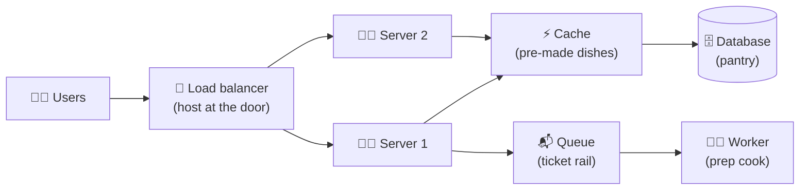

# 001 · What Is System Design?

> ⏱ 7 min · 📈 1% · 🅰️ Part A (core) · Phase 01: Foundations
>
> `░░░░░░░░░░░░░░░░░░░░` 1% of the whole guide

---

## 📖 Story

Pull up a chair. Our story begins in a small apartment kitchen, where Leo has just quit his job to launch **Pantry**, a website where neighbours sell home-cooked meals to each other. He hires **Maya**, a junior engineer who has built websites but never a *system*. On her first morning, Leo asks, "Will it handle the whole city?" Maya doesn't know. Neither do you, yet. That's exactly where we start.

## 🎯 One-sentence idea

**System design is choosing and connecting building blocks (servers, databases, caches, queues) so software stays fast, correct, and available as it grows. Every choice is a trade-off.**

## 🧸 Analogy

Think of a **restaurant**.

- On day one you have 1 cook, 1 table, and 1 fridge. Easy.
- Then 500 people show up. Now you need **more cooks** (servers), a **host at the door** to seat people (load balancer), **pre-made popular dishes** (cache), a **ticket rail** so orders don't get lost (queue), and a **bigger pantry split across rooms** (sharded database).

Nobody asks "what's the *correct* restaurant?" They ask "what's the right restaurant **for this many customers, this menu, and this budget**?" That's system design.

## 🖼️ Visual

## 🔬 How it works

- **Building blocks ("atoms"):** a small set of reusable parts: DNS, load balancers, app servers, caches, databases, queues, object storage, CDNs. This guide teaches each one.
- **Requirements drive choices:** *what* the system does (features) plus *how well* it must do it (speed, scale, uptime).
- **Trade-offs are everywhere:** faster usually means costlier; always-available usually means sometimes-stale; simpler usually means less flexible.
- **Scale changes everything:** a design that works for 1,000 users may collapse at 10 million. Good designs **start simple and evolve**.
- **The core qualities** to balance:
  - **Scalability:** can it handle more load by adding resources?
  - **Latency / performance:** how fast does it respond?
  - **Availability:** is it up when people need it?
  - **Consistency:** does everyone see the same, correct data?
  - **Durability:** once saved, does data stay saved?
  - **Cost & simplicity:** can we afford and understand it?

## 🧩 Worked example

**Same app, three scales: a photo-sharing app.**

| Stage | Users | Design |
|---|---|---|
| 🐣 Launch | 1,000 | 1 server running the app + a Postgres DB on the same box |
| 🐥 Growing | 100,000 | Move DB to its own server, put photos in object storage (S3), add a CDN |
| 🦅 Big | 10,000,000 | Load balancer + many stateless app servers, Redis cache, DB read replicas, a queue for thumbnail generation |

Notice: **nothing was "wrong" at launch.** Building the 🦅 design on day one would have wasted money and time. That's a trade-off too.

## ⚖️ Trade-offs

| You gain | You pay | Use it when |
|---|---|---|
| Simple design (1 server) | Can't scale, single point of failure | Early product, prototypes |
| Distributed design (many parts) | Complexity, cost, harder debugging | Real scale or strict uptime needs |
| Strong correctness | Slower, less available | Money, inventory, medical |
| High speed/availability | Data may be briefly stale | Social feeds, likes, views |

## 🌍 Real world

- **Instagram** served its first 30 million users with a small team and a few boring technologies (Django + Postgres + Redis). Simple scales further than people think.
- **Netflix, Uber, Amazon** evolved into hundreds of services only *after* hitting real limits.

## 📌 Cheat card

> - System design = **atoms + trade-offs + requirements**.
> - The six qualities: **Scale, Speed, Uptime, Consistency, Durability, Cost** ("**SSUCDC**" or "**Some Sysadmins Use Coffee Daily, Constantly**").
> - **Start simple, then evolve.** Never over-engineer on day one.
> - The answer to most design questions starts with **"It depends on…"**, followed by the requirements.

## 🧪 Feynman check

Explain to a friend **in 3 sentences**: *What is system design, and why is there no single right answer?*

If you used a word like "scalability" without explaining it, try again with the restaurant.

⚠️ **Common confusion:** System design is **not** about drawing fancy diagrams or naming technologies. It's about **justifying choices** with requirements and trade-offs. "I'd use Kafka" is weak. "I'd use a queue because writes spike 10× during sales and we need to absorb bursts" is strong.

## ⚡ Quick recall

1. What are "atoms" in system design?

Answer

Reusable building blocks, such as load balancers, caches, databases, queues, CDNs, and object storage, that get combined into bigger systems.

2. Why not build the "big company" architecture from day one?

Answer

It's expensive, slow to build, and complex, and you don't yet know where the real bottlenecks will be. Start simple and evolve when real limits appear.

3. Name four qualities a design balances.

Answer

Any four of: scalability, latency/performance, availability, consistency, durability, cost/simplicity.

## 🎤 Interview practice

**Q1. "What makes a system design 'good'?"**

Model answer

- A good design **meets its stated requirements**, both functional and non-functional, at the **lowest reasonable complexity and cost**.
- It makes **explicit trade-offs**, for example choosing availability over strict consistency for a feed.
- It **handles failure**, with no single point of failure where uptime matters.
- It **can evolve**: it's simple now, with a clear path to scale.
- **Likely follow-up:** "How would you know if your design is working?" → metrics and SLOs (lessons 007, 067).

**Q2. "You have a working app on one server. Traffic grows 100×. What do you do first?"**

Model answer

- **Measure first**: find the actual bottleneck (CPU? DB? network?).
- The usual order is: **separate the DB** from the app server → **add a cache** for hot reads → **put a load balancer** in front of several **stateless** app servers → add **read replicas** → move static and media to a **CDN/object storage** → shard only when needed.
- Mention the trade-off: each step adds complexity, so only do what the numbers require.
- **Likely follow-up:** "What if the database is the bottleneck?" → indexes, caching, read replicas, then sharding (lessons 037, 046, 049).

> 📖 *Next time: Maya opens her browser and wonders what actually happens when a hungry customer clicks "Order".*

---

⬅️ [Start Here](../../START-HERE.md) · 🗺️ [Phase map](README.md) · ➡️ [002 · Life of a Request](002-life-of-a-request.md)

✅ **Safe stopping point.** Tick lesson 001 in [PROGRESS.md](../../PROGRESS.md).
