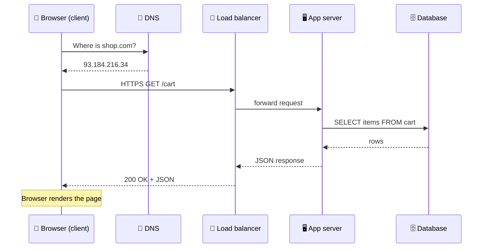

# 002 · Client–Server & the Life of a Request

> ⏱ 8 min · 📈 2% · 🅰️ Part A (core) · Phase 01: Foundations
>
> `░░░░░░░░░░░░░░░░░░░░` 2% of the whole guide

---

## 📖 Story

Maya types Pantry's address and watches the page appear. It feels instant, but she's curious: where did that click *go*? She opens her browser's developer tools and finds a waterfall of steps she'd never noticed: a lookup, a handshake, a wait, a reply. Let's follow one click together, hop by hop.

## 🎯 One-sentence idea

**When you click something, your device (the client) sends a request through DNS and the network to a server, which may ask a database, and then sends a response back. Every hop adds time and is a place things can break.**

## 🧸 Analogy

Ordering pizza by phone:

1. You look up the pizza shop's number in your contacts (**DNS**: name → address).
2. You call and they pick up (**connection**: TCP handshake).
3. You say "one large margherita" (**request**).
4. The cashier asks the kitchen (**server → database**).
5. They tell you "20 minutes, $12" (**response**).

You are the **client**. The shop is the **server**. The kitchen is the **database**.

## 🖼️ Visual



## 🔬 How it works

- **Client:** anything that *asks*, like a browser, mobile app, or another service.
- **Server:** anything that *answers*. It listens on an address and port and returns responses.
- **DNS lookup:** turns `shop.com` into an IP address. The result is cached, so it's often skipped (lesson 011).
- **Connection:** TCP handshake plus a TLS handshake for HTTPS (lessons 010, 013).
- **Request/response:** usually HTTP. The client sends a method + path + headers + body, and the server replies with a status code + body (lesson 012).
- **Behind the server:** it may call caches, databases, and other services. Each call is **another mini request/response**.
- **Every hop = latency + a possible failure.** Fewer hops, closer data, and caching make things faster.

## 🧩 Worked example

What happens when you type `https://shop.com/cart` and press Enter, with rough timings:

| Step | What happens | ~Time |
|---|---|---|
| 1 | Browser checks its DNS cache: miss → asks DNS resolver | 20–50 ms |
| 2 | TCP handshake with server | 1 RTT ≈ 30 ms |
| 3 | TLS handshake (TLS 1.3) | 1 RTT ≈ 30 ms |
| 4 | Send HTTP request, the load balancer picks a server | ~1 ms |
| 5 | App server queries database (indexed) | 2–10 ms |
| 6 | Response travels back | ~30 ms |
| 7 | Browser renders HTML, fetches CSS/JS/images (often from a CDN) | 100+ ms |

Try it yourself:

```bash
curl -w "dns:%{time_namelookup} connect:%{time_connect} tls:%{time_appconnect} total:%{time_total}\n" -o /dev/null -s https://example.com
```

## ⚖️ Trade-offs

| You gain | You pay | Use it when |
|---|---|---|
| Thin client (logic on the server) | More server load and round trips | Web apps, security-sensitive logic |
| Thick client (logic on the device) | Harder updates, logic exposed | Offline apps, games, rich UIs |
| More layers (LB, cache, gateway) | More hops, more to operate | You need scale and resilience |

## 🌍 Real world

- "What happens when you type google.com into your browser?" is a **classic interview question**. This lesson is the short version.
- **Chrome DevTools → Network tab** shows every request, its timing breakdown, and its size. Open it on any site.

## 📌 Cheat card

> - **Client asks, server answers.** Servers can be clients of *other* servers.
> - Path: **DNS → TCP → TLS → HTTP request → server → DB → response**.
> - **Every hop costs time and can fail.**
> - Speed-up levers: **cache** (skip hops), **CDN** (shorter hops), **keep-alive** (reuse connections).

## 🧪 Feynman check

Explain the pizza-phone analogy step by step, and map each step to DNS, TCP, request, database, and response.

⚠️ **Common confusion:** "Server" means a **role**, not only a physical machine. One machine can run many servers, and one "server" (like google.com) can be thousands of machines behind a load balancer.

## ⚡ Quick recall

1. What does DNS do?
<details><summary>Answer</summary>

It translates a human-friendly name (`shop.com`) into a machine address (an IP like `93.184.216.34`).
</details>

2. Why is the second visit to a site usually faster?
<details><summary>Answer</summary>

DNS results, connections (keep-alive), and static files (browser cache/CDN) are reused, so several hops are skipped.
</details>

3. Can a server also be a client?
<details><summary>Answer</summary>

Yes. An app server is a client of the database, cache, and other services it calls.
</details>

## 🎤 Interview practice

**Q1. "Walk me through what happens when a user types a URL and hits Enter."**
<details><summary>Model answer</summary>

- **DNS resolution:** browser cache → OS cache → resolver → root/TLD/authoritative servers → IP.
- **TCP handshake** (SYN, SYN-ACK, ACK), then the **TLS handshake** (certificate check, key exchange).
- **HTTP request** → often hits a **CDN** or **load balancer** first → routed to an **app server**.
- The app server may check a **cache**, query a **database**, or call other services, then builds the response.
- The response comes back → the browser **parses HTML**, fetches sub-resources, and renders.
- **Likely follow-up:** "Where would you add caching in this path?" → browser, CDN, reverse proxy, app-level cache (Redis), DB buffer cache.
</details>

**Q2. "A page takes 3 seconds to load. How do you figure out where the time goes?"**
<details><summary>Model answer</summary>

- Break the request into hops: DNS, connect, TLS, time-to-first-byte (server time), and download/render.
- Use **browser DevTools** / `curl -w` for client-side timing, and **distributed tracing** on the server to find slow DB or service calls.
- Common culprits: many sequential requests, no CDN, slow DB queries (missing index, N+1), large uncompressed assets.
- **Likely follow-up:** "The server part is 2.5 s. Now what?" → trace spans, check DB query plans, cache hot results.
</details>

> 📖 *Next time: Some of those hops take nanoseconds and others take a tenth of a second. Maya wants to know which is which.*

---

⬅️ [001 · What Is System Design?](001-what-is-system-design.md) · 🗺️ [Phase map](README.md) · ➡️ [003 · Latency Numbers & Percentiles](003-latency-numbers-and-percentiles.md)

✅ **Safe stopping point.** Tick lesson 002 in [PROGRESS.md](../../PROGRESS.md).
