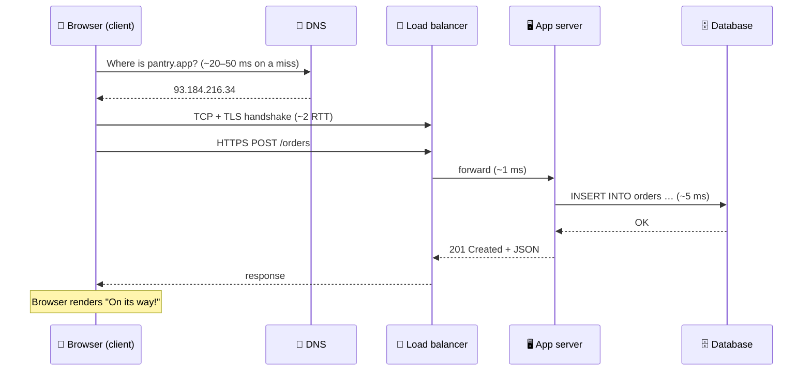

# 002 · Client–Server & the Life of a Request

> ⏱ 8 min · 📈 2% · 🅰️ Part A (core) · Phase 01: Foundations
>
> `░░░░░░░░░░░░░░░░░░░░` 2% of the whole guide

---

## 📖 Story

Maya clicks **"Order"** on her own site. A spinner turns for a moment. Then: *"Your lasagna is on its way!"*

It felt instant. But Maya has an engineer's itch, and I love that itch. She hits F12 and opens the Network tab.

What she sees is a waterfall of colored bars, like a crime-scene timeline. **DNS lookup: 38 ms. TCP connect: 29 ms. TLS: 31 ms. Waiting for server: 112 ms. Download: 4 ms.**

Five separate stages to deliver one click, and every one of them is a place where the order could stall, time out, or vanish.

Let me freeze the frame and walk you through that one click, hop by hop.

## 🎯 One-sentence idea

**A click is a chain of hops: the client resolves a name, opens a connection, sends a request to a server that may call other systems, and gets a response back, and every hop adds latency and is a place things can fail.**

## 🧸 Analogy

Ordering pizza by phone:

1. You look up the shop's number in your contacts (**DNS**: name → address).
2. You call, and they pick up (**connection**: the TCP handshake).
3. You say "one large margherita" (**request**).
4. The cashier shouts to the kitchen (**server → database**).
5. They tell you "20 minutes, $12" (**response**).

You are the **client**. The shop is the **server**. The kitchen is the **database**.

## 🖼️ Visual

*Diagram brief:* a left-to-right timeline with five lanes (Browser, DNS, Load balancer, App server, Database). Arrows go out and come back, and each arrow is labelled with its rough cost.



## 🔬 How it works

- **Client vs server is a role, not a machine:** a client *asks*, a server *answers* on an IP and port. An app server is also a *client* of its database and cache.
- **DNS** resolves `pantry.app` to an IP address. The answer is cached in the browser, the OS, and the resolver, so most clicks skip this step (lesson 011).
- **Connection setup** costs round trips: TCP needs 1 RTT, and TLS 1.3 adds 1 more. Keep-alive and HTTP/2 reuse the connection, so you pay this once rather than on every click (lessons 010, 013).
- **Request/response:** the client sends method + path + headers + body, and the server answers with a status code + body (lesson 012). Behind the server, every cache, database, or service call is another mini request/response.
- **Every hop = latency + a failure mode.** The fastest hop is the one you skip, which is why caching, CDNs, and connection reuse exist.

## 🧩 Worked example

What happens when Maya loads `https://pantry.app/cart` from a cold start:

| Step | What happens | ~Time |
|---|---|---|
| 1 | Browser DNS cache miss → resolver lookup | 20–50 ms |
| 2 | TCP handshake | 1 RTT ≈ 30 ms |
| 3 | TLS 1.3 handshake | 1 RTT ≈ 30 ms |
| 4 | Request reaches the load balancer, which picks a server | ~1 ms |
| 5 | App server runs an indexed DB query | 2–10 ms |
| 6 | Response travels back | ~30 ms |
| 7 | Browser renders, fetches CSS/JS/images (often from a CDN) | 100+ ms |

On the **second** visit, steps 1–3 mostly disappear, saving roughly **90 ms**. Measure it yourself:

```bash
curl -w "dns:%{time_namelookup} connect:%{time_connect} tls:%{time_appconnect} ttfb:%{time_starttransfer} total:%{time_total}\n" \
     -o /dev/null -s https://example.com
```

## ⚖️ Trade-offs

| Maya's choice | What she gains | What she pays |
|---|---|---|
| Thin client (logic on the server) | Easy updates, logic stays private | More round trips, more server load |
| Thick client (logic on the device) | Fewer round trips, works offline | Harder updates, logic exposed to users |
| More layers (LB, cache, gateway) | Scale and resilience | More hops to pay for and more parts to operate |

## 🌍 Real world

- "What happens when you type google.com into your browser?" is a **classic interview opener**. This lesson is the compact answer.
- **Chrome DevTools → Network tab** shows exactly this waterfall for every request, on any site.
- **Google** pushed **QUIC/HTTP/3** largely to cut handshake round trips out of this chain.

## 📌 Cheat card

> - **Client asks, server answers.** Servers are clients of *other* servers.
> - The path: **DNS → TCP → TLS → HTTP → server → DB → response**.
> - A cold HTTPS connection costs **≈ 2–3 RTTs before the first byte** of your request is processed.
> - Speed-up levers: **cache** (skip hops), **CDN** (shorter hops), **keep-alive** (reuse connections).

## 🧪 Feynman check

Walk a friend through the pizza phone call step by step, and map each step to DNS, TCP, request, database, and response.

⚠️ **Common confusion:** "Server" means a **role**, not a box. One machine can run many servers, and one "server" like google.com is thousands of machines behind load balancers.

## ⚡ Quick recall

1. What does DNS do?
<details><summary>Reveal Answer</summary>

It translates a name (`pantry.app`) into a machine address (an IP like `93.184.216.34`).
</details>

2. Why is the second visit to a site usually faster?
<details><summary>Reveal Answer</summary>

DNS answers, open connections (keep-alive), and static files (browser cache/CDN) are reused, so several hops are skipped.
</details>

3. Can a server also be a client?
<details><summary>Reveal Answer</summary>

Yes. An app server is a client of the database, the cache, and every service it calls.
</details>

## 🎤 Interview practice

**Q. "A user types a URL and hits Enter. The page takes 3 seconds. Walk me through every hop, then tell me how you'd find where the 3 seconds went."**
<details><summary>Model answer</summary>

- **The hops:**
  - **DNS:** browser cache → OS cache → recursive resolver → root → TLD → authoritative server → IP.
  - **TCP handshake** (SYN, SYN-ACK, ACK), then the **TLS handshake** (certificate verification, key exchange).
  - **HTTP request** → usually a **CDN** or **load balancer** first → routed to an **app server**.
  - The app server checks a **cache**, queries the **database**, and calls other services, then builds the response.
  - The browser **parses HTML**, fetches sub-resources, and renders.
- **Finding the 3 seconds:**
  - Split the time on the client: DNS, connect, TLS, **TTFB** (server time), download, render. Use DevTools or `curl -w`.
  - If TTFB is most of it, use **distributed tracing** on the server to find the slow span: an unindexed query, N+1 calls, or a slow dependency.
  - If render is most of it, look for too many sequential requests, no CDN, or large uncompressed assets.
- **Likely follow-up:** "Where would you add caching along this path?" → browser, CDN, reverse proxy, application cache (Redis), and the database buffer pool.
</details>

## 📖 Teaser

> 📖 *Some of those hops take nanoseconds and others take a tenth of a second, and Maya is about to discover that her "fast" average is hiding a monster.*

---

⬅️ [001 · What Is System Design?](001-what-is-system-design.md) · 🗺️ [Phase map](README.md) · ➡️ [003 · Latency Numbers & Percentiles](003-latency-numbers-and-percentiles.md)

✅ **Safe stopping point.** Tick lesson 002 in [PROGRESS.md](../../PROGRESS.md).
