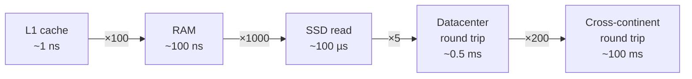

# 003 · Latency Numbers & Percentiles

> ⏱ 9 min · 📈 3% · 🅰️ Part A (core) · Phase 01: Foundations
>
> `░░░░░░░░░░░░░░░░░░░░` 3% of the whole guide

---

## 📖 Story

A message lands in Pantry's support inbox: *"Your site is SO slow. I gave up and ordered pizza."*

Maya frowns and pulls up the dashboard. **Average response time: 80 ms.** That's fast. Faster than most sites she knows.

She almost closes the tab. Then something nags at her, the way a creak in the floor nags at you at 2 a.m.

She exports the raw request log and sorts it from fastest to slowest. The top of the list is a wall of 10s and 12s. The bottom of the list is **4,800 ms. 5,100 ms. 6,000 ms.** One request in a hundred is crawling, and the average had smoothed them into nothing.

I've been fooled by averages myself, more than once. Let me show you what they hide.

## 🎯 One-sentence idea

**Know roughly how slow each operation is (memory ≪ disk ≪ the network across the world), and measure speed with percentiles like p99, because averages hide your unhappiest users.**

## 🧸 Analogy

Getting a snack, scaled so that 1 ns = 1 second:

- 🍫 From your **pocket**: 1 second (CPU L1 cache, ~1 ns)
- 🍪 From the **kitchen**: under 2 minutes (RAM, ~100 ns)
- 🛒 From the **corner store**: about a day (SSD, ~100 µs)
- ✈️ From **another continent**: about 3 years (a cross-world round trip, ~100 ms)

You'd never fly abroad for every snack. **Keep frequently used things close.** That's the whole idea behind caches and CDNs.

## 🖼️ Visual

*Diagram brief:* a staircase of five boxes from L1 to cross-continent, with each step labelled by how much slower it is than the one before. Below it, a horizontal bar of 100 sorted requests with markers at p50, p99, and max.



```
 100 requests sorted, fastest → slowest
 fast ▕████████████████████████████████████████▏ slow
      ▲                  ▲              ▲     ▲
     min                p50            p99   max
                    (typical user)  (the unlucky 1%)
```

## 🔬 How it works

- **Orders of magnitude, not exact numbers:** RAM is about **1000×** faster than an SSD read, and an SSD read is about **1000×** faster than a cross-world round trip. Design with those ratios in mind.
- **The mean lies:** 99 requests at 10 ms and one at 5,000 ms gives a mean of about 60 ms. That number describes *nobody's* actual experience.
- **Percentiles tell the truth:** **p50** is the typical request, **p99** is the slowest 1%, and **p99.9** is the slowest 0.1%. At 1M requests a day, 1% is **10,000** bad experiences.
- **Fan-out amplifies the tail:** if a page waits on 100 parallel calls and each has a 1% chance of being slow, **1 − 0.99¹⁰⁰ ≈ 63%** of page loads will hit at least one slow call.
- **SLOs are written as percentiles** ("p99 < 200 ms") and computed from **histograms**, never from averages.

## 🧩 Worked example

Ten request times (ms): `12, 10, 11, 13, 9, 10, 12, 11, 10, 900`

- **Mean** = (98 + 900) ÷ 10 ≈ **100 ms**. Misleading.
- **p50:** sort → `9, 10, 10, 10, 11, 11, 12, 12, 13, 900` → **≈ 11 ms**. That's the typical experience.
- **p90 ≈ 13 ms, max ≈ 900 ms.** Something is occasionally very slow. Go hunt it: a GC pause, a cold cache, a lock?

A latency budget for a 200 ms p99 API:

```
Client ↔ server network       60 ms
TLS + load balancer           10 ms
App logic                     20 ms
Cache miss → DB query         30 ms
3 service calls (parallel)    50 ms
Headroom                      30 ms
--------------------------------------
Total                        200 ms
```

## ⚖️ Trade-offs

| Maya's choice | What she gains | What she pays |
|---|---|---|
| Track p50/p99/p99.9 | Sees the pain real users feel | Histogram storage and more complex metrics |
| Track only averages | Simple dashboards | Blind to the tail, which is where users quit |
| Hedged requests (send a 2nd copy if the 1st is slow) | Much lower p99 | ~2–5% extra load on backends |

## 🌍 Real world

- **Amazon** famously reported that every extra 100 ms of latency cost about 1% in sales.
- **Google's "The Tail at Scale"** (Dean & Barroso) popularized hedged requests and the fan-out math above.
- **Jeff Dean's "Latency Numbers Every Programmer Should Know"** is the source of the classic table.

## 📌 Cheat card

> - **"100, 100, half, 100":** RAM ~100 **ns**, SSD ~100 **µs**, same-datacenter RTT ~**0.5 ms**, cross-continent RTT ~100 **ms**.
> - **Never report averages alone.** Report **p50, p95/p99, p99.9**.
> - **Fan-out amplifies tails:** P(at least one slow) = 1 − (1 − p)ⁿ.
> - Humans: **< 100 ms feels instant**, **> 1 s breaks flow**.
> - Full table: [NUMBERS.md](../../cheatsheets/NUMBERS.md)

## 🧪 Feynman check

Explain to a friend why "our average response time is 50 ms" could be hiding a serious problem. Use the ten-request example.

⚠️ **Common confusion:** p99 = 200 ms does **not** mean "99% of *users* wait 200 ms." It means 99% of *requests* finish in **200 ms or less**. A user who makes 50 requests per session has a **~40%** chance (1 − 0.99⁵⁰) of hitting at least one slower request.

## ⚡ Quick recall

1. Roughly how much slower is an SSD read than a RAM read?
<details><summary>Reveal Answer</summary>

About 1000× (~100 ns vs ~100 µs).
</details>

2. What does p99 = 300 ms mean?
<details><summary>Reveal Answer</summary>

99% of requests finished in 300 ms or less, and 1% took longer.
</details>

3. Why does calling many services in parallel make tail latency worse?
<details><summary>Reveal Answer</summary>

The page waits for its *slowest* call. With n calls, the chance that at least one is slow is 1 − (1 − p)ⁿ, which grows quickly with n.
</details>

## 🎤 Interview practice

**Q. "Your service's average latency is 40 ms, but users say it's slow and conversion is dropping. Diagnose it and fix it."**
<details><summary>Model answer</summary>

- **Look past the average.** Pull **p95/p99/p99.9 histograms**. The pain is in the tail.
- **Correlate the tail with causes:**
  - **GC pauses** (check the GC logs against the latency spikes).
  - **Cold caches** after deploys or evictions.
  - **Lock or connection-pool contention** under load.
  - **Noisy neighbours** on shared hosts.
  - **Slow dependencies**, and **retries** that multiply load.
  - **Queueing** as utilization goes above ~70%.
- **Check fan-out.** If a page calls 30 backends, a 1% tail on each becomes a ~26% tail on the page.
- **Fixes:**
  - Tight **timeouts** on every call.
  - **Hedged requests** on idempotent reads.
  - **Caching** hot data.
  - Moving slow calls **off the critical path** (async).
  - **Capacity headroom** so queues stay short.
- **Alerting:** page on an **SLO burn rate** for p99 over a window, not on single spikes.
- **Likely follow-up:** "Hedging doubles load, doesn't it?" → No. You only send the second copy after the first exceeds roughly the p95, so extra load is ~5%.
</details>

## 📖 Teaser

> 📖 *Maya now knows how slow one request is. Next, she has to figure out how many of them Pantry can handle at once.*

---

⬅️ [002 · Life of a Request](002-life-of-a-request.md) · 🗺️ [Phase map](README.md) · ➡️ [004 · Latency vs Throughput vs Bandwidth](004-latency-throughput-bandwidth.md)

✅ **Safe stopping point.** Tick lesson 003 in [PROGRESS.md](../../PROGRESS.md).
