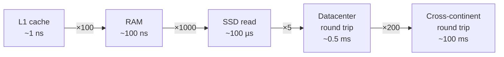

# 003 · Latency Numbers & Percentiles

> ⏱ 9 min · 📈 3% · 🅰️ Part A (core) · Phase 01: Foundations
>
> `░░░░░░░░░░░░░░░░░░░░` 3% of the whole guide

---

## 📖 Story

A customer in the next town complains that Pantry "feels slow." Maya checks the average response time: 80 milliseconds. Perfectly fine! So why the complaint? Leo shrugs: "Maybe they're just impatient." But Maya has a hunch that the average is hiding something. She's right, and you're about to find out what.

## 🎯 One-sentence idea

**Know roughly how slow each operation is (memory ≪ disk ≪ network across the world), and measure speed with percentiles like p99 instead of averages, because averages hide your unhappiest users.**

## 🧸 Analogy

Getting a snack:

- 🍫 From your **pocket**: 1 second (CPU cache)
- 🍪 From the **kitchen**: 2 minutes (RAM)
- 🛒 From the **corner store**: a day (SSD)
- ✈️ From **another country**: years (a network round trip across the world)

You wouldn't fly abroad for every snack. **Keep frequently used stuff close.** That's what caching and CDNs do.

## 🖼️ Visual



**Percentiles:** sort 100 request times from fastest to slowest.

```
p50 (median) ─ half of requests are faster than this
p90          ─ 90% are faster
p99          ─ 99% are faster; 1 in 100 is slower  ← "tail latency"
p99.9        ─ 1 in 1000 is slower

 fast ▕████████████████████████████████████████▏ slow
      ▲                  ▲              ▲     ▲
     min                p50            p99   max
```

## 🔬 How it works

- **Orders of magnitude matter, not exact numbers.** RAM is about **1000×** faster than SSD, and SSD is about **1000×** faster than a cross-world round trip.
- **Average (mean) lies.** 99 requests at 10 ms and 1 at 5,000 ms gives an average of about 60 ms, which describes *nobody's* experience.
- **p50** = the typical user. **p99** = the unlucky 1%. At scale, 1% is a lot of people. At 1M requests/day, that's 10,000 slow requests.
- **Tail latency amplifies.** If a page calls 100 services in parallel and each has a 1% chance of being slow, then **63%** of page loads hit at least one slow call (1 − 0.99¹⁰⁰ ≈ 0.63).
- That's why **SLOs are written as percentiles**: "p99 < 200 ms".

## 🧩 Worked example

Ten request times (ms): `12, 10, 11, 13, 9, 10, 12, 11, 10, 900`

- **Mean** = (sum of the first 9 = 98, plus 900) ÷ 10 ≈ **100 ms**. That's misleading.
- **p50** (median) = sort → `9, 10, 10, 10, 11, 11, 12, 12, 13, 900` → middle ≈ **11 ms**. That's the typical experience.
- **p90** ≈ **13 ms**, and **max / p99** ≈ **900 ms**. Something is occasionally very slow. Go find it: GC pause? cold cache? a lock?

Quick latency budget for a 200 ms API:

```
Network client ↔ server   60 ms
TLS + LB                  10 ms
App logic                 20 ms
Cache miss → DB query     30 ms
3 service calls (parallel) 50 ms
Headroom                  30 ms
------------------------------
Total                    200 ms
```

## ⚖️ Trade-offs

| You gain | You pay | Use it when |
|---|---|---|
| Tracking p99/p99.9 | More storage and more complex metrics (histograms) | Any user-facing service |
| Tracking only averages | Hides real pain | Never alone |
| Hedged requests (send a 2nd copy if the 1st is slow) | Extra load | Cutting tail latency on read paths |

## 🌍 Real world

- **Amazon** found that every extra 100 ms of latency cost about 1% in sales (a widely cited figure).
- **Google's "The Tail at Scale"** paper popularized hedged requests and the tail-amplification math above.
- **Jeff Dean's "Latency Numbers Every Programmer Should Know"** is where the classic table comes from.

## 📌 Cheat card

> - **"100, 100, half, 100"**: RAM ~100 **ns**, SSD ~100 **µs**, same-datacenter RTT ~**0.5 ms**, cross-continent RTT ~100 **ms**.
> - **Never use averages alone.** Report **p50, p95/p99, p99.9**.
> - **Fan-out amplifies tails:** P(at least one slow) = 1 − (1 − p)ⁿ.
> - Humans: **< 100 ms feels instant**, **> 1 s breaks flow**.
> - Full table: [NUMBERS.md](../../cheatsheets/NUMBERS.md)

## 🧪 Feynman check

Explain to a friend why "our average response time is 50 ms" might hide a serious problem. Use the snack analogy or the 10-requests example.

⚠️ **Common confusion:** p99 = 200 ms does **not** mean "99% of users wait 200 ms." It means 99% of *requests* take **200 ms or less**, and 1% take longer.

## ⚡ Quick recall

1. Roughly how much slower is an SSD read than a RAM read?
<details><summary>Answer</summary>

About 1000× (~100 ns vs ~100 µs).
</details>

2. What does p99 = 300 ms mean?
<details><summary>Answer</summary>

99% of requests finished in 300 ms or less, and 1% took longer.
</details>

3. Why does calling many services in parallel make tail latency worse?
<details><summary>Answer</summary>

The page is only as fast as its *slowest* call. With many calls, it becomes likely that at least one hits its tail: 1 − (0.99)ⁿ grows fast with n.
</details>

## 🎤 Interview practice

**Q1. "Your service's average latency is fine, but users complain it's slow. What's going on?"**
<details><summary>Model answer</summary>

- Averages hide the **tail**, so look at **p95/p99/p99.9** latency histograms.
- Likely causes of tail latency: **GC pauses**, **cold caches**, **lock contention**, **noisy neighbours**, **slow dependencies**, **retries**, and **queueing** under load.
- Fan-out pages amplify it: one slow backend makes the whole page slow.
- Fixes: timeouts, hedged/backup requests, caching, removing slow dependencies from the critical path, and capacity headroom.
- **Likely follow-up:** "How would you set an alert?" → alert on an SLO breach of p99 over a window, not on single spikes.
</details>

**Q2. "Should this be a database call or a cache call? Justify it with numbers."**
<details><summary>Model answer</summary>

- A Redis get over the network is about **0.5–1 ms**. An indexed DB read is about **1–10 ms**. A disk-heavy or unindexed query can take **100 ms+**.
- If the data is read far more often than it changes, the cache saves 5–10× latency *and* load on the DB.
- The trade-off: staleness and cache-invalidation complexity (lessons 027–031).
- **Likely follow-up:** "What if the data changes every second?" → short TTL, or skip caching, or write-through.
</details>

> 📖 *Next time: Leo asks a question that sounds simple: how many orders can Pantry actually handle?*

---

⬅️ [002 · Life of a Request](002-life-of-a-request.md) · 🗺️ [Phase map](README.md) · ➡️ [004 · Latency vs Throughput vs Bandwidth](004-latency-throughput-bandwidth.md)

✅ **Safe stopping point.** Tick lesson 003 in [PROGRESS.md](../../PROGRESS.md).
